# GD图像处理技术

## 1. GD图像处理技术相关概念

### 为什么使用GD图像处理技术

在WEB项目中，GD图像处理技术应用非常广泛，比如制作验证码图片，给图片打水印等。


### 什么是GD图像处理技术

GD图像处理技术 即 PHP通过使用==GD扩展==来操作图像的一种技术。


## 2. 开启GD扩展

扩展，意味着GD并不是PHP默认就是配置开启的，而是需要额外进行配置的。


**==开启步骤==**：

第一步，打开php的配置文件php.ini，确认extension_dir配置项已经正确配置，


第二步，去掉下图所示配置前的分号，开启配置项，


第三步，确认php_gd2.dll在extension_dir指定的目录下是否存在，

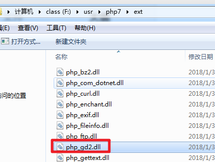

第四步，重启apache，确认是否开启成功，

重启apache


确认扩展是否开启成功


phpinfo输出如上图所示，说明开启成功。


## 3. ==GD扩展相关操作==

#### 操作分析

在程序中使用GD扩展操作图像，其实就相当于我们在电脑中使用各种绘图软件来绘制图像，比如PS软件。


我们以PS软件绘制图像的方式为切入点，来分析绘图过程中所需要的一些操作有哪些：

1. 打开PS软件（开启GD扩展操作）
2. 创建画布操作；
3. 在画布上做各种各样的绘图操作（画点，画线，画椭圆，选择颜色，填充颜色）
4. 将成品图保存成文件；
5. 关闭画布；
6. 关闭软件；


#### 创建画布相关操作

涉及的函数：

> **imagecreate**(宽,  高)   创建画布，单位像素
>
> **imagecreatetruecolor**(宽,  高)    创建一个真彩色画布
>
> **imagecreatefromjpeg**(jpeg图片路径)    根据一张已有的jpeg图片创建画布
>
> **imagecreatefromgif**(gif图片路径)    根据一张已有的gif图片创建画布
>
> **imagecreatefrompng**(png图片路径)    根据一张已有的png图片创建画布


**==需求==**：根据以下要求完成操作，

1. 根据imagecreate和imagecreatetruecolor两个函数分别创建一个400*200的画布，打印返回值；
2. 根据一张已有的jpeg图片创建画布，打印返回值；

**==解答==**：创建名为code2.php的程序文件，代码如下：

```php
<?php

#imagecreate创建画布
$img1 = imagecreate(400, 200);
var_dump( $img1 ); echo '<hr/>';

#imagecreatetruecolor创建画布
$img2 = imagecreatetruecolor(400, 200);
var_dump( $img2 ); echo '<hr/>';

#imagecreatefromjpeg创建画布
$img3 = imagecreatefromjpeg('./1.jpg');
var_dump( $img3 ); 
```

访问codex1.php，输出的内容如下：

```mysql
resource(2) of type (gd)  #imagecreate创建的画布资源
resource(3) of type (gd)  #imagecreatetruecolor创建的画布资源
resource(5) of type (gd)  #imagecreatefromjpeg创建的画布资源
```


**==小结==**：

1. imagecreate和imagecreatetruecolor创建画布是指定的是画布的宽度和高度，单位像素；
2. imagecreatefrom系列的创建画布是指定固定格式的图片路径，比如imagecreatefromjpeg，就需要指定jpeg格式的图片路径；


#### 关闭画布操作

涉及的函数：

> **imagedestroy**(画布资源)    销毁画布资源


**==需求==**：根据以下要求完成操作，

1. 根据imagecreate创建一个400*200的画布，打印返回值；
2. 使用imagedestroy关闭打开的画布，再次打印"1"中创建的画布资源返回值；

**==解答==**：创建名为code3.php的程序文件，代码如下：

```php
<?php

#imagecreate创建画布
$img1 = imagecreate(400, 200);
var_dump( $img1 ); echo '<hr/>';

#imagedestroy关闭画布资源
imagedestroy($img1);
var_dump( $img1 ); 

```

访问code3.php，输出的内容如下：

```mysql
resource(2) of type (gd)  #imagecreate创建的画布资源
resource(2) of type (Unknown)   #imagedestroy销毁后的$img1的输出
```


#### 图像输出相关操作

涉及的函数：

> **imagejpeg**(画布资源[,  保存文件的全路径])    以jpeg的格式输出图片到浏览器或保存成文件
>
> **imagepng**(画布资源[,  保存文件的全路径])    以png的格式输出图片到浏览器或保存成文件
>
> **imagegif**(画布资源[,  保存文件的全路径])    以gif的格式输出图片到浏览器或保存成文件


**==需求==**：创建code4.php程序文件，

1. 使用imagecreate创建一个400*200的画布；
2. 同时实现根据GET方式传递的type值判定，如果type值为1，则直接将"1"中创建的画布以jpeg图片的格式输出到浏览器；如果type值为2，则将"1"中创建的画布以jpeg格式保存成图片文件；

**==解答==**：创建名为code4.php的程序文件，代码如下：

```php
<?php

#imagecreate创建画布
$img1 = imagecreate(400, 200);

if( $_GET['type']==1 ){//将画布以jpeg格式的图片输出到浏览器
    header('Content-type:image/jpeg');//输出图像到浏览器之前必须先设置返回给浏览器的内容类型
    imagejpeg($img1);
}elseif( $_GET['type']==2 ){//将画布以jpeg格式的图片保存成文件文件
    imagejpeg($img1, './a.jpg');
}

```

访问code4.php：

当GET方式传递的type值等于1时，效果为：


当GET方式传递的type值等于2时，效果为：

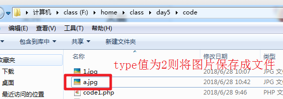


**==小结==**：

1. 如果要将图片输出到浏览器，则必须在输出前指定header内容类型；
2. 如果要将图片保存成文件，则需要给函数指定第二个参数，为文件保存的全路径；


#### 画布内容相关操作

涉及的函数：

> **imagecolorallocate**(画布资源,  R色值,  G色值,  B色值)    分配一个颜色
>
> **imagefill**(画布资源,  基点x坐标,  基点y坐标,  颜色)    向画布填充颜色
>
> **imageline**(画布资源,  起点x坐标,  起点y坐标,  终点x坐标,  终点y坐标,  颜色)    画线段操作
>
> **imagerectangle**(画布资源,  对角线起点x坐标,  对角线起点y坐标,  对角线终点x坐标,  对角线终点y坐标,  颜色)    画矩形
>
> **imagearc**(画布资源,  圆心x坐标,  圆心y坐标,  椭圆宽,  椭圆高,  起点角度,  终点角度,  颜色)    画圆弧线段
>
> **imagestring**(画布资源,  字体大小,  文字左上角x坐标,  文字左上角y坐标,  内容,  颜色)    根据系统字体写字
>
> **imagettftext**(画布资源,  字体大小,  角度,  文字左下角x坐标,  文字左下角y坐标,  颜色,  字体路径,  内容)    根据ttf格式的字体写字


**==TIPS==**：在程序中，画布的坐标都是以左上角为（0, 0）坐标点：


**==需求1==**：创建code5.php程序文件，

1. 使用imagecreate创建一个400*200的画布；
2. 将画布的背景色填充为RGB(255, 233, 85)；
3. 将画布以jpeg格式的图片直接输出到浏览器；

**==解答1==**：创建名为code5.php的程序文件，代码如下：

```php
<?php

#imagecreate创建画布
$img1 = imagecreate(400, 200);

#填充背景色
//分配一个颜色
$color = imagecolorallocate($img1, 255, 233, 85);
//填充背景色
imagefill($img1, 0, 0, $color);

#将图像输出到浏览器
header('Content-type:image/jpeg');
imagejpeg($img1);
```

访问code5.php，效果为：

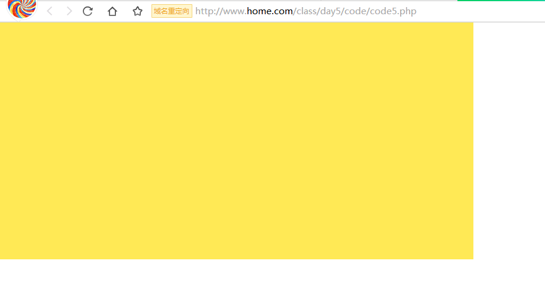

**==需求1小结==**：

函数：


原理：

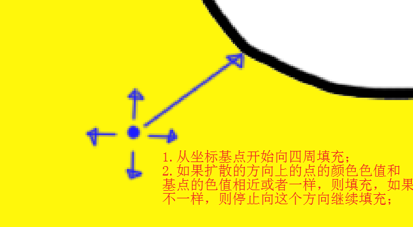


**==需求2==**：创建code6.php程序文件，

1. 使用imagecreate创建一个400*200的画布；

2. 将画布的背景色填充为RGB(255, 233, 85)；

3. 在画布上画一条线段；

4. 将画布以jpeg格式的图片直接输出到浏览器；

5. 效果图为：

   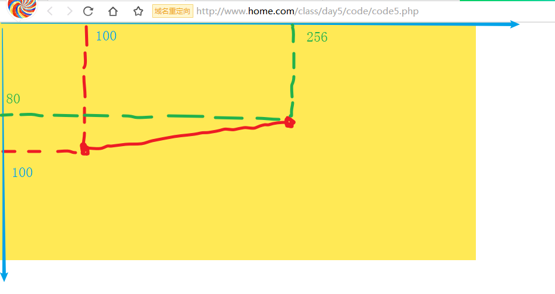

**==解答2==**：创建名为code6.php的程序文件，代码如下：

```php
<?php
#imagecreate创建画布
$img1 = imagecreate(400, 200);

#填充背景色
//分配一个颜色
$color = imagecolorallocate($img1, 255, 233, 85);
//填充背景色
imagefill($img1, 0, 0, $color);

#画线段
//重新选一个原色
$color1 = imagecolorallocate($img1, 30, 122, 76);
//画线段
imageline($img1, 100, 100, 256, 80, $color1);


#将图像输出到浏览器
header('Content-type:image/jpeg');
imagejpeg($img1);
```

访问code6.php，效果为：


**==需求2小结==**：

函数：


原理：

两点之间确定一条线段，所以画线段需要指定起点的（x,y）坐标和终点的(x, y)坐标；


**==需求3==**：创建code7.php程序文件，

1. 使用imagecreate创建一个400*200的画布；

2. 将画布的背景色填充为RGB(255, 233, 85)；

3. 在画布上画一个矩形；

4. 将画布以jpeg格式的图片直接输出到浏览器；

5. 需要的效果图：

   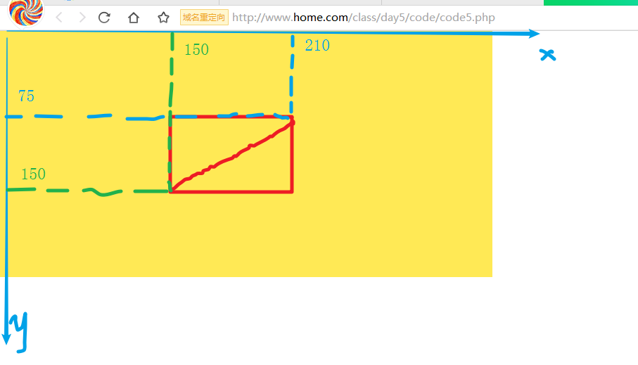

**==解答3==**：创建名为code7.php的程序文件，代码如下：

```php
<?php

#imagecreate创建画布
$img1 = imagecreate(400, 200);

#填充背景色
//分配一个颜色
$color = imagecolorallocate($img1, 255, 233, 85);
//填充背景色
imagefill($img1, 0, 0, $color);

#画线段
//重新选一个原色
$color1 = imagecolorallocate($img1, 30, 122, 76);
//画线段
imagerectangle($img1, 150, 150, 210, 75, $color1);


#将图像输出到浏览器
header('Content-type:image/jpeg');
imagejpeg($img1);
```

访问code7.php，效果为：

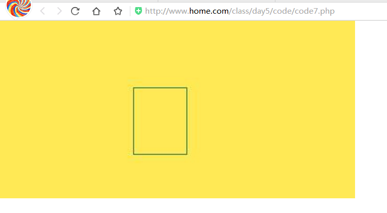

**==需求3小结==**：

函数：


原理：

通过确定对角线的两个点的坐标，实现最终的矩形。


**==需求4==**：创建code8.php程序文件，

1. 使用imagecreate创建一个400*200的画布；
2. 将画布的背景色填充为RGB(255, 233, 85)；
3. 在画布上画一个椭圆；
4. 将画布以jpeg格式的图片直接输出到浏览器；

**==解答4==**：创建名为code8.php的程序文件，代码如下：

```php
<?php

#imagecreate创建画布
$img1 = imagecreate(400, 200);

#填充背景色
//分配一个颜色
$color = imagecolorallocate($img1, 255, 233, 85);
//填充背景色
imagefill($img1, 0, 0, $color);

#画线段
//重新选一个原色
$color1 = imagecolorallocate($img1, 30, 122, 76);
//画弧线段
imagearc($img1, 200, 100, 200, 100, 30, 120, $color1);


#将图像输出到浏览器
header('Content-type:image/jpeg');
imagejpeg($img1);
```

访问code8.php，效果为：

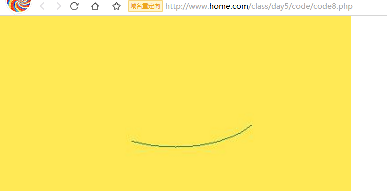

**==需求4小结==**：

函数：

**imagearc**(画布资源,  圆心x坐标,  圆心y坐标,  椭圆宽,  椭圆高,  起点角度,  终点角度,  颜色) 


原理：

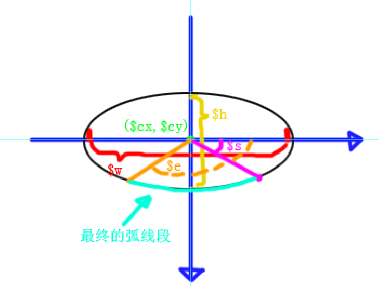

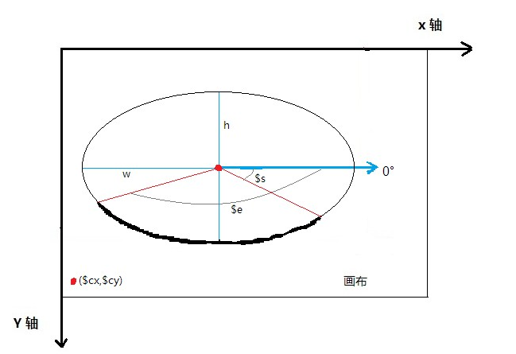


**==需求5==**：创建code11.php程序文件，

1. 使用imagecreate创建一个400*200的画布；
2. 将画布的背景色填充为RGB(255, 233, 85)；
3. 在画布上使用imagestring写一句话："今天天气好晴朗"；
4. 将画布以jpeg格式的图片直接输出到浏览器；

**==解答5==**：创建名为code11.php的程序文件，代码如下：

```php
<?php

#创建画布
$img = imagecreate(400, 200);

#填充背景色
//分配一个颜色
$color = imagecolorallocate($img, 255, 233, 85);
//填充背景色
imagefill($img, 0, 0, $color);

#写字
//分配写字的颜色
$color = imagecolorallocate($img, 122, 36, 79);
//$content = '今天天气好晴朗';//写的内容， 中文变成乱码了
$content = 'abcdefg';//写的内容
imagestring($img, 5, 100, 80, $content, $color);

#输出图像到浏览器
header('Content-type:image/jpeg');
imagejpeg($img);
```

访问code11.php，效果为：

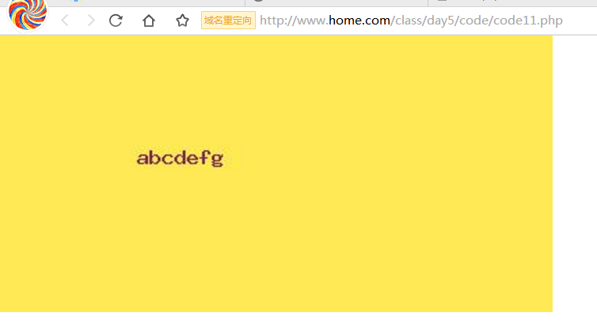

**==需求5小结==**：

函数：


原理：

1. 字体的局限性大；
2. 内容如果输出中文的话，则默认是乱码，因为要开启额外的扩展支持；


**==需求6==**：创建code13.php程序文件，

1. 使用imagecreate创建一个400*200的画布；
2. 将画布的背景色填充为RGB(255, 233, 85)；
3. 在画布上使用imagettftext写一句话："今天天气好晴朗"；
4. 将画布以jpeg格式的图片直接输出到浏览器；

**==解答6==**：创建名为code13.php的程序文件，代码如下：

```php
<?php

#创建画布
$img = imagecreate(400, 200);

#填充背景色
$color = imagecolorallocate($img, 255, 233, 85);
imagefill($img, 0, 0, $color);

#写字
$color = imagecolorallocate($img, 16, 233, 27);
$content = '今天天气好晴朗';
imagettftext($img, 30, 0, 100, 120, $color, 'F:/home/class/day5/code/source/font1.ttf', $content);

#输出图像到浏览器
header('Content-type:image/jpeg');
imagejpeg($img);

```

访问code13.php，效果为：

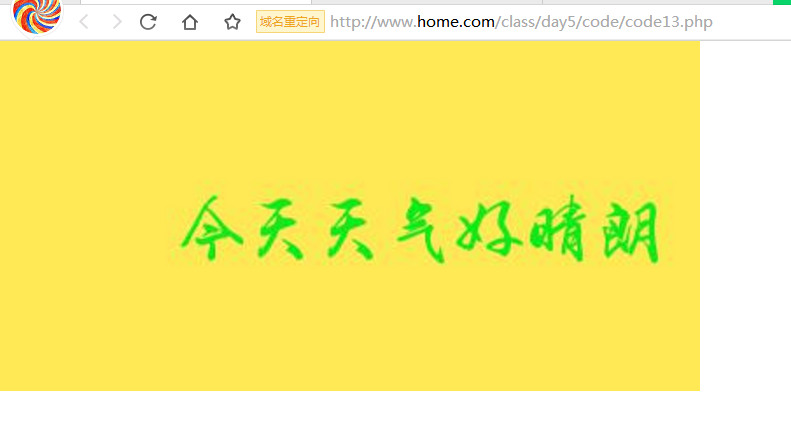

**==需求6小结==**：

函数：


原理：

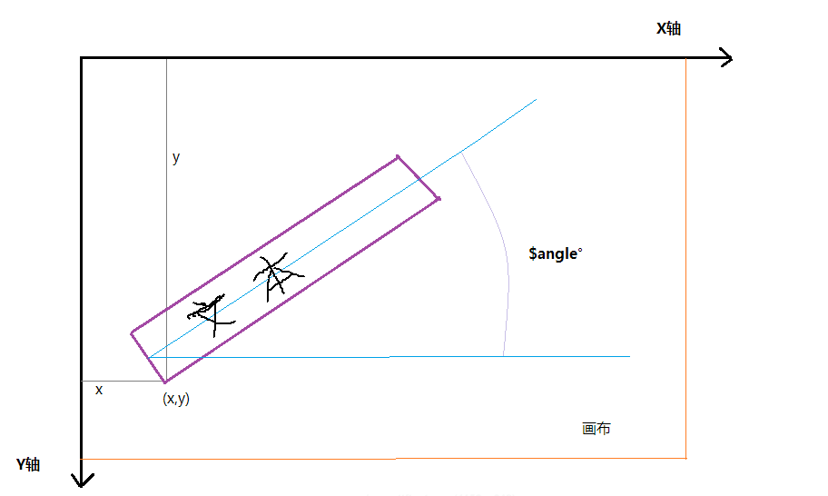

1. 使用这个函数，需要指定自定义的ttf格式的字体来实现；


#### 辅助相关操作

涉及的函数：

> **imagesx**(画布资源)    获得图片的宽度
>
> **imagesy**(画布资源)    获得图片的高度
>
> **getimagesize**(图片路径)    获得图片的宽度和高度等信息


**==需求==**：创建code12.php程序文件，

1. 使用imagecreatefromjpeg创建一个画布；
2. 获取这个画布的宽度；
3. 获取这个画布的高度；
4. 获取这个画布的宽度、高度、位度等信息；

**==解答==**：创建名为code12.php的程序文件，代码如下：

```php
<?php

#创建画布
$img = imagecreatefromjpeg('./1.jpg');

#获取图片宽度和高度
$w = imagesx($img);
$h = imagesy($img);

echo '宽度为：'.$w.'px；高度为' . $h . 'px<br/>'; 

//获得图片的宽高等信息，指定的参数不能是资源，而应该是文件的路径
$info = getimagesize('./1.jpg');
echo '<pre>';
var_dump( $info ); 
```

访问code12.php，效果为：

```mysql
宽度为：500px；高度为300px  #imagesx和imagesy获得的宽度和高度信息

#getimagesize函数获得的宽度，高度，位度等信息
array(7) {
  [0]=>
  int(500)
  [1]=>
  int(300)
  [2]=>
  int(2)
  [3]=>
  string(24) "width="500" height="300""
  ["bits"]=>
  int(8)
  ["channels"]=>
  int(3)
  ["mime"]=>
  string(10) "image/jpeg"
}
```

**==需求小结==**：

1. imagesx和imagesy需要指定画布资源参数；
2. getimagesize需要指定文件路径参数；


## 4. 全天总结

1. 创建画布相关函数

   以下两个函数是根据指定的宽高来创建画布

   imagecreate函数

   imagecreatetruecolor函数

   以下三个函数是根据一张已有的图片来创建画布

   imagecreatefromjpeg函数

   imagecreatefrompng函数

   imagecreatefromgif函数

2. 关闭画布资源操作函数

   imagedestroy函数   销毁画布资源

3. 输出图像操作函数

   以下三个函数即可以将图片直接输出到浏览器（==在输出之前必须指定header('Content-type:image/xxxx')项==），又可以将图片保存成指定格式的图片文件，

   imagejpeg函数

   imagepng函数
   imagegif函数

4. 画布操作相关函数

   imagecolorallocate函数   分配颜色函数

   imagefill函数    填充背景色

   imageline函数   画线段（画点）

   imagerectangle函数   画矩形

   imagearc函数   画弧线段（椭圆，正圆）

   imagestring函数    根据系统字体写字

   imagettftext函数   根据ttf格式的字体写字

5. 打水印操作

   imagecopymerge函数   实现打水印操作

6. 制作缩略图

   imagecopyresampled函数    实现缩略图功能函数

