# 面向对象4

## 1. ==对象的遍历==

对象和数组本质上同属于**复合数据**类型，我们可以在程序中可以对数组进行遍历。


回顾对数组的遍历：

**==需求==**：对以下指定的数组进行foreach遍历

```php
$arr = ['name'=>'zhangsan', 'age'=>12, 'height'=>1.78];
```

**==解答==**：构建名为code1.php的文件，代码如下：

```php
$arr = ['name'=>'zhangsan', 'age'=>12, 'height'=>1.78];

foreach( $arr as $k=>$v ){ 
    echo 'Key：'; 
    var_dump( $k ); echo '<br/>';
    echo 'Value：'; 
    var_dump( $v ); echo '<hr/>';
}
```

访问code1.php的效果：

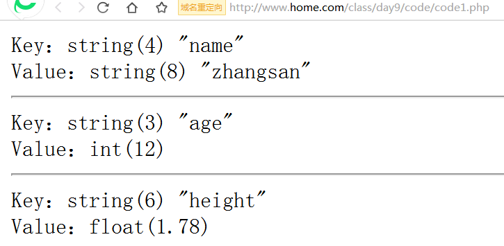

**==小结==**：

1. 遍历数组其实就是每次都去得到数组的一个元素，将数组元素的下标赋值给$k，将数组元素的值赋值给$v；


**提问**：我们可以对数组进行遍历，那么，是否也能够对对象进行遍历呢？

### 默认的对象遍历

我们尝试对对象进行一次遍历测试，


**==需求==**：对$a1对象进行foreach遍历

```php
class A{
    
    public $name='zhangsan';
    public $age=12;
    public $height=1.8;
}

$a1 = new A;
```

**==解答==**：构建名为code2.php的文件，代码如下：

```php
class A{
    
    public $name='zhangsan';
    public $age=12;
    public $height=1.8;
}

$a1 = new A;
var_dump( $a1 ); echo '<hr/>';

foreach( $a1 as $k=>$v ){ 
    echo 'Key：'; 
    var_dump( $k ); echo '<br/>';
    echo 'Value：'; 
    var_dump( $v ); echo '<hr/>';
}
```

访问code2.php的效果：


**==小结==**：

1. 默认的对象遍历，其实就是逐个 的去获得属性的名和属性的值；


### 自定义对象遍历

PHP中，还提供了一种自定义遍历对象的方式。


实现自定义对象遍历的**前提**：需要实现PHP==预定义==接口"Iterator"

自定义对象遍历的**概念**：当==遍历==一个==对象时==，PHP自动==按顺序执行==预定义接口Iterator中实现的==五个方法==。 


PHP预定义接口Iterator：

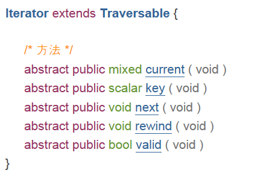


**==需求1==**：测试Iterator接口中五个抽象方法的执行顺序；

**==解答1==**：构建名为code4.php的文件，代码如下：

```php
#使用一个普通类实现预定义接口Iterator
class A implements Iterator{

    public $num=0;

    public function current(){ 
        echo 'current<br/>'; 
    }
    public function key(){ 
        echo 'key<br/>'; 
    }
    public function next(){ 
        echo 'next<br/>'; 
    }
    public function rewind(){ 
        echo 'rewind<br/>'; 
    }
    public function valid(){ 
        if( $this->num<1 ){
            $this->num++;
            echo 'valid<br/>'; 
            return true;
        }else{
            return false;
        }
    }
}

$a1 = new A;
foreach( $a1 as $k=>$v ){ //遍历$a1对象，触发PHP自动去按顺序执行5个被实现了的抽象方法
    
}
```

访问code4.php的效果：

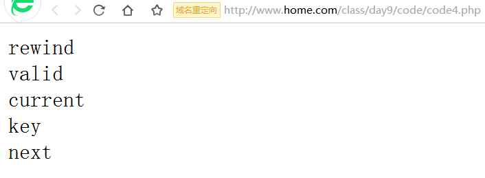

**==小结1==**：

1. 我们从最终的效果中发现，5个抽象方法执行的顺序是：1)rewind方法，2）valid方法，3）current方法，4）key方法，5）next方法；


5个抽象方法的作用前置说明：


**==需求2==**：使用Iterator预定义接口完成对$arr属性中保存的数组数据的遍历；

1. 需要使用如下所示的类：

   ```php
   class A{
       
       public $arr=['name'=>'zhangsan', 'age'=>12, 'height'=>1.78];
   }
   ```

**==解答2==**：构建名为code5.php的文件，代码如下：

```php
#实现Iterator预定义接口
class A implements Iterator{
    
    public $var1='var1';
    public $var2='var2';
    public $arr=['name'=>'zhangsan', 'age'=>12, 'height'=>1.78];

    #rewind方法将会被首次执行
    public function rewind(){ 
        reset($this->arr);//重置$arr属性所保存数组指针到第一个元素的位置
    }

    #当第一轮遍历的时候，valid将会被作为第二个被执行的方法来执行；以后每一轮都将最为第一个被执行的方法来执行
    public function valid(){ 
        if( key($this->arr)===NULL ){//如果当前元素的指针所在位置上的元素下标的值为NULL，则说明指针已经挪出了数组了
            return false;//返回false，停止继续往下循环执行
        }else{//否则则说明指针还在数组里面
            return true;//返回true,继续往下执行
        }
    }
    #当第一轮遍历的时候，current方法将会作为第三个被执行的方法来执行；以后每一轮都将作为第二个被执行的方法来执行
    public function current(){ 
        return current($this->arr);//将当前指针位置上的元素值返回给foreach结构的$v
    }
    #当第一轮遍历的时候，key方法将会作为第四个被执行的方法来执行；以后每一轮都将作为第三个被执行的方法来执行
    public function key(){ 
        return key($this->arr);//将当前指针位置上的元素键返回给foreach结构的$k
    }
    #next方法是每一轮的最后一次将被执行的方法
    public function next(){ 
        next($this->arr);//将$arr属性保存的数组元素的指针向下移动一位
    }
}

$a1 = new A;
foreach( $a1 as $k=>$v ){ 
    echo 'key：'; 
    var_dump( $k ); echo '<br/>';
    echo 'value：'; 
    var_dump( $v ); echo '<hr/>';
}
```

访问code5.php的效果：

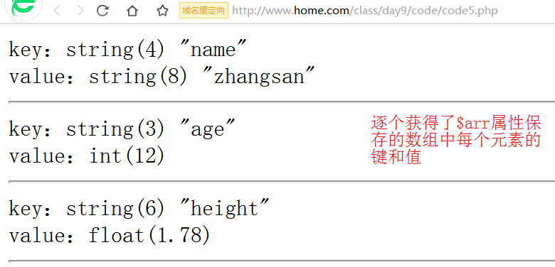

**==小结2==**：

1. 当实现了一个预定义接口Iterator及其5个抽象方法后，再使用遍历的方式去遍历对象的话，则会触发PHP自动按顺序去执行5个实现了的抽象方法；


## 2. ==对象的序列化与反序列化==

在PHP中，如果我们直接将（PHP八种数据类型）数据写入文件中，那么，除了字符串数据外，其他的数据都将会失真。


**==需求==**：按要求完成以下操作；

1. 在code目录中创建code9.php的程序，代码如下，访问该程序页面将八种数据类型数据写入文件中：

   ```php
   #标量数据类型
   $string = 'string';//字符串
   $int = 100;//整型
   $float = 3.14;//浮点
   $bool = true;//布尔
   
   file_put_contents('./txt/string.txt', $string);
   file_put_contents('./txt/int.txt', $int);
   file_put_contents('./txt/float.txt', $float);
   file_put_contents('./txt/bool.txt', $bool);
   
   #复合数据类型
   $array = ['zhangsan', 16];//数组
   $object = new stdClass;//对象
   
   file_put_contents('./txt/array.txt', $array);
   file_put_contents('./txt/object.txt', $object);
   
   #特殊数据类型
   $resource = opendir('./dir');//资源
   $null = null;//null
   
   file_put_contents('./txt/resource.txt', $resource);
   file_put_contents('./txt/null.txt', $null);
   ```

2. 再在code目录下创建code10.php程序，代码如下，访问该程序页面，分别读取八个文件中保存的八种数据，查看最终打印效果，

   ```php
   #标量数据类型
   $string = file_get_contents('./txt/string.txt');
   echo 'string.txt文件的内容：<br/>'; 
   var_dump( $string ); 
   echo '<hr/>';
   
   $int = file_get_contents('./txt/int.txt');
   echo 'int.txt文件的内容：<br/>'; 
   var_dump( $int ); 
   echo '<hr/>';
   
   $float = file_get_contents('./txt/float.txt');
   echo 'float.txt文件的内容：<br/>'; 
   var_dump( $float ); 
   echo '<hr/>';
   
   $bool = file_get_contents('./txt/bool.txt');
   echo 'bool.txt文件的内容：<br/>'; 
   var_dump( $bool ); 
   echo '<hr/>';
   
   
   #复合数据类型
   $array = file_get_contents('./txt/array.txt');
   echo 'array.txt文件的内容：<br/>'; 
   var_dump( $array ); 
   echo '<hr/>';
   
   $object = file_get_contents('./txt/object.txt');
   echo 'object.txt文件的内容：<br/>'; 
   var_dump( $object ); 
   echo '<hr/>';
   
   
   #特殊数据类型
   $resource = file_get_contents('./txt/resource.txt');
   echo 'resource.txt文件的内容：<br/>'; 
   var_dump( $resource ); 
   echo '<hr/>';
   
   $null = file_get_contents('./txt/null.txt');
   echo 'null.txt文件的内容：<br/>'; 
   var_dump( $null ); 
   echo '<hr/>';
   ```

**==解答==**：最终读取txt文件的内容效果为：


**==小结==**：

1. 除了字符串类型在保存前和读取后数据值和数据类型都维持了一致，其余7中数据类型全部都失真了。


在PHP中，将对象进行序列化与反序列化操作就是为了让对象数据类型数据，存储进文件后，再从文件中读取出来也不失真。


### 对象的序列化

**概念**：对象的序列化就是通过==serialize函数==将某个==对象转换==成一个具有固定信息格式的==字符串==。

涉及的函数：

> **serialize**(对象)      将对象进行序列化


**==需求==**：将如下所示的对象$d进行序列化，并且将序列化后的结果输出；

```php
class DirTool{
    public $path;
    public $resource;
    
    public function __construct(){
        $this->path = './dir';
        $this->resource = opendir($this->path);
    }
}

$d = new DirTool;
```

**==解答==**：构建名为code11.php的文件，代码如下：

```php
class DirTool{
    public $path;
    public $resource;
    
    public function __construct(){
        $this->path = './dir';
        $this->resource = opendir($this->path);
    }
}

$d = new DirTool;
var_dump( $d ); //直接打印对象
echo '<hr/>';
$str = serialize($d);//将$d对象进行序列化操作
var_dump( $str ); 

```

访问code11.php的效果：


**==小结==**：

1. 使用serialize函数能够直接将对象进行序列化；
2. 将对象序列化之后，其实就变成了一个具有固定格式的字符串；


#### __sleep魔术方法

当对象被序列化时，如果类中定义了__sleep魔术方法，则该魔术方法将会被PHP自动调用执行。


**==需求==**：在如下所示的类中构建__sleep魔术方法；

```php
class DirTool{
    public $path;
    public $resource;
    
    public function __construct(){
        $this->path = './dir';
        $this->resource = opendir($this->path);
    }
}

$d = new DirTool;
```

1. 在魔术方法中输出"100"，观察访问页面效果；

2. 在魔术方法中构建如下代码，观察访问页面效果；

   ```php
   return array('path');
   ```

**==解答==**：构建名为code12.php的文件，代码如下：

```php
class DirTool{
    public $path;
    public $resource;
    
    public function __construct(){
        $this->path = './dir';
        $this->resource = opendir($this->path);
    }

    //定义一个__sleep魔术方法
    public function __sleep(){ 
        //echo 100; 
        return array('path');//return语句中的数组元素，负责控制将会把哪些属性进行序列化
    }
}

$d = new DirTool;

$str = serialize($d);//将$d对象进行序列化
var_dump( $str ); 
```

访问code12.php的效果：


**==小结==**：

1. PHP不负责定义__sleep魔术方法，只负责调用这个魔术方法；
2. 调用这个魔术方法的时机是，当使用serialize对一个对象进行序列化时，将会触发PHP自动调用执行这个魔术方法；
3. 如果在魔术方法中构建return语句返回数组，则数组可以控制哪些属性将会被序列化，不在数组当中的属性将不会被序列化；


### 对象的反序列化

**概念**：对象的反序列化就是通过unserialize函数将==某个对象序列化后的字符串==**还原回**原来的==对象==。

涉及的函数：

> **unserialize**(序列化后的字符串)      将对象进行反序列化


**==需求1==**：按要求完成以下操作：

1. 构建程序文件code13.php，内容如下，将$str进行反序列化，打印反序列化后的结果，观察效果；

   ```php
   $str = 'O:7:"DirTool":2:{s:4:"path";s:5:"./dir";s:8:"resource";i:0;}';
   ```

**==解答1==**：构建名为code13.php的文件，代码如下：

```php

$str = 'O:7:"DirTool":2:{s:4:"path";s:5:"./dir";s:8:"resource";i:0;}';//这个是某个对象序列化后的字符串结果

#执行反序列化操作
$obj = unserialize($str);

var_dump( $obj ); 
```

访问code13.php的效果：


**==小结1==**：

1. 在反序列化对象时，如果没有原始类的定义，则反序列化后，PHP将会自动把该对象划归为PHP中的一个预定义系统类__PHP\_Incomplete\_Class中；


**==需求2==**：按要求完成以下操作：

1. 构建程序文件codex1.php，内容如下，将$str进行反序列化，打印反序列化后的结果，观察效果；

   ```php
   class DirTool{
       public $path;
       public $resource;
       
       public function __construct(){
           $this->path = './dir';
           $this->resource = opendir($this->path);
       }
   }
   
   $str = 'O:7:"DirTool":2:{s:4:"path";s:5:"./dir";s:8:"resource";i:0;}';
   ```

**==解答2==**：构建名为code16.php的文件，代码如下：

```php
class DirTool{      //原始类的定义
    public $path;
    public $resource;
    
    public function __construct(){
        $this->path = './dir';
        $this->resource = opendir($this->path);
    }
}

$str = 'O:7:"DirTool":2:{s:4:"path";s:5:"./dir";s:8:"resource";i:0;}';//对象序列化后的字符串结果

$obj = unserialize($str);//反序列化回一个对象
var_dump( $obj ); 
```

访问code16.php的效果：


**==小结2==**：

1. 反序列化需要使用unserialize函数来实现；
2. 反序列化时必须要有原始类的定义才能够正确的还原对象；


#### __wakeup魔术方法

当对象序列化的字符串结果被反序列化时，如果类中定义了__wakeup魔术方法，则该魔术方法将会被PHP自动调用执行。


**==需求==**：在如下所示的类中构建__wakeup魔术方法；

```php
class DirTool{
    public $path;
    public $resource;
    
    public function __construct(){
        $this->path = './dir';
        $this->resource = opendir($this->path);
    }
}

$str = 'O:7:"DirTool":2:{s:4:"path";s:5:"./dir";s:8:"resource";i:0;}';
var_dump(unserialize($str));
```

1. 在魔术方法中输出"100"，观察访问页面效果；
2. 在魔术方法中再次把$resource属性的资源值重新还原回来，观察访问页面效果；

**==解答==**：构建名为code17.php的文件，代码如下：

```php
class DirTool{      //原始类的定义
    public $path;
    public $resource;
    
    public function __construct(){
        $this->path = './dir';
        $this->resource = opendir($this->path);
    }

    #构建一个__wakeup魔术方法
    public function __wakeup(){ 
        $this->resource = opendir($this->path);
    }
}

$str = 'O:7:"DirTool":2:{s:4:"path";s:5:"./dir";s:8:"resource";i:0;}';//对象序列化后的字符串结果

$obj = unserialize($str);//反序列化回一个对象
var_dump( $obj ); 
```

访问code17.php的效果：


**==小结==**：

1. PHP不负责定义__wakeup魔术方法，只负责调用该方法；
2. 调用该魔术方法的时机：当反序列化一个对象序列化字符串结果时，将会被PHP自动调用执行一次；


## 3. ==反射机制==

函数拓展：

> **get_declared_classes**()   获得当前程序脚本中所定义出的所有类的类名
>
> **get_class_methods**(类名)    获得类中定义的方法信息

 

我们可以在程序中通过以上两个函数和其他的一些函数获得类中相关的一些简单信息。但是有时候我们需要获得更加详细的类中的信息，通过这些简单函数就没有办法获得了。那怎么呢？

 

在PHP中，我们可以通过反射机制来获得更详细的类中的信息！反射机制可以形象的比喻为： X光机 或 照妖镜


在PHP中，我们是通过PHP==预定义==好的类来实现反射机制的，

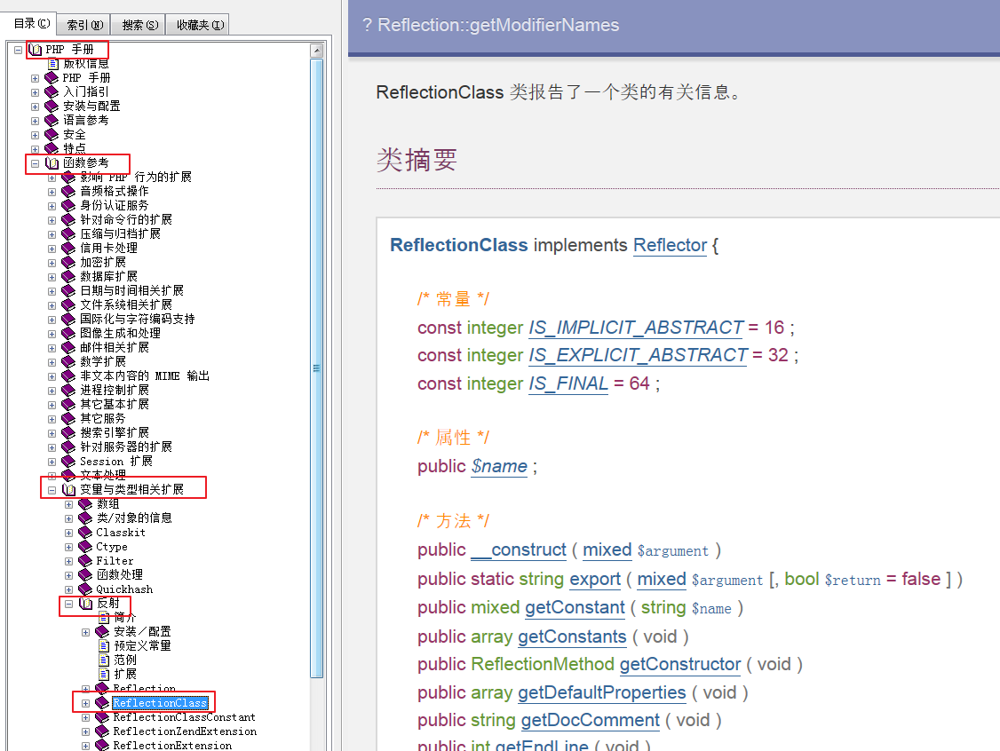


反射机制可以分为：1）类的反射；2）类常量的反射；3）类属性的反射；4）类方法的反射；5）类方法参数的反射；


### 类的反射

涉及的方法：

> ReflectionClass::export    反射指定的类的信息
>
> getFileName    反射类所在的文件名
>
> implementsInterface    判断某个类是否实现了某个接口


**==需求1==**：引入code/prepare/CatpchaTool.class.php文件，使用ReflectionClass::export反射CaptchaTool类的信息；

**==解答1==**：构建名为code20.php的文件，代码如下：

```php
include './prepare/CaptchaTool.class.php';//引入类文件

echo '<pre>';
//ReflectionClass::export('CaptchaTool');//第一个参数可以是  类名

//$obj = new CaptchaTool;
//ReflectionClass::export($obj);//第一个参数也可以是基于某个类创建的对象

$info = ReflectionClass::export('CaptchaTool', true);//第二个参数如果不指定，则信息将会直接输出到浏览器，如果指定为true，则信息将会以返回值的信息返回
echo '<pre>';
var_dump( $info ); 

```

访问code20.php的效果：

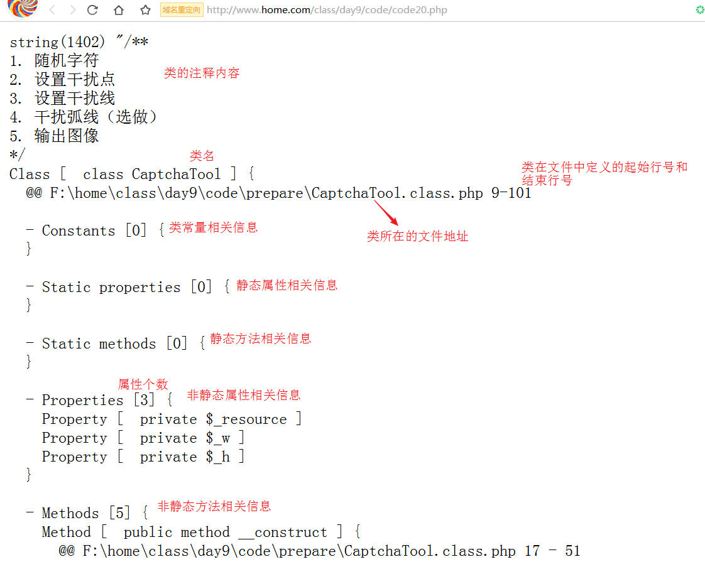

**==小结1==**：

1. ReflectionClass::export可以实现获得类中的详细类信息；


**==需求2==**：引入code/prepare/CatpchaTool.class.php文件，使用getFileName方法反射CaptchaTool类所在的文件名；

**==解答2==**：构建名为code21.php的文件，代码如下：

```php
include './prepare/CaptchaTool.class.php';//引入类文件

$obj = new ReflectionClass('CaptchaTool');//创建ReflectionClass类的对象，反射CaptchaTool类中的信息
var_dump( $obj ); echo '<hr/>';
$fileName = $obj->getFileName();//获得CaptchaTool类所在的文件
var_dump( $fileName ); 
```

访问code21.php的效果：


**==小结2==**：

1. getFileName能够获取某个类所在的文件全路径。


**==需求3==**：使用如下代码，按要求完成操作：

```php
interface inter1{}
interface inter2{}

class A implements inter2{}
```

1. 使用implementsInterface方法反射A类是否实现了inter1和inter2接口；

**==解答3==**：构建名为code22.php的文件，代码如下：

```php
interface inter1{}
interface inter2{}

class A implements inter2{}

$obj = new ReflectionClass('A');//实例化ReflectionClass反射类的对象，反射A类的信息
$re = $obj->implementsInterface('inter1');//判断需要反射的A类是否有实现指定的inter1接口
var_dump( $re ); echo '<hr/>';//返回false意味着没有实现inter1接口
$re = $obj->implementsInterface('inter2');//判断需要反射的A类是否有实现指定的inter2接口
var_dump( $re ); //返回true意味着实现了inter2接口
```

访问code22.php的效果：


**==小结3==**：

1. implementsInterface方法可以判断某个类是否实现了某个接口。


### 类常量的反射

涉及的方法：

> getConstants方法    获得所有相关常量的信息


**==需求==**：使用如下代码，按要求完成操作：

```php
class A{
    const URL='www.home.com';
}
```

1. 使用getConstants方法反射A类中的常量信息；

**==解答==**：构建名为code23.php的文件，代码如下：

```php
class A{
    const URL='www.home.com';
    const PATH='./source';
}

$obj = new ReflectionClass('A');//实例化ReflectionClass反射类的对象，反射A类的信息
$info = $obj->getConstants();//获得类常量的所有信息
var_dump( $info ); 
```

访问code23.php的效果：


**==小结==**：

1. getConstants方法可以获取所有常量的信息；


### 类属性的反射

涉及的方法：

> getProperties方法  获得类中所有属性的信息 


**==需求==**：引入code/prepare/CatpchaTool.class.php文件，使用getProperties方法反射CaptchaTool类中所有属性的信息；

**==解答==**：构建名为code24.php的文件，代码如下：

```php
include './prepare/CaptchaTool.class.php';//引入类文件

$obj = new ReflectionClass('CaptchaTool');//创建ReflectionClass类的对象，反射CaptchaTool类中的信息
$info = $obj->getProperties();
echo '<pre>';
var_dump( $info ); 
```

访问code24.php的效果：

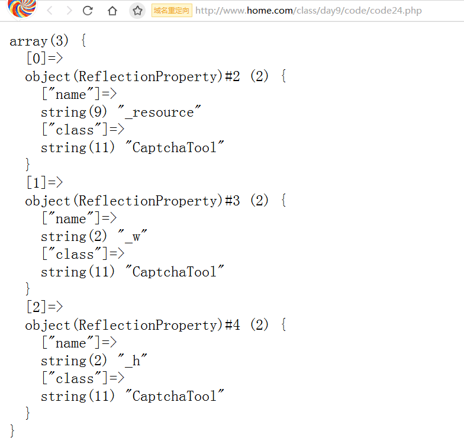

**==小结==**：

1. getProperties可以获取类中所有的属性信息；


### 类方法的反射

涉及的方法：

> getMethods方法  获得类中所有方法的信息


**==需求==**：引入code/prepare/CatpchaTool.class.php文件，使用getMethods方法反射CaptchaTool类中所有方法的信息；

**==解答==**：构建名为code25.php的文件，代码如下：

```php
include './prepare/CaptchaTool.class.php';//引入类文件

$obj = new ReflectionClass('CaptchaTool');//创建ReflectionClass类的对象，反射CaptchaTool类中的信息
$info = $obj->getMethods();
echo '<pre>';
var_dump( $info ); 
```

访问code25.php的效果：

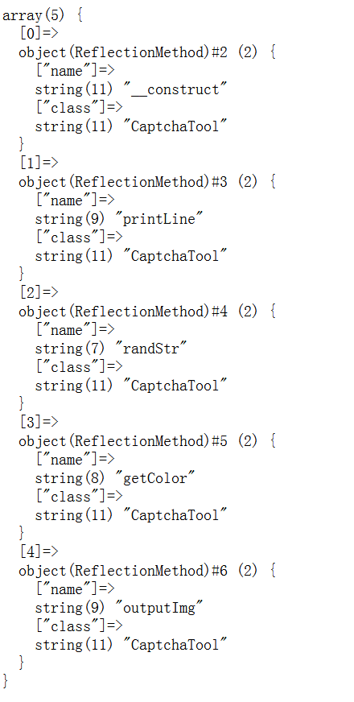

**==小结==**：

1. getMethods可以获取类中所有方法名；


### 类方法参数的反射

涉及的方法：

> ReflectionMethod::export     反射指定方法的参数信息


**==需求==**：引入code/prepare/CatpchaTool.class.php文件，使用ReflectionMethod::export方法反射CaptchaTool类中getColor方法所有参数的信息；

**==解答==**：构建名为code26.php的文件，代码如下：

```php
include './prepare/CaptchaTool.class.php';//引入类文件

echo '<pre>';
//ReflectionMethod::export('CaptchaTool', 'getColor');//反射CaptchaTool类中的getColor方法中的所有参数信息，不指定第三个参数，默认是false，表示直接将信息输出到浏览器
$info = ReflectionMethod::export('CaptchaTool', 'getColor', true);//
var_dump( $info ); 
```

访问code26.php的效果：


**==小结==**：

1. ReflectionMethod::export可以反射指定类中某个指定方法的所有参数信息；


## 4. ==命名空间==

**提问**：我们在电脑中，如何创建两个同名的文件？

回答： 在不同的文件夹下创建同名文件即可。

 

**提问**：在PHP中，同一个脚本代码程序里，是否能够创建两个相同名的函数？

回答：正常情况下，是不行的。但是，如果使用了命名空间，则允许创建同名函数。


命名空间的定义语法：

```php
#关键字为namespace
namespace  空间名; 
```


**==需求==**：在程序中实现定义两个同名函数f1；

**==解答==**：构建名为code27.php的文件，代码如下：

```php
namespace first;//定义一个命名空间名字叫first空间

function f1(){ 
    echo 'f1'; 
}

namespace second;//定义一个命名空间，名字叫second空间

function f1(){ 
    echo 'new-f1'; 
}
```

访问code27.php的效果：


**==小结==**：

1. 可以使用关键字namespace定义命名空间；


**==注意事项==**：命名空间==首次定义==之前不能有任何PHP非注释代码；

==演示案例==：

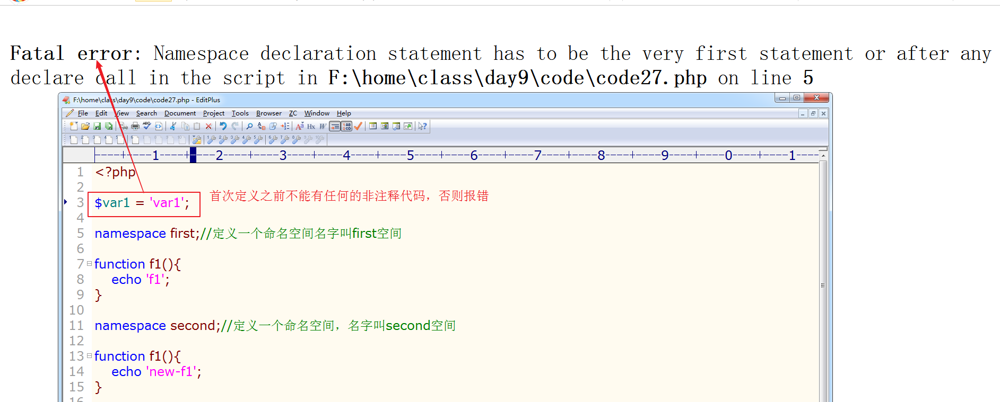


### 空间成员

命名空间所支持控制的成员包括三种：1）函数；2）类；3）老版本的常量；


### 全局空间和子空间

全局空间示例：程序页面中未指定命名空间的部分就属于全局空间。


==子空间示例==：

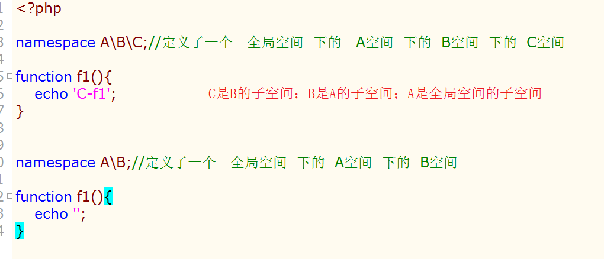


### 命名空间的三种访问方式

命名空间的三种访问方式包括：1)非限定名称访问；2）完全限定名称访问；3）限定名称访问；


#### 非限定名称访问

**概念**：所谓的非限定名称访问，指的就是在访问的成员前面不加上命名空间。 

==演示案例==：

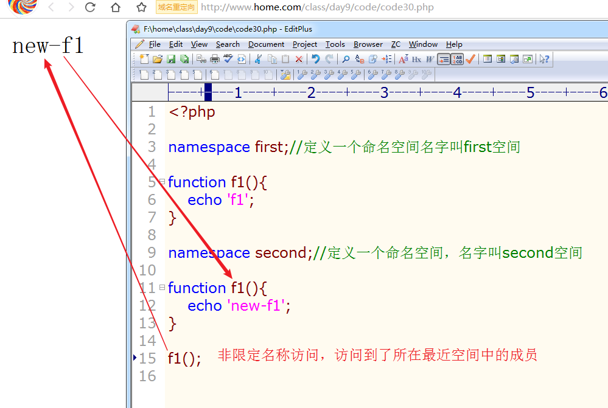


#### 完全限定名称访问(推荐)

**概念**：完全限定名称访问指的就是从全局空间开始指定一直访问到该成员的访问方式。 

==演示案例==：

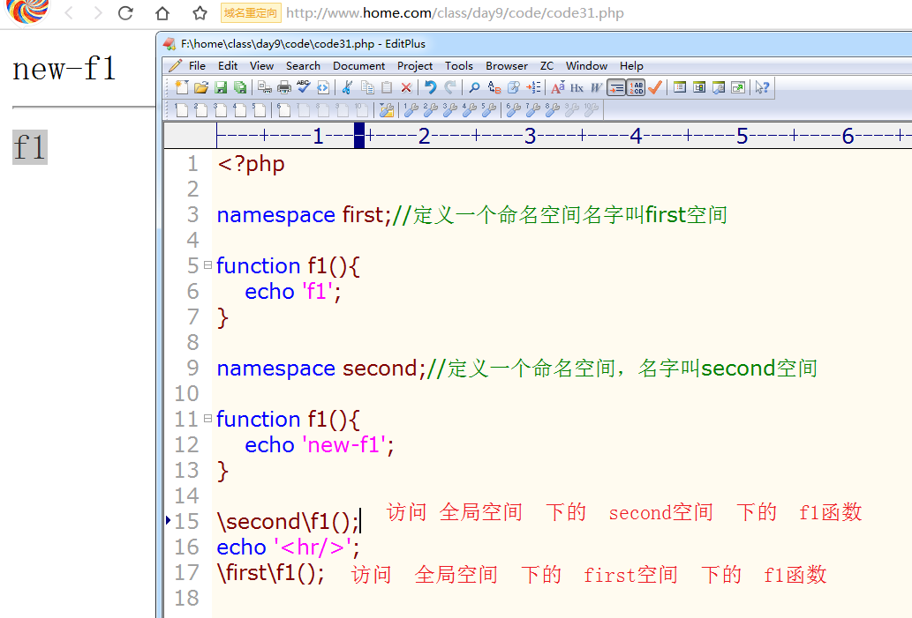


#### 限定名称访问

**概念**：表示从当前空间开始，直接指定子空间的成员。 

==演示案例==：

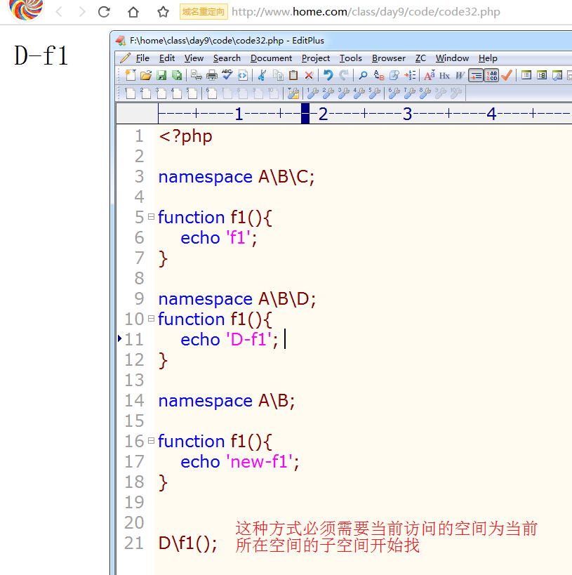


#### 总结

1. 完全限定名称访问的方式是从全局空间开始一直指定到需要访问的成员为止；


### 空间引入

==演示案例==：

构建一个名为code34.php的文件，代码如下：

```php
namespace second;

function f1(){ 
    echo 'second-f1'; 
}
```

再构建一个名为code33.php的文件，代码如下：

```php
namespace first;

function f1(){ 
    echo 'first-f1'; 
}

include './code34.php';

f1();
```

访问code33.php效果为：


**==小结==**：

从上面的案例效果来看，我们发现没有输出second-f1，而是输出了first-f1，说明非限定名称访问方式访问到的最近的空间是first，为什么不是引入进来的second空间？


#### 空间引入的原理

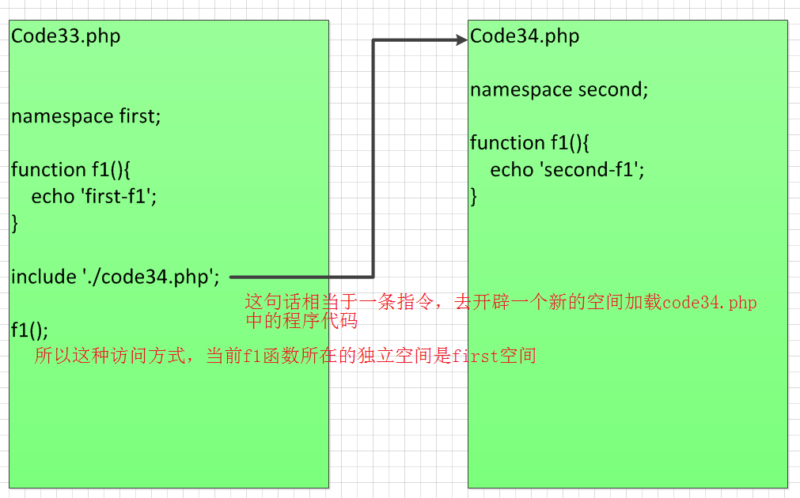


### 空间类的引入

==演示案例==：

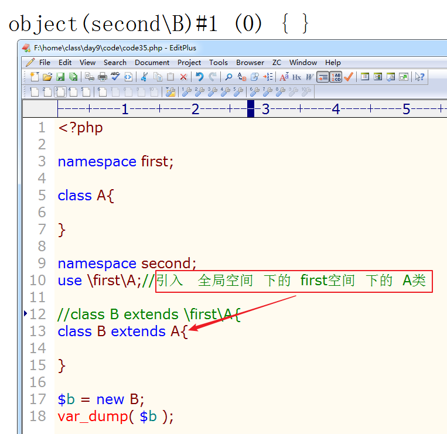


**==小结==**：

1. 空间类的引入必须引入到具体的类名上；


## 5. 全天总结

1. 对象的遍历：1）默认的对象遍历；2）自定义的对象遍历；

   默认的对象遍历：foreach遍历一个对象，就是逐个去获得对象中的属性名和属性值；

   自定义对象的遍历：（如果实现了一个名为Iterator的预定义接口）foreach遍历一个对象时，则会触发PHP自动按顺序调用执行5个被实现了的接口抽象方法；

2. 对象的序列化：使用serialize函数将一个对象进行序列化，如果存在__sleep魔术方法，则序列化一个对象时将会触发PHP自动调用执行一次该魔术方法；

   对象的反序列化（必须要有原始类的定义）：使用unserialize函数将一个对象序列化后的字符串结果还原回原来的对象；如果存在__wakeup魔术方法，则反序列化时将会触发PHP自动调用执行一次该魔术方法；

3. 反射机制的概念：通过PHP内置的预定义系统类，获得某个指定的类中所有的相关成员的信息；

4. 定义命名空间：使用namespace关键字定义命名空间；

   ==完全限定名称==访问调用命名空间成员：从全局空间开始，一直指定到这个成员为止。


