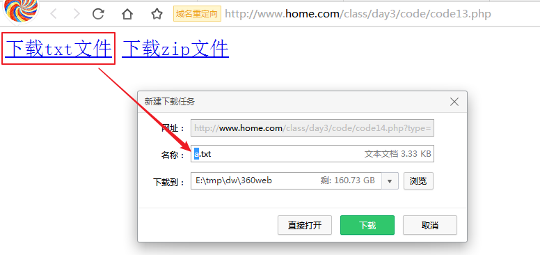

## 案例：文件下载

**==操作需求==**：实现文件下载功能，要求：

1. 通过下载页面可以下载code/dw目录中的txt文件和zip文件；
2. 下载txt文件指定默认的新名字为a.txt；zip文件指定默认的新名字为b.zip；

**==步骤==**：

第一步，构建名为code13.php的程序页面，代码如下：

```html
<!DOCTYPE html>
<HTML>
<head>
    <meta charset="UTF-8">
    <title>文件下载</title>
</head>
<body>
    
    <a href="http://www.home.com/class/day3/code/code14.php?type=1">下载txt文件</a>
    <a href="http://www.home.com/class/day3/code/code14.php?type=2">下载zip文件</a>

</body>
</HTML>
```

第二步，构建名为code14的程序处理页面，代码如下：

```php
<?php

$type = $_GET['type'];//接收type值

if( $type==1 ){//表示下载的是txt文件

    $newFileName = 'a.txt';//下载后默认的新名字
    $oriFile = './dw/article.txt';//需要下载的txt文件的路径

}elseif( $type==2 ){//表示下载zip文件

    $newFileName = 'b.zip';//下载后默认的新名字
    $oriFile = './dw/fscp.zip';//需要下载的zip文件的路径
}

//  表示 服务器告诉浏览器  服务器接下来响应的数据的内容类型是文件流类型的
header('Content-type:application/octet-stream');
//  表示  服务器告诉浏览器  服务器接下来返回的内容你浏览器应该当成附件的形式来处理，这个附件新名字叫filename所指定的名字
header('Content-disposition:attachment; filename='.$newFileName);
//  将读取的文件内容响应给浏览器
echo file_get_contents($oriFile); 
```

第三步，测试使用效果：

访问code13.php，点击下载txt文件，



点击之后，弹出上图所示下载框，新名字为a.txt，

然后选择下载路径，直接下载，


