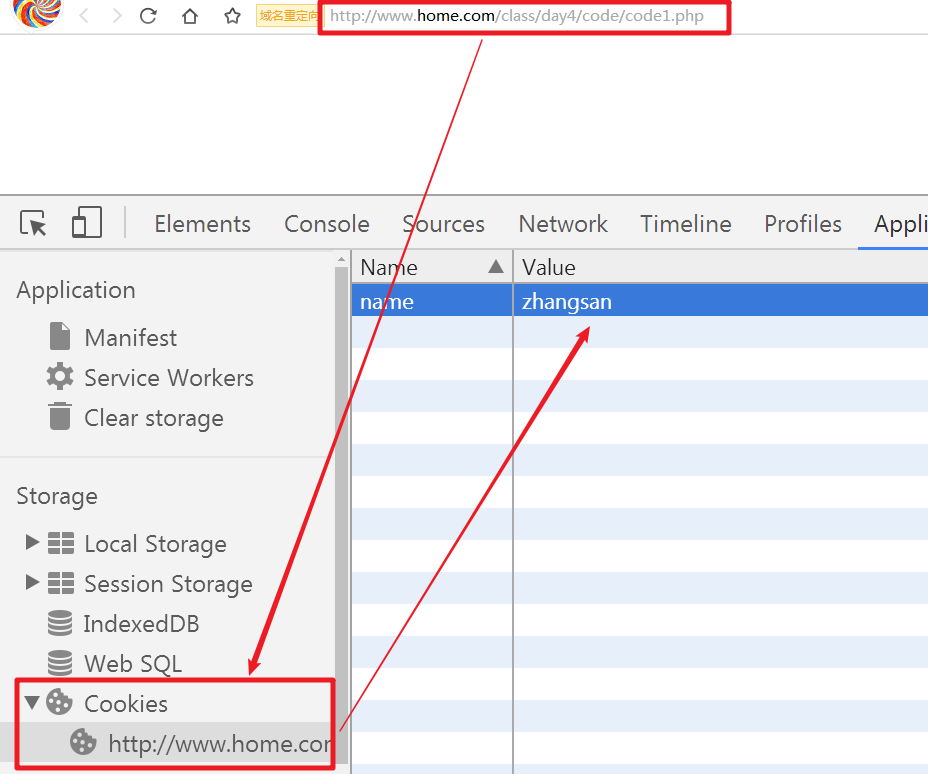
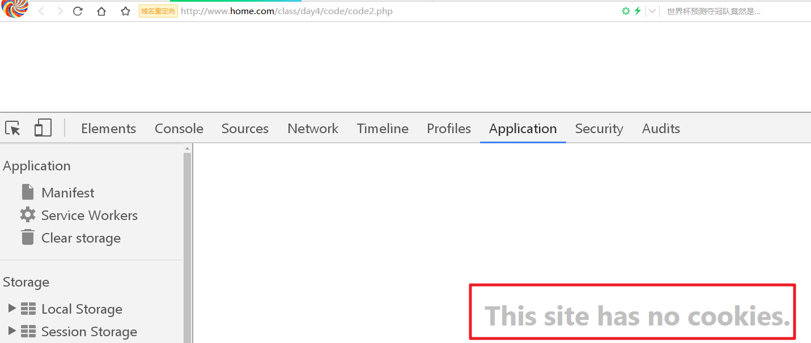
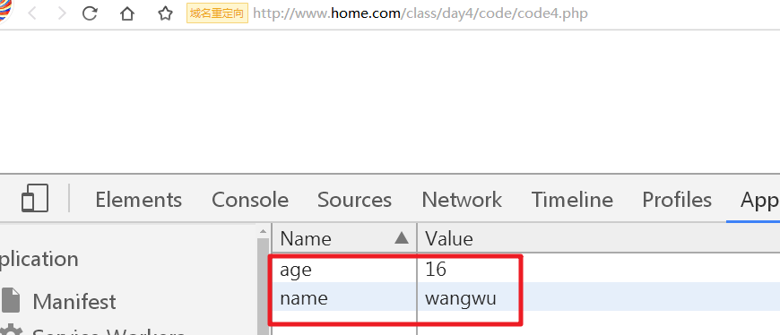
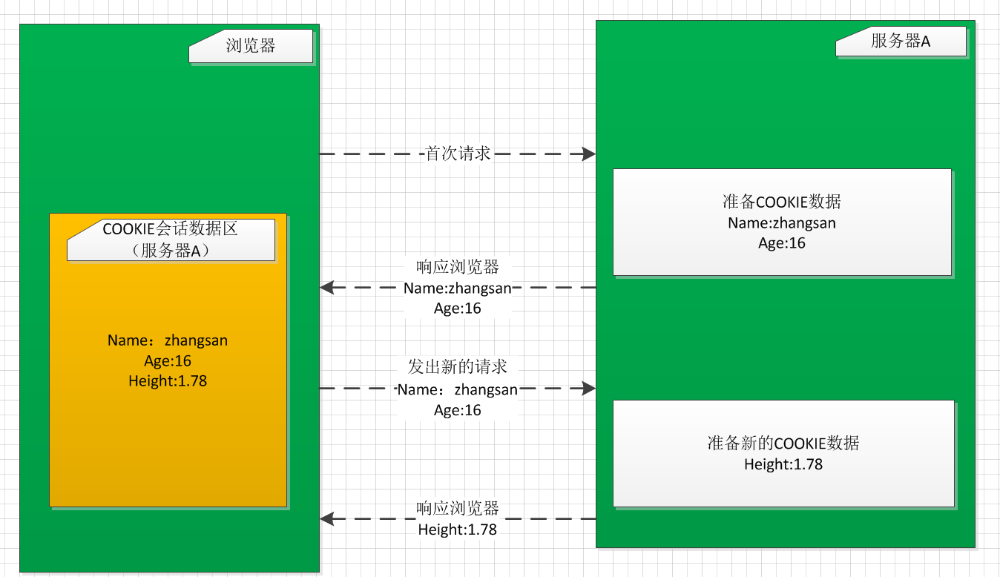
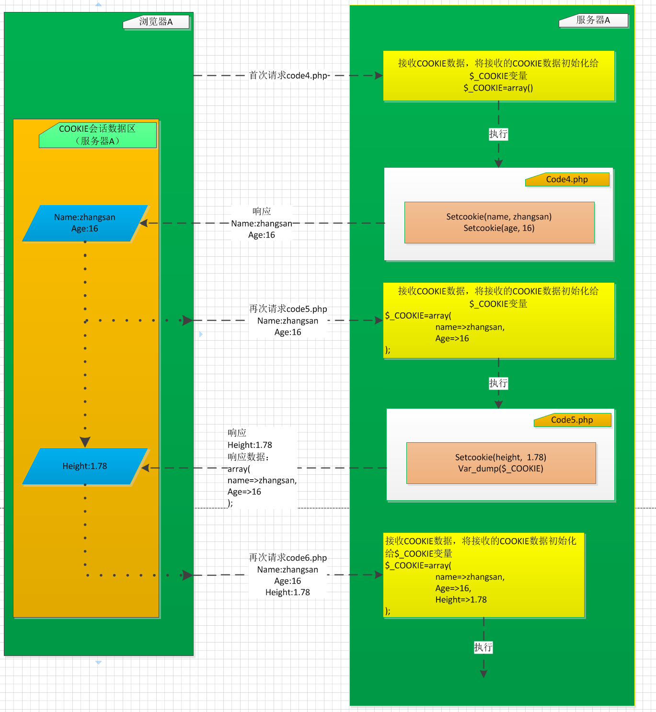
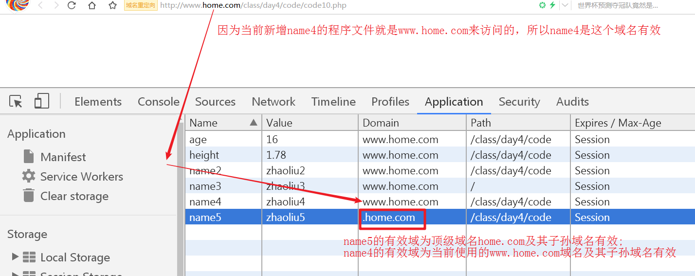
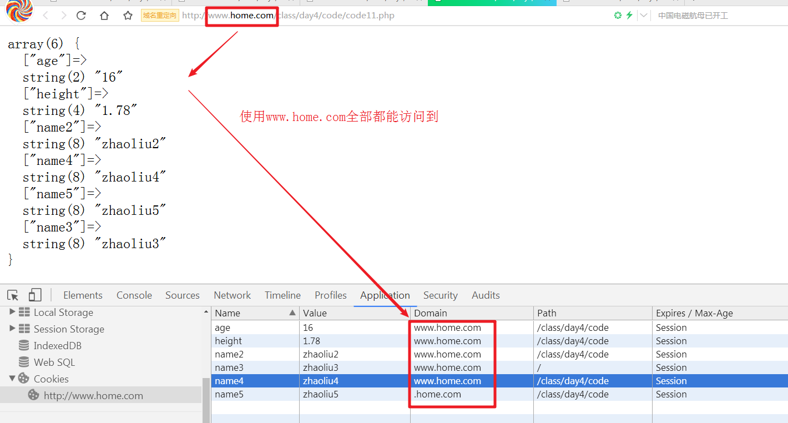
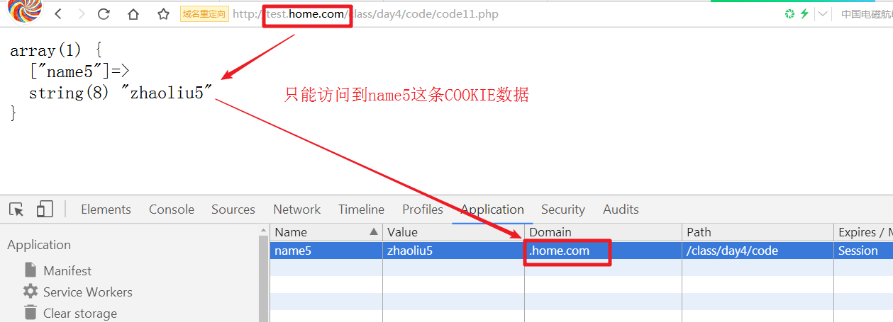
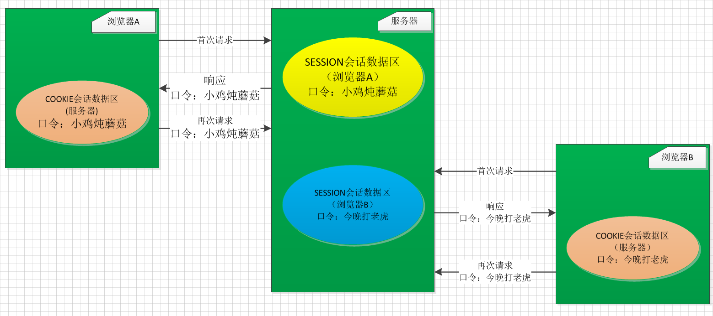
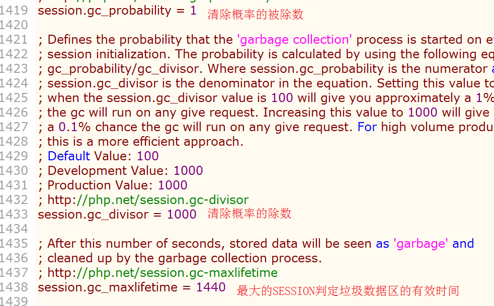

# 会话技术

## 1. 会话技术相关概念

### 为什么使用会话技术

1)我们访问网站走的是HTTP协议，协议具有无连接无状态的特性，对事物的处理不具有记忆能力；

2)我们在web项目中，很多时候需要将会话数据记忆存储，以便后续的程序能够随时调用和使用；

 

在web项目中我们可以通过会话技术解决以上问题。


### 什么是会话技术

通俗的讲：会话技术就是浏览器和服务器“唠嗑”。


**==概念==**：在web页面访问过程中，使访问过程中产生的数据==持久化存储==的一种技术。


## 2. 会话技术的分类

会话技术按==照数据存储的位置==划分，分为两类：

- [x] COOKIE技术；
- [x] SESSION技术；


## 3. ==COOKIE技术==

==**概念**==：将数据持久化存储在==浏览器端==，并且能够==使数据标识服务器==的一种技术。


### 基本操作

#### 设置操作（增删改）

涉及的函数：

> **setcookie**(名,  值)       设置COOKIE数据


**==需求==**：分别实现增、删、改COOKIE数据的操作，要求

1. 访问code1.php文件，实现新增一条COOKIE数据，名为：name，值为：zhangsan；
2. 访问code2.php文件，实现修改"1"中新增的COOKIE数据，新值为：lisi；
3. 访问code3.php文件，实现删除COOKIE数据name；

**==解答==**：构建名为code1.php的程序文件，代码如下：

```php
<?php

#新增COOKIE数据
setcookie('name', 'zhangsan');
```

访问code1.php后新增COOKIE数据的效果为：



构建名为code2.php的程序文件，代码如下：

```php
<?php

#修改COOKIE数据，名不变，值改变
setcookie('name', 'lisi');
```

访问code2.php后修改COOKIE数据的效果为：原来为zhangsan，现在为lisi


构建名为code3.php的程序文件，代码如下：

```php
<?php

#删除COOKIE数据，名不变，值变为空字符串
setcookie('name', '');
```

访问code3.php后删除COOKIE数据的效果为：原来有name=lisi数据，现在被删除了




**==小结==**：

1. setcookie函数可以实现增，删，改COOKIE数据的操作。


#### 查看操作

**==需求==**：分别查看COOKIE数据的操作，要求

1. 访问code4.php文件，实现新增两条COOKIE数据，第一条名为：name，值为：wangwu，第二条名为：age，值为：16；
2. 访问code5.php文件，实现新增一条COOKIE数据名为：height，值为：1.78，同时查看并打印所有的COOKIE数据；
3. 访问code6.php文件，查看并打印出所有的COOKIE数据；

**==解答==**：构建名为code4.php的程序文件，代码如下：

```php
<?php

#新增两条COOKIE数据
setcookie('name', 'wangwu');
setcookie('age', '16');
```

访问code4.php后新增COOKIE数据的效果为：



构建名为code5.php的程序文件，代码如下：

```php
<?php

//再新增一条COOKIE数据
setcookie('height', 1.78);

#打印目前所有的COOKIE数据
var_dump( $_COOKIE ); 
```

访问code5.php后打印效果为：


构建名为code6.php的程序文件，代码如下：

```php
<?php

#打印目前所有的COOKIE数据
var_dump( $_COOKIE ); 
```

访问code6.php后打印效果为：


**==小结==**：

1. 查询操作只需要使用$_COOKIE超全局预定义数组变量就可以办到。


**==提问==**：在访问code4.php时首先生成了两条COOKIE数据，然后再访问code5.php时在程序中又新增了一条COOKIE数据，按道理来说一共现在有3条COOKIE数据，但是访问code5.php时只打印出了code4.php中生成的2条，然而，再访问新的文件code6.php时却能够打印三条，为什么呢？


### COOKIE技术的基本原理

**==原理图==**：




**==小结==**：

1. COOKIE数据时存储在浏览器端的；
2. 每当请求服务器时，只要存在该服务器的COOKIE数据，则会随着本次请求将**==所有==**的COOKIE数据全部携带上，一起去到服务器；


### setcookie与$_COOKIE变量之间的关系

**==关系图==**：




**==小结==**：

1. setcookie函数只负责一件事情，在接下来响应浏览器的时候，告诉浏览其应该去设置一条什么样的COOKIE；
2. $_COOKIE只有在程序编译阶段才被PHP执行初始化操作，执行setcookie函数不会直接操作到$\_COOKIE;


### COOKIE数据的属性设置

setcookie除了前两个参数表示名和值之外，还有五个属性相关的参数，分别是： 

> **setcookie**(名, 值, ==有效期==，==有效路径==，==有效域==，==是否安全传输==，==httponly==);


#### 有效期

通过setcookie函数的第三个参数来进行设置的；

==不设置==或==设置为0==表示==默认==情况，为一个会话周期；

默认情况一个会话周期为从新增该条COOKIE到浏览器关闭为止。


**==需求==**：新增一条COOKIE数据，名为：name1，值为：zhaoliu；同时设置这条COOKIE数据的有效期为当前时间过3秒失效。

**==解答==**：构建名为code7.php的程序文件，代码如下：

```php
<?php

//        设置有效期为当前时间3秒后失效
setcookie('name1', 'zhaoliu', time()+3);
```

访问code7.php，观察监控面板效果：

访问时，生成的COOKIE数据


3秒后，刷新监控面板，发现被浏览器自动清除了，说明有效期生效


**==小结==**：

1. 有效期能够控制COOKIE数据存活的生命周期；
2. 我们时常利用COOKIE数据的有效期来设置一个过期的时间，以达到删除某条COOKIE数据的效果；


#### 有效路径

通过setcookie函数的第四个参数来进行设置的；

==不设置==或==设置为空字符串==表示默认情况；

默认情况表示当前程序所在目录及其子目录有效。


**==需求==**：在code目录中创建名为code9.php的程序文件，新增2条COOKIE数据，

1. 第一条名为：name2，值为：zhaoliu2，不设置其他属性；第二条名为：name3，值为：zhaoliu3，要求这条COOKIE数据的有效路径为"/"；
2. 在当前目录中新建一个新目录demo1，在新目录中创建一个新的程序文件code_demo.php，打印出所有能够获得的COOKIE数据；
3. 在code目录的上级目录中创建一个新的程序文件code_up.php，打印出所有能够获得的COOKIE数据；

**==解答==**：在code目录下构建名为code9.php的程序文件，代码如下：

```php
<?php
//设置了一条普通的COOKIE数据
setcookie('name2', 'zhaoliu2');
//下面这条COOKIE数据的有效路径被设置成了“/”,表示网站的根目录及其子孙目录全有效
setcookie('name3', 'zhaoliu3', 0, '/');
```

访问code9.php，观察监控面板效果：


在code新建一个新目录demo1，并且在新目录中创建一个新的程序文件code_demo.php，代码如下：

```php
<?php
echo '<pre>';
var_dump( $_COOKIE ); 
```

访问code_demo.php文件，观察打印效果：


在code目录的上级目录创建一个新的程序文件code_up.php，代码如下：

```php
<?php

echo '<pre>';
var_dump( $_COOKIE ); 
```

访问code_up.php文件，观察打印效果：


**==小结==**：

1. 我们可以通过setcookie第四个参数设置COOKIE数据的有效路径；
2. 所能设置的最大有效路径，只能到网站的根目录，网站根目录用"/"表示；


#### 有效域

通过setcookie函数的第五个参数来进行设置的；

==不设置==或==设置为空字符串==表示默认情况；

默认情况表示当前域名及其子域名有效。


**==需求==**：完成以下要求：

1. 配置一个新的域名"test.home.com"和已有的www.home.com域名指向相同的目录；
2. 构建名为code10.php的程序文件，使用www.home.com域名访问，实现新增两条COOKIE数据，第一条名为：name4，值为：zhaoliu4，不设置其他属性；第二条名为：name5，值为：zhaoliu5，要求这条COOKIE数据的有效域为"home.com"；
3. 构建code11.php文件，在文件中实现打印所有COOKIE数据操作，观察使用www.home.com访问时的效果和test.home.com访问时的效果；

**==解答==**：

首先打开apache的虚拟主机配置文件，新增test.home.com虚拟主机域名配置项，参照www.home.com的配置，如下图所示，


构建名为code10.php的程序文件，代码如下：

```php
<?php
//设置了一条普通的COOKIE数据
setcookie('name4', 'zhaoliu4');
//设置第五个参数为顶级域名home.com
setcookie('name5', 'zhaoliu5', 0, '', 'home.com');
```

访问code10.php，观察监控面板效果：



构建名为code11.php的程序文件，代码如下：

```php
<?php
echo '<pre>';
var_dump( $_COOKIE ); 
```

使用www.home.com访问，效果为：



使用test.home.com访问，效果为：




**==小结==**：

1. 默认情况下，普通的COOKIE数据在当前域名及其子域名有效；
2. 可以通过第五个参数进行修改，但是最大的域名只能设置成顶级域名；


#### 是否安全传输

通过setcookie函数的第六个参数来进行设置的；

==不设置==或==设置为false==表示默认情况；

默认情况表示http或https下都有效，如果将值设置为true,则表示只有在https下才有效（包括增删改查）。


**==需求==**：完成以下要求：

1. 在day4/code/code13.php新增1条COOKIE数据，名为：name6，值为：zhaoliu6，将是否安全传输出行设置为true，使用http://www.home.com域名访问，查看执行效果；
2. 在day3/code/code_day4.php新增1条COOKIE数据，名为：name6，值为：zhaoliu6，将是否安全传输出行设置为true，使用https://www.t1.com域名访问，查看执行效果；

**==解答==**：在day4/code构建名为code13.php的程序文件，代码如下：

```php
<?php
//将第六个是否安全传输参数设置为true
setcookie('name6', 'zhaoliu6', 0, '', '', true);
```

使用http://www.home.com域名访问code13.php，观察监控面板效果：


在day3/code构建名为code_day4.php的程序文件，代码如下：

```php
<?php
//将第六个是否安全传输参数设置为true
setcookie('name6', 'zhaoliu6', 0, '', '', true);
```

使用https://www.t1.com域名访问code_day4.php，观察监控面板效果：


**==小结==**：

1. 如果要想在https下专门设置COOKIE数据成功，则必须指定第六个参数为true;


#### httponly

通过setcookie函数的第七个参数来进行设置的；

==不设置==或==设置为false==表示默认情况；

默认情况表示除了能够使用原程序脚本代码访问以外，还能够通过其他脚本语言访问到COOKIE数据。如果设置为true，则表示==只==允许原程序脚本代码进行操作。


**==需求==**：实现如下操作，要求：

1. 构建code14.php程序文件，新增三条COOKIE数据，第一条数据名为：name，值为：zhangsan；第二条数据名为：age，值为：16；第三条数据名为：name1，值为：zhaoliu1，要求第三条数据设置httponly属性为true；
2. 构建code15.php程序文件，使用PHP打印出所有的COOKIE数据；同时使用javascript代码也打印能够获取的COOKIE数据；

**==解答==**：构建code14.php，代码如下：

```php+HTML
<?php

setcookie('name', 'zhangsan');
setcookie('age', 16);
//设置第七个参数为true，表示httponly属性开启
setcookie('name1', 'zhaoliu1', 0, '', '', false, true);
```

访问code14.php，监控面板观察新增的COOKIE数据如下：


构建code15.php，代码如下：	

```php+HTML
<?php

var_dump( $_COOKIE ); 

?>
<script type="text/javascript">
alert(document.cookie);
</script>
```

访问code15.php，观察效果：

javascript输出内容为：


php输出内容为：


**==小结==**：

1. httponly属性如果设置为true，则表示只允许源程序脚本语言进行操作；


### COOKIE技术的局限

1)COOKIE数据保存在浏览器端（用户机器上），不可控因素高，安全性相对比较低。

2)每次请求都会携带所有的COOKIE数据，如果数据量大，将会占用大量的带宽，降低网站加载效率。

 

正因为以上局限性，SESSION技术应运而生！


## 4. ==SESSION技术==

**==概念==**：将数据==持久化存储==在==服务器端==，并且还要==使数据能够区分不同的浏览器==的一种技术。 


### 基本操作

对SESSION数据的基本操作包括：设置操作（==增删改==）和查询操作。


**==需求==**：分别实现增、删、改、查SESSION数据的操作，要求

1. 访问code16.php文件，实现新增一条SESSION数据，名为：name，值为：zhangsan；
2. 访问code17.php文件，实现修改"1"中新增的SESSION数据，新值为：lisi；
3. 访问code18.php文件，实现删除SESSION数据name；
4. 以上操作实现完成后，都通过访问code19.php文件来进行查看操作；

**==解答==**：构建名为code19.php的程序文件，本文件中实现只输出SESSION数据操作，代码如下：

```php
<?php

//1. 开启SESSION机制
session_start();

//2. 打印出所有的SESSION数据
var_dump( $_SESSION ); 
```

构建名为code16.php程序文件，代码如下：

```php
<?php

//1. 开启SESSION机制
session_start();

//2. 新增一条SESSION数据，直接往$_SESSION数组中添加一个元素
$_SESSION['name'] = 'zhangsan';
```

先访问code16.php，然后再访问code19.php，输出内容效果如下：


构建名为code17.php的程序文件，代码如下：

```php
<?php

//1. 开启SESSION机制
session_start();

//2. 修改名为name的SESSION数据
$_SESSION['name'] = 'lisi';
```

先访问code17.php，然后再访问code19.php，输出内容效果如下：


构建名为code18.php的程序文件，代码如下：

```php
<?php

//1. 开启SESSION机制
session_start();

//2. 删除指定的SESSION数据
unset($_SESSION['name']);
```

先访问code18.php，然后再访问code19.php，输出内容效果如下：


**==小结==**：

1. 在操作SESSION数据之前，必须先开启SESSION机制，方法是：session_start()函数；
2. SESSION数据的增删改查操作其实就是对$_SESSION这个数组进行元素的增删改查操作；


### SESSION技术的基本原理

**==原理图==**：




**==小结==**：

1. SESSION数据是存储在服务器端；
2. 实现SESSION技术的本质其实是依赖于COOKIE技术，因为能够标识出存储SESSION数据空间的标识就是以COOKIE数据的形态来存在的；


### $_SESSION与SESSION会话数据区的关系

**==关系图==**：


**==小结==**：

1. session_start时，如果之前没有开辟过SESSION会话数据区，则重新开辟一个，然后将$_SESSION赋值为空数组；如果已经存在SESSION会话数据区，则直接找到这个数据区，然后将数据区中所有的数据赋值给$\_SESSION作为$\_SESSION的数组元素；
2. 在程序执行的过程中，对$_SESSION变量的任何操作都不会直接操作到SESSION会话数据区；
3. 整个程序执行的过程中只有两个时机会操作到SESSION会话数据区，一个是session_start时，一个是程序执行结束时，程序执行结束时，将会把$_SESSION数组变量中的所有数据全部覆盖存储进SESSION会话数据区；


### 销毁SESSION数据（区）

涉及的函数：

> session_destroy()    销毁SESSION会话数据（区）


**==需求==**：分别实现如下操作

1. 访问code22.php文件，实现新增2条SESSION数据，第一条名为：name，值为：zhangsan；第二条名为：age，值为12；
2. 访问code23.php文件，先打印出所有的SESSION数据，然后再执行销毁SESSION数据区的操作，接着再次打印所有的SESSION数据；
3. 访问code24.php文件，打印出所有的SESSION数据；

**==解答==**：构建名为code22.php的程序文件，代码如下：

```php
<?php

//1. 开启SESSION机制
session_start();

var_dump( $_SESSION ); echo '<hr/>';
//新增两条SESSION数据
$_SESSION['name'] = 'zhangsan';
$_SESSION['age'] = 12;

var_dump( $_SESSION ); 

```

访问code22.php，然后再构建名为code23.php的程序文件，代码如下：

```PHP
<?php

//1. 开启SESSION机制
session_start();

var_dump( $_SESSION ); echo '<hr/>';//第一次输出

//销毁SESSION数据（区）
session_destroy();

var_dump( $_SESSION ); //第二次输出

```

访问code23.php后，输出的内容为：

```mysql
array(2) { ["name"]=> string(8) "zhangsan" ["age"]=> int(12) }//第一次输出
array(2) { ["name"]=> string(8) "zhangsan" ["age"]=> int(12) }//第二次输出
```

构建code24.php的程序文件，代码如下：

```php
<?php

//1. 开启SESSION机制
session_start();

var_dump( $_SESSION );
```

访问code24.php，输出的内容如下：


**==小结==**：

session_destroy函数只负责销毁SESSION会话数据区，其他任何事情都不负责处理。


### SESSION的属性控制

SESSION技术的实现，本质上是依赖于COOKIE技术的，在做SESSION操作的时候，PHP会自动生成一个名为PHPSESSID的COOKIE数据。

既然PHPSESSID是一条COOKIE数据，那么，COOKIE数据所具有的属性PHPSESSID也同样拥有。但是，因为PHPSESSID不是我们通过setcookie函数来新增的，而是PHP帮我们增加的，所以，如果我们要控制PHPSESSID这条特殊的COOKIE数据的属性的话，就必须通过配置php.ini相应的配置项来控制。

#### 有效期

和普通的COOKIE数据==相同==。

默认情况下也是一个会话周期。

一个会话周期表示生成这个COOKIE数据开始到浏览器关闭为止。

#### 有效路径

和普通COOKIE数据==不同==。

默认情况下是网站的==根目录及其子孙目录==下都有效。

#### 有效域

和普通的COOKIE数据==相同==。

都是当前域名及其子域名下有效。

#### 是否安全传输

和普通的COOKIE数据==相同==。

默认情况为http和https都能使用。

#### httponly

这个属性对于SESSION无意义。

#### 在php.ini中的对应配置项


#### SESSION的属性设置

涉及的函数：

> **session_set_cookie_params**(有效期[,  有效路径[,  有效域[,  是否安全传输[,  httponly]]]])

**==案例==**：通过session_set_cookie_params设定有效期，观察效果。

**==实现==**：构建名为code25.php的程序文件，代码如下：

```php
<?php

//在开启SESSION机制之前设置接下来要生成的PHPSESSID的属性
session_set_cookie_params(10, '/', 'home.com');

//1. 开启SESSION机制
session_start();

$_SESSION['name'] = 'zhangsan';
var_dump( $_SESSION );
```

访问code25.php观察有效期效果：


有效期10秒后，再刷新监控面板，


**==小结==**：

1. 虽然SESSION的属性（PHPSESSID的属性）可以通过php.ini来控制，但是我们在项目中并不会采取这种方式，原因是服务器中环境是唯一的，但是项目可能有多个，如果改变环境的配置，则会影响所有的项目，包括不是你的项目；所以我们的使用策略是，什么时候需要，就什么是有设置；
2. 所以我们可以在程序session_start开启SESSION机制之前使用session_set_cookie_params来进行设置；


### SESSION的垃圾回收机制

PHP中存在一种针对SESSION会话数据区的垃圾回收机制，如果PHP发现，在==一定的时间内==，==某个SESSION会话数据区没有被使用==，则在下一次访问时，将会==自动==以==一定的概率清除==这个被认为是无效的垃圾SESSION会话数据区。 


涉及到php.ini中的几个配置项：



PHP对于SESSION数据区是否是一个垃圾数据区的判定方法是：如果发现在session.gc_maxlifetime秒数内，如果还没有任何程序访问这个数据区，则会认为这数据区==可能==是一个垃圾数据区；接着会以session.gc_probability除以session.gc_divisor得到的概率来进行清除；


**==小结==**：

1. 如果在一定的时间内，PHP发现SESSION数据区没有被任何程序访问，则会认为这个数据区==可能==是一个垃圾会话数据区，则会以php.ini中配置参数形成的概率进行删除这个会话数据区。


## 8. 全天总结

1. COOKIE技术 指的是  将数据持久化存储在浏览器端，并且使数据能够区分服务器的一门技术；

2. SEESION技术  指的是 将数据持久化存储在服务器端，并且使数据能够区分浏览器的一门技术；

3. COOKIE数据的设置（增删改）操作：使用setcookie函数进行操作；查询操作：使用$_COOKIE变量进行操作；

4. SESSION数据的增删改查操作：1)必须session_start开启SESSION机制；2）然后使用$_SESSION进行增删改查操作，操作的方法就像操作普通数组一样操作；

5. COOKIE技术实现的基本原理：

   1）COOKIE数据存储在浏览器端的；

   2）如果浏览器存在某个服务器的COOKIE数据，则当访问服务器时将会把所有有关该服务器的COOKIE数据全部携带上；

6. setcookie函数与$_COOKIE变量之间的关系：

   1）setcookie函数只是负责在服务器响应浏览器时，告诉浏览器接下来需要去设置一条什么样的COOKIE数据；

   2）$_COOKIE是只负责接收请求时传递过来的COOKIE数据的，setcookie函数执行时并不会直接操作到$\_COOKIE变量；

7. SESSION技术实现的基本原理：

   1）SESSION数据存储在服务器端的；

   2）SESSION技术本质是依赖于COOKIE技术的，因为如果开辟SESSION会话数据区，将会产生与之对应的PHPSESSID，PHPSESSID是以COOKIE数据的形态存在的；

8. $_SESSION与SESSION会话数据区的关系

   1）session_start时，如果之前没有SESSION数据区，则会开辟一个新的SESSION数据区，同时会将$_SESSION初始化成空数组；如果之前有SESSION数据区，则会直接找到该数据区，并且将数据区中所有的数据初始化给$\_SESSION变量；

   2）只有当程序执行结束时，$_SESSION中的数据才会一次性覆盖存储进SESSION会话数据区；

   3）在程序执行的过程中，操作$_SESSION变量不会直接立即影响到SESSION数据区中的任何数据；


