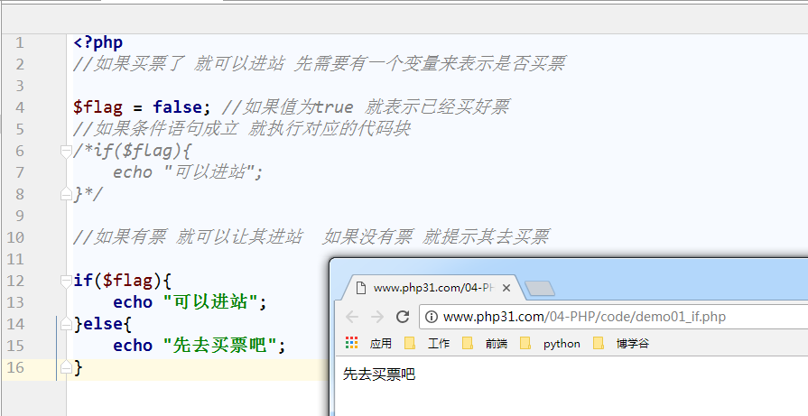
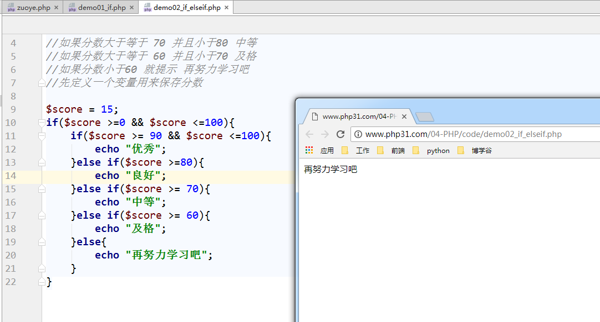
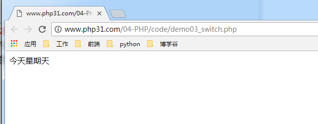
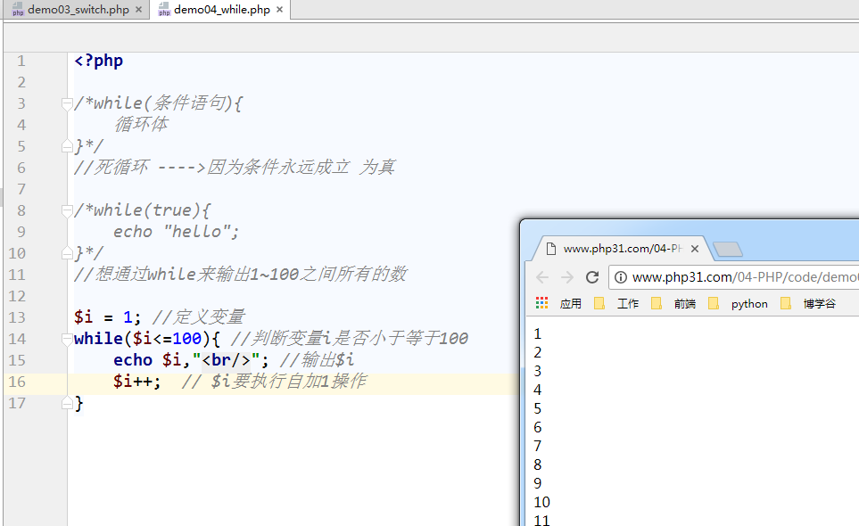
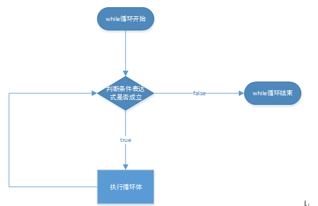
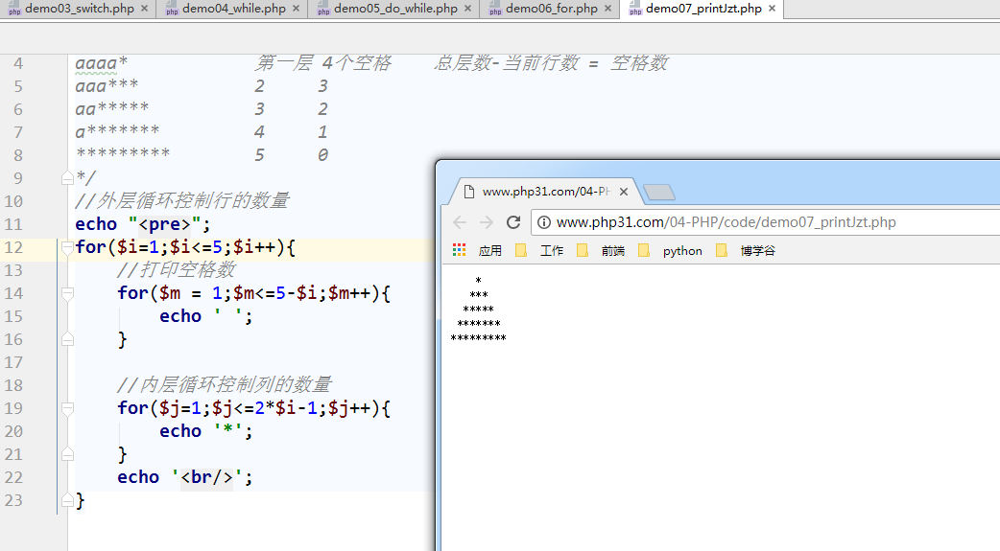
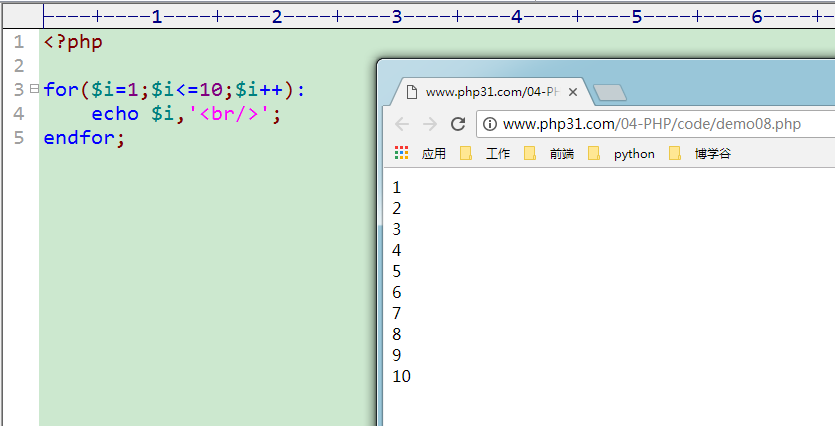
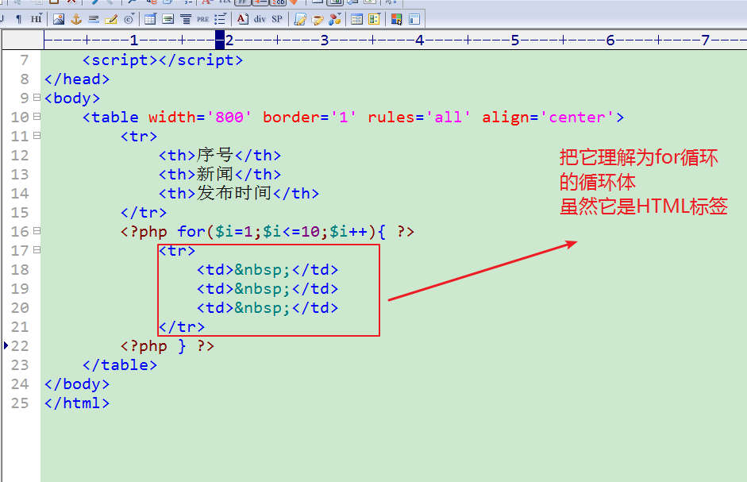
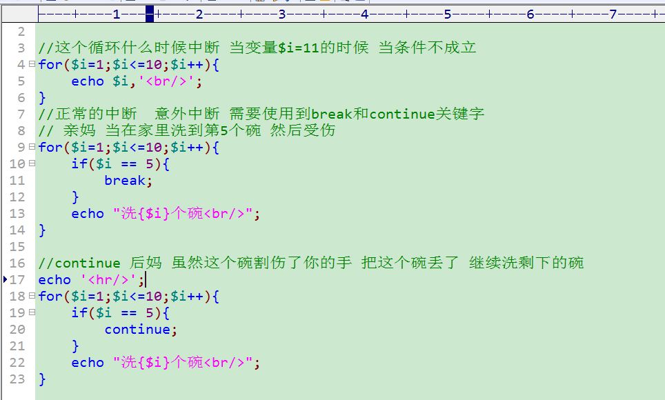

# 流程控制

顺序结构、分支结构、循环结构


## 选择(分支)结构

选择结构用于判断给定的条件，根据判断的结果来控制程序的流程

if语句、switch语句


### if语句

**单分支 **

**结构：**

```
if(条件语句){

执行代码块

}
```

结构说明：

条件语句它得到的是布尔值：true \| false

如果条件表达式成立的话 就执行代码块！


**双分支**

**结构：**

```
if(条件表达式){

执行代码块1

}else{

执行代码块2

}
```

说明：

如果条件表达式成立， 就执行代码块1， 否则就执行代码块2。




**多分支 多条件判断 **

**结构：**

```
if(条件表达式1){

执行代码块1

}elseif(条件表达式2){

执行代码块2

}elseif(条件表达式n){

执行代码块n

}else{

默认执行的代码块

}
```
说明：

先会判断条件表达式1是否成立 ，如果成立就执行代码块1 ，然后就结束if语句。

如果不成立，会判断条件表达式2是否成立， 如果成立就执行代码块2 ，然后就结束if语句； 如果不成立 ，会判断条件表达式n是否成立 ，如果成立就执行代码块n， 如果不成立 就会继续往下判断， 如果上面所有的条件表达式都没有成立， 并且写了else语句 ，就会执行else语句里面的代码块。



### switch语句

**格式：**

```
switch(变量名){

case 值1:

执行代码块1;

break;

case 值2:

执行代码块2;

break;

case 值3:

执行代码块3;

break;

case 值n:

执行代码块n;

break;

default:

默认执行的代码块;

}
```

说明：

得到变量的值与case后面值进行比较 如果返回的是true 就会执行对应的代码块 然后会判断是否有break关键字 如果有的话 switch马上结束 如果没有的话 就会将下一个代码块输出 然后再来判断是否有break关键字。直到找到break关键字为止 ！

```php
<?php
//输出今天星期几
//需要获取服务器的时间

//string date ( string $format [, int $timestamp ] )
//我们需要设置时区  php.ini配置文件去修改
// date_default_timezone_set
//echo date_default_timezone_get(); //获取时区
date_default_timezone_set("Asia/Chongqing");
/*echo date('Y-m-d H:i:s');*/
$week = date("N"); //获取一周中的第几天 用数字表示  1~7
$str = "今天星期";
switch ($week){
    case 1:
        $str .= "一";
    break;
    case 2:
        $str .= "二";
        break;
    case 3:
        $str .= "三";
        break;
    case 4:
        $str .= "四";
        break;
    case 5:
        $str .= "五";
        break;
    case 6:
        $str .= "六";
        break;
    default:
        $str .= "天";
}

echo $str;
```





**if语句与switch语句常用的地方：**

if语句一般用于判断范围的

switch语句一般用于固定值


##  循环结构

循环是程序设计语言中反复执行某些代码的一种计算机处理过程，常见的有**按照次数循环**和**按照条件循环**。


### while循环

**结构**

```
while(条件表达式){

循环体

}
```





**流程图：**




### do....while 循环

**结构**

```
do{

循环体

}while(条件表达式);
```

结构说明：

先会执行一次循环体，然后再来判断条件表达式是否成立！不管条件表达式是否成立 都会先执行一次循环体！


### for循环

**格式：**

```
for(定义变量;条件语句;变量更新){

循环体

}
```

结构说明：

第一步：对变量进行初始化 定义变量并赋值 只会执行一次

第二步：判断条件表达式是否成立 当条件表达式不成立 循环体就不会执行了 ！

第三步：在条件表达式成立的情况下 执行循环体

第四步：变量进行更新




## 流程控制的替代语法 

PHP 提供了一些流程控制的替代语法，包括 *if*，*while*，*for*，***foreach*** 和 *switch*。替代语法的基本形式是把左花括号（{）换成冒号（:），把右花括号（}）分别换成 *endif;*，*endwhile;*，*endfor;*，*endforeach;* 以及 *endswitch;*

```
if():

endif;

for():

endfor;

while():

endwhile;

foreach():

endforeach;

switch():

endswitch;
```

**注意：**

do...while是没有替代语法！

 




# 循环中断关键字

正常情况下循环什么情况才会中断：当条件表达式不满足

**意外中断：**break，continue 一般是在循环语句里面使用， 使用的时候 一般会配合 if语句。


## break

在循环里面当遇到 break关键字会将整个循环结束 ！

## continue

在循环体里面当遇到 continue关键字中断本次循环 然后继续执行下一次循环！




## 中断的层次 

一旦涉及到循环嵌套的时候 就有可以要考虑中断的层数的问题！

break关键字 ，它默认是中断一层循环。

break n; 它表示可以中断n层循环。

问：

现在我要打印99乘法表！

不输出当遇到乘积大于30


只要遇到了乘积大于30的数 下面都不要执行！


