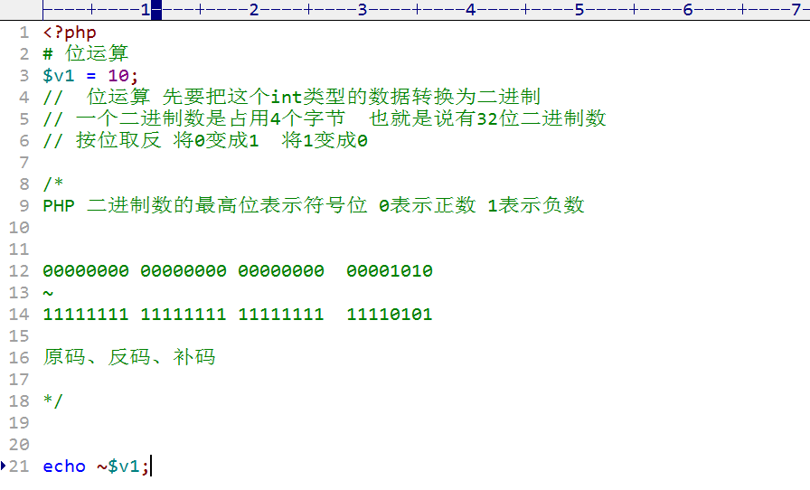
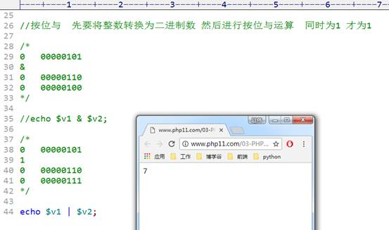
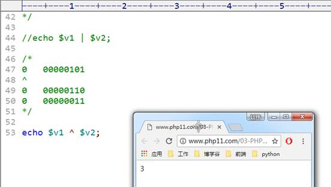
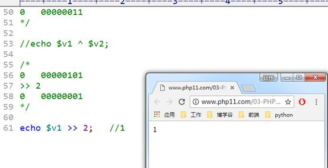
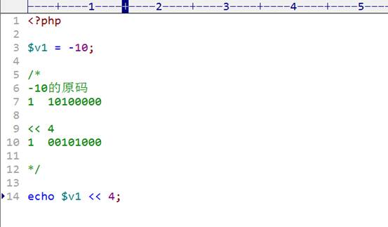

# 运算符

----

**什么叫运算符？**  \\\\
可以进行运算的符号 


**运算符的优先级！**  \\\\
* 有括号先算括号里面的，然后再乘除再加减！
* 需要提升某一个运算符的优先级是，加括号。


**结合性**  \\\\
什么是结合性，当一个表达式中运算符的优先级相同时 就要考虑结合性。结合性分为左结合和右结合！左结合 运算的规则就从左往右进行运算  右结合 从右往左进行运算！

 

**关于运算符的分类**   
* **一元运算符：**当前的运算符它操作数只能一个  
* **二元运算符：**当前的运算符它操作的数有两个  
* **三元运算符：**当前的运算符它操作的数有三个


----


## 算术运算符

| **运算符** | **名称** | **例子**        | **结果**        |
| ---------- | -------- | --------------- | --------------- |
| +          | 加法     | $x + $y         | $x 与 $y 求和   |
| -          | 减法     | $x - $y         | $x 与 $y 的差数 |
| *          | 乘法     | $x * $y         | $x 与 $y 的乘积 |
| /          | 除法     | $x / $y         | $x 与 $y 的商数 |
| %          | 模数     | $x % $y         | $x 除 $y 的余数 |
| ++         | 加加     | $x++ 或者 ++$x  |                 |
| --         | 减减     | $x--  或者 --$x |                 |

``++``  运算符  \\\\
它不管前置加加还是后置加加反正它最终都是自加1 \\\\
它分为前置++和后置++   \\\\

* **前置++**：先加1，再赋值    ++在前变量在后 
* **后置++**：先赋值后再自加1


``--``  运算符  \\\\ 
它不管前置减减还是后置减减反正它最终都是自减1  \\\\
它分为前置--和后置--   \\\\

* **前置--**：先自减1，再赋值 
* **后置--**：先赋值后再自减1

----


## 赋值运算符

| **赋值** | **等同于**   | **描述**                       |
| -------- | ------------ | ------------------------------ |
| $x = $y  | $x = $y      | 右侧表达式为左侧运算数设置值。 |
| $x += $y | $x = $x + $y | 相加                           |
| $x -= $y | $x = $x - $y | 相减                           |
| $x *= $y | $x = $x * $y | 相乘                           |
| $x /= $y | $x = $x / $y | 相除                           |
| $x %= $y | $x = $x % $y | 相取余（模）                   |

----


## 字符串连接运算符

| 运算符 | 名称     | 例子                                       | 结果 |
| ------ | -------- | ------------------------------------------ | ---- |
| .      | 串接     | $txt1 = "Hello"  $txt2 = $txt1 . " world!" | 现在 $txt2 包含 "Hello world!" |
| .=     | 串接赋值 | $txt1 = "Hello"  $txt1 .= " world!"        | 现在 $txt1 包含 "Hello world!" |

----


## 比较运算符

**注意：比较运算符它返回布尔类型的数据  true** **和false** 


| 运算符 | 名称               | 例子      | 结果                                               |
| ------ | ------------------ | --------- | -------------------------------------------------- |
| ==     | 等于               | $x == $y  | 如果 $x 等于 $y，则返回 true。                     |
| ===    | 全等（完全相同）   | $x === $y | 如果 $x 等于 $y，且它们类型相同，则返回 true。     |
| !=     | 不等于             | $x != $y  | 如果 $x 不等于 $y，则返回 true。                   |
| <>     | 不等于             | $x <> $y  | 如果 $x 不等于 $y，则返回 true。                   |
| !==    | 不全等（完全不同） | $x !== $y | 如果 $x 不等于 $y，或它们类型不相同，则返回 true。 |
| >      | 大于               | $x > $y   | 如果 $x 大于 $y，则返回 true。                     |
| <      | 大于               | $x < $y   | 如果 $x 小于 $y，则返回 true。                     |
| >=     | 大于或等于         | $x >= $y  | 如果 $x 大于或者等于 $y，则返回 true.              |
| <=     | 小于或等于         | $x <= $y  | 如果 $x 小于或者等于 $y，则返回 true。             |


----


## 三目运算符

**语法：** 

```php
条件语句 ? 代码1 :代码2;
```

**说明：**
问号前面的位置是判断的条件，判断结果为boolean型，为true时执行代码1，为false时执行代码2。 \\\\
如果为真执行第一个，否则执行第二个。”

----


## 合并运算符

运算符号：``??``

合并运算符就是三目运算符和isset语句的简写。

```php
<?php
//如果 ?? 前面的变量未定义，则使用后面的，否则使用??前面的    
$v1=20;
echo $v1 ?? 10;  //20
```

----


## 逻辑运算符

| 运算符     | 名称 | 例子                   | 结果                                                 |
| ---------- | ---- | ---------------------- |------------------------- |
| and 或 &&  | 与   | $x and $y或 $x && $y   | 如果 $x 和 $y 都为 true，则返回 true                 |
| or 或 \|\| | 或   | $x or $y 或 $x \|\| $y | 如果 $x 和 $y 只要有一个为 true，则返回 true         |
| xor        | 异或 | $x xor $y              | 如果 $x 和 $y 有且仅有一个为 true，则返回 true       |
| !          | 非   | !$x                    | 如果 $x 为 true，则返回 false，$x为false，则返回true |

**短路运算**  \\\\
我们一般使用逻辑与来实现短路运算！

```php
true && $v1++;
echo $v1; //11
```


----


## 位运算  bit 

| 运算符         | 名称 | 描述 |
| ------------------ | -------- | -------------------- |
| $a  & $b | 按位与   | 把 *$a* 和 *$b* 中都为 1 的位设为 1，其余位置设为0          |
| $a \| $b | 按位或   | 把 *$a* 和 *$b* 中都为 0 的位设为0，其余位置设为1           |
| $a  ^  $b | 按位异或 | 把 *$a* 和 *$b* 中一个为 1 另一个为 0 的位设为 1，其余设为0 |
| ~  $a      | 按位取反 | *$a* 中为 0 的位设为 1，为1的位设为0                        |
| $a  <<  $b | 左移     | *$a* 中的位向左移动 *$b* 次                                 |
| $a  >>  $b | 右移     | *$a* 中的位向右移动 *$b* 次                                 |

使用二进制来参与运算！将一个数转换比特位然后再来参与运算！  \\\\

**位运算一般是针对于整型数据来进行操作！**


| 符号 | 说明                                           |
| ---- | ---------------------------------------------- |
| ~    | 按位取反  如果是0的话就变成1  如果1的话就变成0 |




**原码、反码、补码**    \\\\
将一个整型数据转换二进制， 在我们计算机叫(补码计算机)  \\\\
在计算机中二进制其实是以补码的形式存在的！  \\\\
但是在展示给用户看的时候是原码。 \\\\


**正数的原码、反码、补码都一样**  \\\\
将一个数转换为二进制以后：最高位用于表示符号位  

* 0表示正数 
* 1表示负数 


### 原码


 


### 反码

**正数的原码反码补码都一样**


 

 

负数的反码， 除了最高位不变 ， 其它的位 取反！将0变成1  将1变成0

 


 

 

### 补码

正数的原码反码补码都一样  \\\

负数的补码是其反码的基础上进行加1 

 


 

### 按位与  &  

它的运算规则与逻辑与是一样  只不过它是拿每一个位进行与操作 同时为1才为1 其它的情况都为0 

 


 

 

### 按位或   |

 

它的运算规则与逻辑或是一样  只不过它是拿每一个位进行或操作 只要有一个位为1 就为1 

 



 

 

### 按位异或   ^

 

它的运算规则与逻辑异或是一样  只不过它是拿每一个位进行异或操作 只有一个为0一个为1的情况才为1 



 

### 按位右移 >>



 

### 按拉左移 << 



 


----


## 飞船运算符

php7之后新增的运算符，也是用于比较运算。  \\\\
运算符号：``<=>``    它是用于比较两个表达式。当第一个表达式比第二个表达式，分别小于，等于或大于时它返回-1，0或1。

----


## 错误抑制符

**@**  用于抑制错误！ 只能抑制错误级别低：notice   warning 

主要是用于数据库连接的时候    \\\\


使用一个没有定义的变量，也可以使用错误抑制符。


