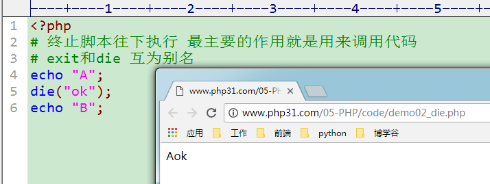
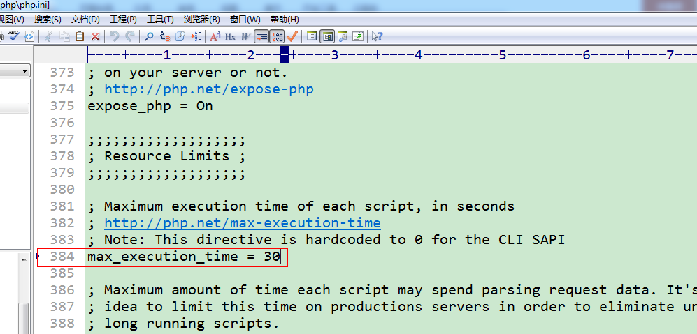
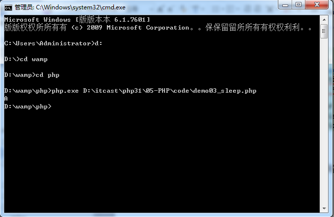
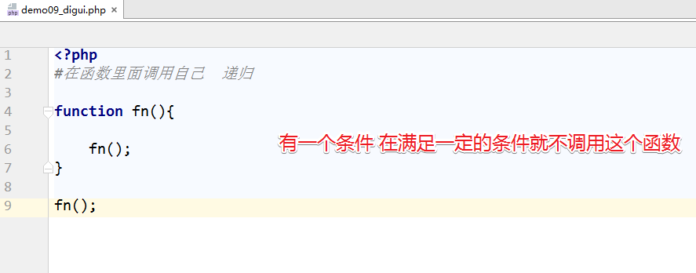
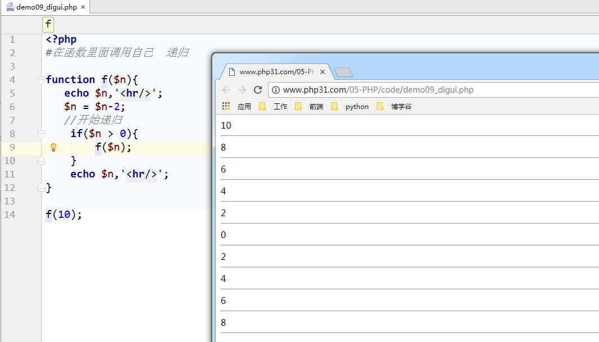
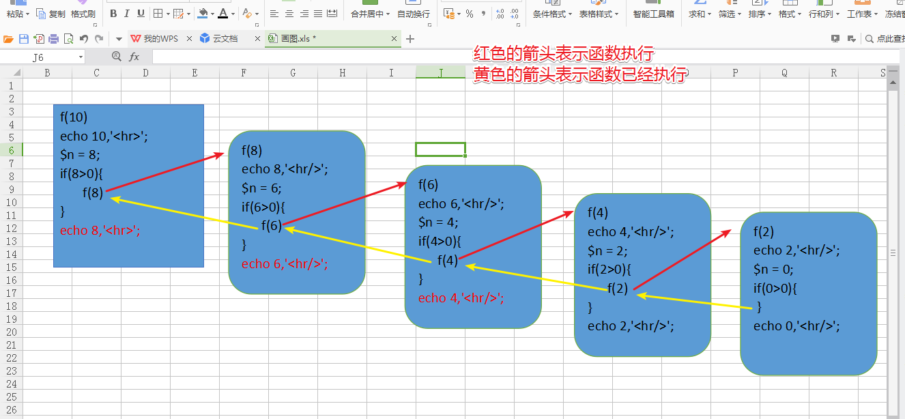
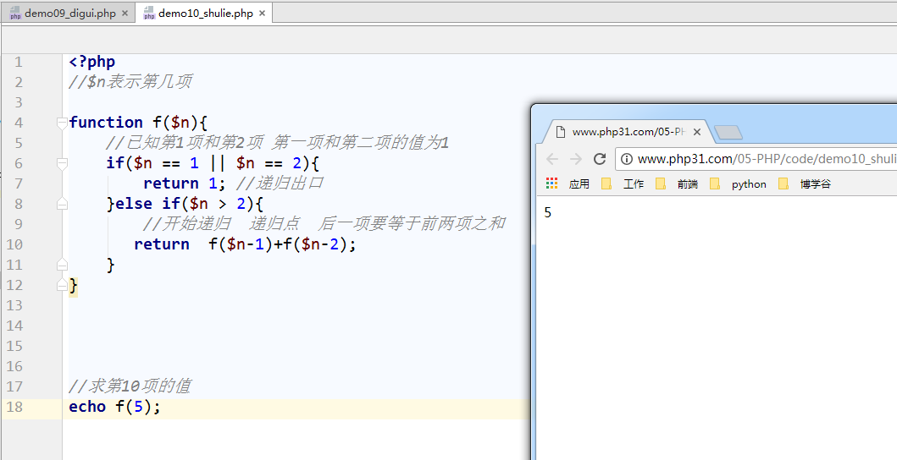

# 一、终止脚本执行

`die`或者`exit `常用来调试代码 ，用于将当前的脚本终止执行！

这两个它们互为别名！



`sleep()`：让其代码睡觉 ，参数是秒数！

当前网页执行的最大时间为30秒！这里是通过PHP中的配置文件设置！ `max_execution_time=30`



如果说有一个脚本它执行的时候需要超过30s ，就不能通过网页的方式来访问这个脚本程序 ，需要通过黑窗口来访问！




# 二、递归

**递归只是算法一种表现形式而已！**

**什么是递归：**在一个函数里面 再调用当前的这个函数







**为什么要有递归调用呢？**

因为我们在生活中，经常如遇到如下的问题：当我们遇到一个大问题的问题 会把这个大问题拆分很多小问题来解决，但是会发生解决大问题的方法同样适用于小问题！

使用递归的思路在来解决一个问题：

[斐波那契数列](https://www.baidu.com/link?url=VRFOYhAvfNI6UqTBDF1MERCsDcfppwufPPfLtppPNU5I7fhmt036TDUTCnfnkpD1Yim2boM4UzBZc5ZJklXxNPNqo-5YirY-sAkBOdf1WUmu6LCcAuWdqbYM9I0Xj1j43N0B7Z9Wx3aPix1AlFa_ca&wd=&eqid=e787dd7d00012d79000000035866074b)**：前两项已知 后一项的数为前两项之和**

-------- -------- -------- -------- -------- ------- ------- ------- ------- --------
  第一项   第二项   第三项   第四项   第五项   第6项   第7项   第8项   第9项   第10项
  1        1        2        3        5        8       13      21      34      55
-------- -------- -------- -------- -------- ------- ------- ------- ------- --------

==在实现递归的时候一定要明确两点：==

1、**递归点** 什么时候开始递归

2、**递归出口** 什么时候不需要递归

**递归点 当n=3的时候开始递归 **

[斐波那契数列](https://www.baidu.com/link?url=VRFOYhAvfNI6UqTBDF1MERCsDcfppwufPPfLtppPNU5I7fhmt036TDUTCnfnkpD1Yim2boM4UzBZc5ZJklXxNPNqo-5YirY-sAkBOdf1WUmu6LCcAuWdqbYM9I0Xj1j43N0B7Z9Wx3aPix1AlFa_ca&wd=&eqid=e787dd7d00012d79000000035866074b)

**递归出口 当n=1或者n=2的时候不需要递归**





----


# 三、模拟数据结构

**入栈和队列**

### 入栈的特点

先进后出

后进先出

入栈：**array\_push** --- 将一个或多个单元压入数组的末尾（入栈）

出栈：**array\_pop** 将数组最后一个单元弹出（出栈）


### 队列

先进先出

后进后出

入队：**array\_push()**

出队：**array\_shift()** ：从数组的开头删除一个元素

------

  **函数名**         **功能**
 ` array_unshift()`   向数组开头添加一个或者是多个数组元素
  `array_shift()  `   将数组的第一个元素删除并将其返回
  `array_push()   `   向数组的末尾添加一个或者是多个数组元素
  `array_pop()   `    将数组的最后一个元素删除并将其返回

------


# 四、算法

## 冒泡排序

拿数组中相邻的元素进行比较 如果前一个数组元素的值要大于后一个元素的值那么就将两个元素的位置进行互换！

\$row = array(10,3,8,7,6,2);

------

  原数组   10   3   8   7   6   2
  第一次   3    8   7   6   2   10
  第二次   3    7   6   2   8   10
  第三次   3    6   2   7   8   10
  第四次   3    2   6   7   8   10
  第五次   2    3   6   7   8   10

------


## 选择排序

假设当前第一个元素已经排序好，然后记住该元素的下标，拿着这个元素与后面的其他元素进行比较，如果比较之后发现后面的元素比当前元素还要小，记住当前的最小值为后面元素的下标。每一次遍历完数组都会发现一个最小元素的下标，最后进行一次交换。

\$row = array(10, 8,3 ,1,6,2);

------

  原数组   10   8   3   1    6    2
  第一次   1    8   3   10   6    2
  第二次   1    2   3   10   6    8
  第三次   1    2   3   10   6    8
  第四次   1    2   3   6    10   8
  第五次   1    2   3   6    8    10

------


 

## 二分查找算法

二分查找算法它要求当前的数组是已经排好序的。

二分查找算法又称之为折半查找。

```php
<?php

$arr = array(10, 22, 34, 55, 60, 68, 74, 100, 105, 170, 200);

//折半查找 要求是有序

/**

*折半查找

*\@param1 array $data 被查找的数组

*\@param1 int $num 要查找的数

*return mixed index|String

*/

function binarySearch($data,$num){

$startIndex = 0; //开始下标

$endIndex = count($data)-1; //结束下标

while($startIndex <= $endIndex){

$middleIndex = floor(($startIndex + $endIndex)/2);//中间下标

//要查找的元素比中间的元素要大 向右找

if($num > $data[$middleIndex]){

$startIndex = $middleIndex+1;

}

//要查找的元素比中间的元素要小 向左找

if($num < $data[$middleIndex]){

$endIndex = $middleIndex-1;

}

//要查找的元素与中间的元素相等

if($num == $data[$middleIndex]){

return $middleIndex;

}

}

return "找不到";

}

echo binarySearch($arr,70);
```

----


# 五、文件包含

**文件包含的主要目的：用于解决代码的重复使用！**

一个网站它的头部、页脚部分的结构代码是一样的！我们可以想一个办法将这两部分抽离出现！然后需要用到这两部分的 我们就将这两个部分载入进去！

**include**、**include\_once**、**require**、**require\_once**

这四个文件包含的功能就是一样 ：将一个文件里面的内容全部复制到当前文件中！这个文件包含它只在意文件里面的内容 而不去管这个文件到底是什么文件 ！


当把目标文件加载到当前文件中的时候， 先将目标文件中的代码退到PHP模式

\#PHP模式 在PHP标签里面的代码 称之PHP模式

\#HTML模式 在PHP标签外面的代码 称之HTML模式

在将一个文件包含到PHP中文件中的时候 它先会退出PHP模式


## 文件的地址

用于描述，一个文件在磁盘上的位置，文件载入，在磁盘上查找文件！

`D:\itcast\php31\04-PHP\code\demo10.php `文件的绝对路径

[[www.php31.com/04-PHP/code/demo10.php]](http://www.php31.com/04-PHP/code/demo10.php) 服务器上文件的地址

文件包含后所使用的是 磁盘上的文件位置！ 相对路径与绝对路径

分成，==相对路径==与==绝对路径==


### 相对路径

相对于当前位置的某个文件的位置。

当前目录的表示方式总共会有两种：

`./`  当前文件所在的地址


**==注意==**：当前位置的确定，不是由代码写在哪个文件中确定的，而是有当前代码在哪里执行确定！ 浏览器请求谁（哪个脚本），当前地址就是哪里！

因为以后我们在做项目的时候 目录结构非常复杂 可能需要将其它的目标文件包含到某一个文件里面的执行 使用相对路径就会出面问题。

**因此建议，使用包含文件 项目中（目录结构复杂），最好使用绝对路径！**


### 绝对路径

文件在磁盘上的真实位置！

在windows上，决定路径就是带盘符的路径！

缺点，比较长，典型的，将某部分，定义成常量！

`include 绝对路径`

通常我们会定义一些目录常量 ，通过字符串拼接的方式得到我们想要载入的文件的路径。

`__DIR__ `这个魔术常量会使用的非常多。


* 文件包含后面的文件的路径一定是绝对路径，不要写在相对路径。


## 各种文件包含的区别

**include**、**include\_once**、**require**、**require\_once**

include与require之间有的区别， 同时适用于include\_once与require\_once

include ：包含

require：必须

**语法：**

`include '载入文件的地址'`

`require '载入文件的地址'`

只是在于报错的上面的显示的区别

当使用include载入文件的时候 如果目标文件不存在， 会报一个**警告**错误！ 但是不会影响到当前文件继续往下执行！


当使用require 载入文件的时候 如果目标文件不存在 会报一个**致命**错误！ 但是会影响到当前文件继续往下执行！


在工作中一般建议使用require

include与include\_once之间有的区别， 同时适用于require与require\_once

include\_once 在载入之间会进行一次判断 ，判断当前的文件是否已经被载入了，如果已经被载入过了 就不会再载入！

include 不会去判断当前文件是否已经载入


----


# 六、进制转换

------

**什么是进制?**  \\\\

* **一种可以进位的机制！**


**生活中有哪些进制？**    \\\\

十进制：   

* 24：一天24小时
* 60：60分钟一个小时
* 12：12月为一年
* 365：365天为一年
* 7:7天为一周
* 360:360°为一周
* 16：古代的一市斤=16两

\\\\

在计算机中有**二进制、八进制、十进制、十六进制** 

* 二进制 ：0 1
* 八进制：01234567
* 十进制：0123456789
* 十六进制：0123456789ABCDEF   
* 位权：每一个位上面都有一个权重来表示 
* 基数：二进制的基数就是2   八进制的8，依次类推 

------


## 其他进制转十进制

每一位数*基数位权

按权展开：


------


## 十进制转二进制


**13.75**


### 整数部分

除二取余：


**填充法（填“1”法）**  \\\\

要使用填1法，要知道 1个字节的每一个位的数是什么。


### 小数部分

**乘2取整法**   \\\\

将一个小数转换为二进制的时候 需要做到保留几位小数。   \\\\
将小数转换为二进制会存在一个问题：丢失精度。  


小数是不能用于比较大小的，因为它的精度不准确。

------


## 十进制转八进制

**整数部分**：除8取余

**小数部分**：乘8取整

------


## 十进制转十六进制

**整数部分**：除16取余

**小数部分**：乘16取整

------


## 二进制与八进制之间的互转

一个八进制数等于3位2进制数    **421法**

| **数数** | **八进制** | **二进制** |
| -------- | ---------- | ---------- |
| **0**    | **0**      | **000**    |
| **1**    | **1**      | **001**    |
| **2**    | **2**      | **010**    |
| **3**    | **3**      | **011**    |
| **4**    | **4**      | **100**    |
| **5**    | **5**      | **101**    |
| **6**    | **6**      | **110**    |
| **7**    | **7**      | **111**    |

 

`八转二：一拆三`   : 将一个八进制数拆分三个二进制数  \\\\ 

``二转八：三并一  ``   :  将三位二进制数合并为一位八进制数    \\\\

------


## 二进制与十六进制互转

二进制与十六进制之间的互转需要用到 **8421法**

| **数数** | **十六进制** | **二进制** |
| -------- | ------------ | ---------- |
| **0**    | **0**        | **0000**   |
| **1**    | **1**        | **0001**   |
| **2**    | **2**        | **0010**   |
| **3**    | **3**        | **0011**   |
| **4**    | **4**        | **0100**   |
| **5**    | **5**        | **0101**   |
| **6**    | **6**        | **0110**   |
| **7**    | **7**        | **0111**   |
| **8**    | **8**        | **1000**   |
| **9**    | **9**        | **1001**   |
| **10**   | **A**        | **1010**   |
| **11**   | **B**        | **1011**   |
| **12**   | **C**        | **1100**   |
| **13**   | **D**        | **1101**   |
| **14**   | **E**        | **1110**   |
| **15**   | **F**        | **1111**   |
| **16**   |              |            |

``十六转二：一拆四`` ： 将一个十六进制拆分四位二进制数   \\\\

``二转十六：四并一`` ：  将四位二进制合成一位十六进制数   \\\\

------


## 八进制与十六进制的互转

``八进制转十六：先一拆三，再四合一`` ：  先将一个八进制数拆分三个二进制数， 然后将四个二进制数合并为一个十六进制数。   \\\\

``十六转八：先一拆四，再三并一``  ： 先将一位十六进制数拆分为四位二进制数  然后将三位二进制数合并成一位 


------


# 进制转换的函数

进制的英文表示方式：

* **二进制：bin**
* **八进制：oct**
* **十进制：dec**
* **十六进制：hex**

 

**注意：**   \\\\
在PHP中，进制转换函数只能是十进制转换为其它进制、或者其它进制转换为十进制！  \\\\


* 十进制转换二进制：decbin(int $val)
* 十进制转换八进制：decoct(int $val)
* 十进制转换十六进制：dechex(int $val)
* 二进制转换十进制：bindec(string $val)
* 八进制转换十进制：octdec(string $val)
* 十六进制转换十进制：hexdec(string $val)


----


