# PHP变量与常量

----


## 变量


### 变量名的命名规则

* 变量名可以使用**大小写英文字母**、**下划线**、**数字**组成

* 变量名**不可以以数字开头**
* **变量名不能使用$this 来命名，因为$this它是一个关键字  在面向对象使用**
* 在定义变量名的时候要做到见名知意
* 变量名**区分大小写** 
* 如果变量名是由多个单词组成的最好可以使用**下划线连接法**和**驼峰法**
  * 比如：``$get_user_name``  下划线连接
  * 比如：``$getUserName `` 从第二个单词开始首字母要大写 

 


### 创建或者声明变量(增)

**语法：**   \\\\
``$变量名 = 值;``

 

**注意：**    \\\\
这里的$符号它不是属于变量名的一部分，它只是一种语法规则而已！   \\\\
PHP是一种弱类型的语言，在创建变量的时候不需要指明变量的数据类型！   \\\\
虽然PHP在创建变量的时候不需要指明变量的数据类型， 但是它也是有类型的！它的数据类型是由其值决定的！   \\\\

不能使用没有定义的变量。

```php
<?php
$name;
$age=18;
```


### 修改变量的值(改)

给变量重新赋值一个值！

```php
<?php
//修改变量的值
$v1=10;
echo $v1; // 10
$v1=20;  //重新赋值
echo $v1; // 20
```

 


### 获取变量的值(查)

使用输出语句将变量的值输出 

```php
<?php
$v1=10;
echo $v1;  //获取变量的值(查)
```


### 删除(删)

要删除变量就得使用PHP中的一个内置的系统函数！ \\\\

``unset(变量名)``   \\\\

使用``unset()``这个函数以后会将变量名与引用给去掉。 \\\\
但其值是被PHP的垃圾回收机制给销毁！   \\\\

```php
<?php
$v1=10;
echo $v1; 

unset($v1);  //销毁变量
echo $v1;   //报错  
```


### 可变变量

**概念**：一个变量的值刚好是另外变量的名字！

```php
<?php
$v1='abc';
$abc=10;
//可变变量语法： $$变量名
echo $$v1; // 10
```
----

### 超全局变量

超全局变量也称之为**预定义变量** \\\\

**预定义变量：**  PHP系统预先定义变量，这几个变量程序员无法创建！只能使用。 \\\\  
得到的结果都是数组。 \\\\

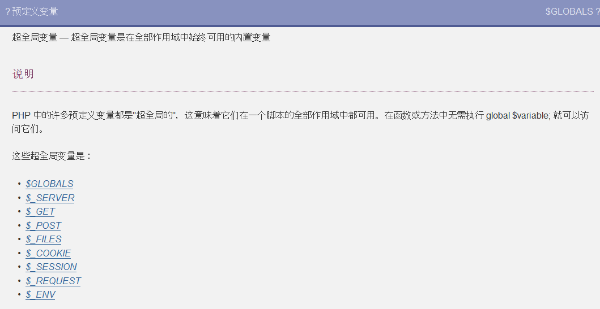

下面是一些常用的超全局变量：

#### $_SERVER

**作用**：获取到服务器与浏览器的相关信息！ 


**$_SERVER[‘SERVER_NAME’]**


**$_SERVER[‘SERVER_ADDR’]**  


**$_SERVER[‘REMOTE_ADDR’]**  


**$_SERVER[‘DOCUMENT_ROOT’]**  


**$_SERVER[‘SCRIPT_FILENAME’]**


#### $_GET

**作用：**获取到表单以get方式提交的数据或者是用户模拟get方式提交的数据！ 

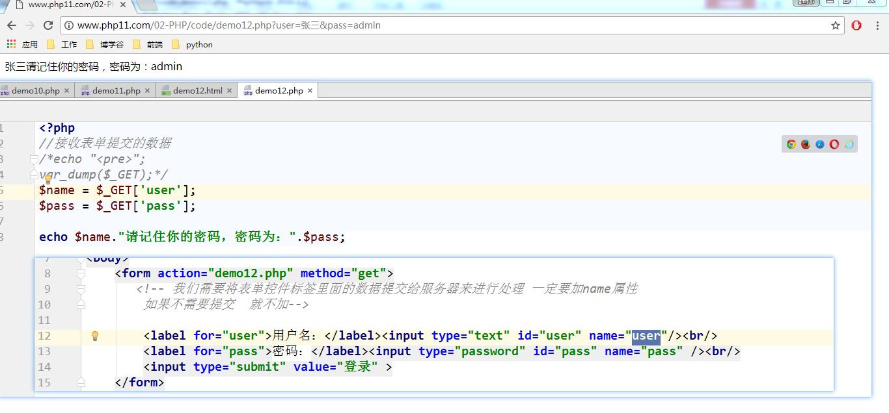

**注意：**
1. 如果我们需要将表单中数据发送给PHP来进行处理，那么就需要给当前的表单控件标签设置name属性值 。

2. 如果我们不需要将表单中的某一个表单控件的数据提交给PHP来进行处理的话 ，就不需要设置name属性。

   


模拟get请求


#### $_POST

**作用：**获取到表单以POST方式提交的数据！ 

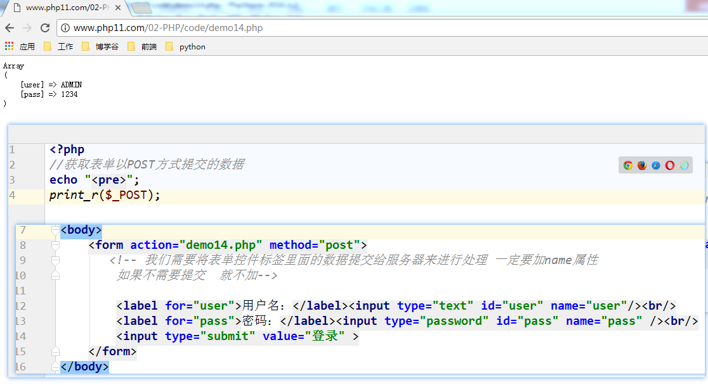


#### $_REQUEST

**$_REQUEST = $_POST +$_GET**      \\\\

**作用**：它可以获取表单以post方式提交的数据，也可以获取到表单以get方式提交的数据。 

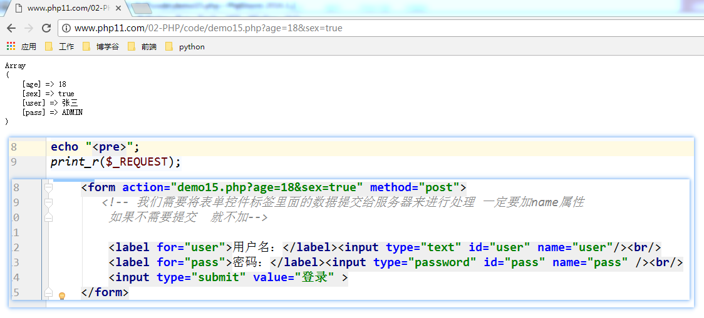


----


## 常量

**什么是常量？**   \\\\
常量一旦被定义就不能修改和删除！这个数据是一直是固定的！常量的值是存放全局数据区的常量区中！  \\\\

在一个PHP文件中，常量 的值永远是固定的！它不会发生改变！


### 常量名的命名规则

* 常量名在定义的时候**不能使用$符号**  

* 常量名的命名规则与变量名其实是差不多的 
* 常量名命名的时候建议使用大写 
* 常量名命名的可以很松散 

```php
//常量名命名可以很松散
<?php
define('^_^','aaa');
echo constant('^_^');  //输出：aaa
```


### 定义常量

**语法：**  \\\\
``define("常量名",常量的值);``  \\\\

在新版的PHP中， 可以使用const 这个关键字来定义常量，  const这个关键字它本身是用来定义类常量。  \\\\

``const 常量名 = 值; ``

```php
<?php
//define定义常量
//常量名一般是大写，常量一旦被定义，其值不能被修改和删除(unset())
define("PI",3.14);
echo PI;   //3.14

//const定义常量
//PHP7 新增语法
const p = 33;
echo p;  //33
```


### 数组常量

在php7之后，常量支持以数组的形式来进行定义。

```php
<?php
//定义数组常量
define('ARR',array(1,5));
var_dump(ARR);

//数组常量输出：
Array(
	[0] => 1,
    [1] => 5
)
```


### 检测常量是否被定义

要使用一个PHP中的内置函数来测试常量是否定义。  \\\\ 

``bool defined (string $name)``

 

``bool ``   ：指的函数的返回值 。 如果该常量已经定义就得到一个**true** ， 如果该常量没有定义就会得到一个**false**。   \\\\ 

``string $name ``  ：字符串 要求是常量名。也就是说在defined这个函数里面写常量名需要加引号。 

```php
//检测常量PI是否已定义
var_dump(defined('PI'));    //bool(true)
```


### 常量名的大小写

一般情况下常量名肯定是区分大小写的 ，可以通过第三个参数来开启不区分大小写。 \\\\

``bool define (常量名, 常量值 [, bool $case_insensitive = false ] );``  \\\\

关于第三个参数： 

* 默认为 **false **表示区分大小写，如果不写就表示区分大小写。  
* 如果将其写为 **true** 则表示不区分大小写。

----


### 预定义常量

系统预先定义好的常量 ！

* **PHP_OS** ：输出当前服务器所在的操作系统

* **PHP_VERSION** ：输出当前PHP的版本
* **PHP_INT_MAX** ：输出PHP中最大的整型数据
* **PHP_INT_SIZE**     ：输出PHP中整型的所占用的字节数


----


### 魔术常量

使用的语法和常量是一样的，而且也是预定义的，但是其值是由其所在的位置决定的，可能出现很多的值！  \\\\


**注意：左右两边各有两个下划线**    \\\\

一些常用的魔术常量：  

* ``__DIR__``     获取当前文件所在的目录的路径。   

* ``__FILE__``   **获取当前文件所在的路径。** 
* ``__LINE__``    文件中的当前行号。 
* ``__FUNCTION__``  当前的函数的名字
* ``__CLASS__``   **当前的类的名字**
* ``__METHOD__``  **当前方法的名字**

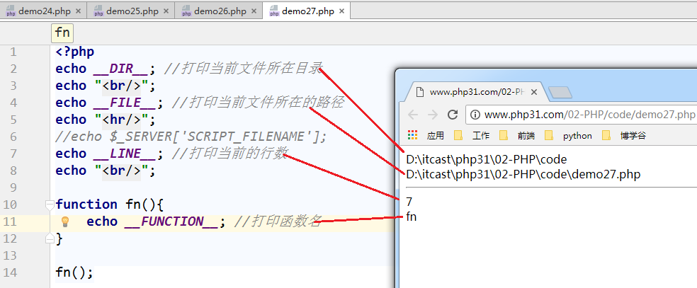

----


## 按值传递和按引用传递

**传递：变量与变量之间的赋值** 


### 按值传递

将一个变量的值赋值给另外一个变量，然后修改其中一个变量的值，并**不会影响**到另外一个变量 。这两个变量之间是没有联系的！


 

 

**问：**将变量$v1给unset掉 会不会影响到变量$v2？

**答**：不会影响到$v2这个变量  

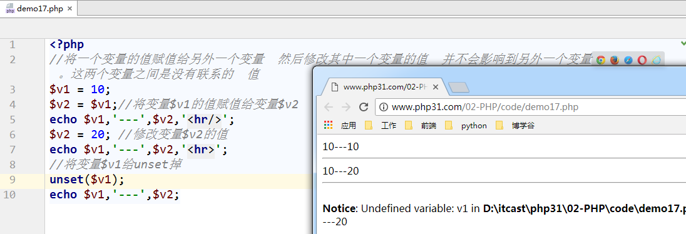

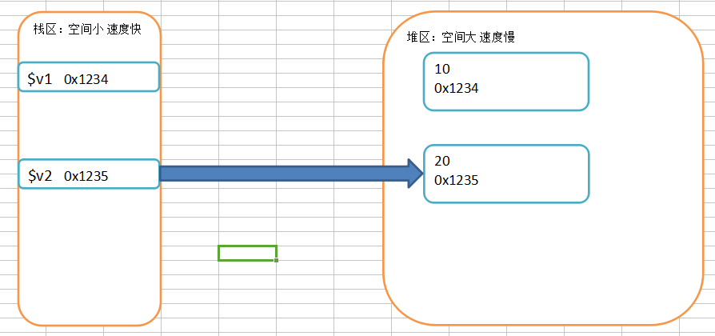

 


### 按引用传递

将一个变量的内存地址赋值给另外一个变量，然后修改一个变量的值 ，它**会影响**到另外一个变量的值。这两个变量之间是有联系的！ \\\\


在PHP中是通过一个&(求地址运算符)得到一个变量的值内存地址。

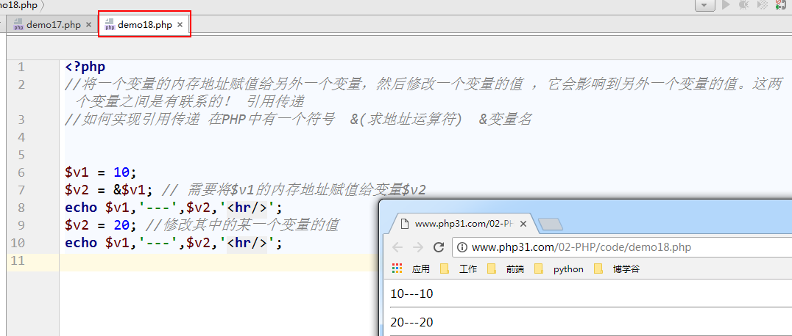

 

1. 先得到$v1的内存地址，然后将这个内存地址赋值给$v2 。
2. $v1与$v2这两个变量指向是同一个地址空间！如果修改一个变量的值另外一个变量也会跟着改变。

 

**思考一下：**如果将其中一个变量给unset掉，那么会不会影响到另外一个变量？

**答**  ：不会影响到另外一个变量。因为unset这个函数它只是将变量名与引用给销毁，变量的值还在。


----


## 变量的数据类型

**PHP中有八种数据类型：**  \\\\

整型、浮点型、布尔型、字符串型、数组、对象、资源、NULL 


### 标量数据类型(基本数据类型)

特点：只能存储一个值！  \\\\

**整型、浮点型、布尔型、字符串型**


#### 整型 int 或者integer

``PHP_INT_SIZE``：表示整型的字节数   \\\\
``PHP_INT_MAX``：表示整型的最大数   \\\\


整型在内存中是使用是**二进制**的方式来表示的！  \\\\
4个字节共表示32位！但是最高位表示符号位。如果最高位是0表示正数，如果1表示负数！  \\\\


在PHP中定义整型数据可以使用四种方式来表示：   \\\
(十进制、八进制、十六进制、二进制)

* 十进制：1234  -1234
* 八进制：以0开头
* 十六进制：以0x开头
* 二进制：以0b开头

问：如果给``PHP_INT_MAX+1``会不会报错？
答：不会，会自动将这个数转换为浮点型数据。


\\\\


#### 浮点数 float或者double

其实浮点数是分为单精度与双精度之分 只是PHP没有作这个区分！  \\\\
浮点数使用8个字节来表示   \\\\

**单精度**与**双精度**   \\\\

浮点数有两种表示的方式：  \\\\
``小数、指数``  \\\\

小数：``12.38``    \\\\
指数：7e3 ---> 7*10^3   \\\\


如果是使用指数来表示：
* e后面必须要有数
* e后面必须是整数 


浮点数的字长和平台相关，尽管通常最大值是 1.8e308 并具有 14 位十进制数字的精度（64 位 IEEE 格式）。   \\\\

```php
<?php
//定义浮点数
$v1=10.23;
var_dump($v1);   //float(10.23)

//使用指数定义浮点数
$v2=7e3;
var_dump($v2); //7*10^3
```

**注意：**最好不要使用浮点数来进行比较！   \\\\

因为计算机只能识别二进制数，需要将0.3转换为二进制数， 乘2取整法   \\\\
因此小数在转换为二进制的时候会丢失精度！

\\\\

#### 布尔型 bool或boolean

布尔型常用表示**真**与**假**！  \\\\

布尔型只有两个值：``true``和``false `` ，并且这两个单词不区分大小写！  \\\

**要打印布尔型的结果，不能使用 echo 输出，必须使用``var_dump``语句来打印。** \\\\

布尔类型一般多用于比较
```php
<?php
//定义布尔类型
$flag=false;
var_dump($flag);  //false
```


\\\\

#### 字符串数据类型 string

在PHP中定义字符串数据类型总共有四种方式：
* 单引号 
* 双引号 
* heredoc 语法结构 
* nowdoc 语法结构（自 PHP 5.3.0 起） 


##### 单引号

使用单引号定义的字符串的特点如下：
1. 单引号不可以解析其中的变量！
2. 当使用单引号定义字符串时，如果字符串里面又有单引号，需要用反斜线来进行转义。
3. 单引号定义的字符串里面只能解析转义单引号和转换反斜线。其它的字符转义不了。

```php
<?php
//单引号 定义字符串
$name='张三';
$res='姓名： $name';   //单引号不可以解析其中的变量
echo $res;

//反斜线来进行转义
$str='姓名：\'张三\'';
echo $str; // 姓名：'张三'
```


##### 双引号

 使用双号定义的字符串的特点如下：

* 双引号可以解析其中的变量！

* 当使用双引号定义字符串时，如果字符串里面又有双引号，需要用反斜线来进行转义。
* 双引号定义的字符转义字符都可以被解析！
* 双引号内如果有变量名，需要确定变量名边界 。

```php
<?php
//双引号 定义字符串
$name='张三';
$res="姓名： $name";   
echo $res; //姓名： 张三

//反斜线来进行转义
$str="姓名：\"张三\" ";
echo $str; // 姓名："张三"

//策略一：变量名与后面的字符串之间加上空格
$res="姓名 $name ";   
//策略二（标准做法）：将变量名用大括号包裹起来，这里的花括号就表示变量名的边界！
$res="姓名{$name}";   
```

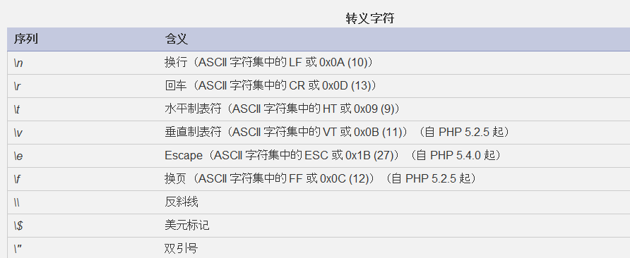


##### heredoc 

定界符，就是让用户自己定义字符串的边界！  \\\\

适用于定义复杂的、多行的字符串，因为字符串的边界是可以由自己随便定义的，所以可以人为的保证边界和字符串的内部不会发生冲突！

**语法形式**：

```PHP
<?php
//注：标记名称前后不能有空格，结束时的标记名称必须靠边。
// heredoc 相当于双引号定义的字符串    
<<<标记名称
    字符串
标记名称;

//示例
$str=<<<doc
    dsfdsfdsf
doc;    
```


##### nowdoc

**语法形式**：

```PHP
<?php
//注：标记名称前后不能有空格，结束时的标记名称必须靠边。
// nowdoc 相当于单引号定义的字符串    
<<<'标记名称'
    字符串
标记名称;

//示例
$str=<<<'doc'
    dsfdsfdsf
doc;    
```

**关于heredoc与nowdoc需要注意的地方**：

1. 当我们在PHP中要定义大量的HTML代码或者是JS代码说可以使用这两种定界符。
2. heredoc定义的字符串它是可以解析变量的 。
3. nowdoc定义的字符串它不能解析变量。
4. nowdoc开始定界符处需要加上单引号。
5. 不管是heredoc与nowdoc在结束定界符处前面不能有空格 一定要顶格写，开始定界符后面也不要有空格！


### 复合数据类型

特点：复合数据类型可以存储多个值！ \\\\ 

**数组、对象**


（详见其它文档）


### 特殊数据类型

**资源、NULL**


#### 资源 resource

凡是PHP操作的外部数据，得到的都是资源数据类型！   \\\\


**注意**：  

* 资源数据类型是不能进行定义的，只能读取！
* 将资源转换为布尔型，会转换为true 

```php
<?php
$fp=fopen('a.txt','r+');
var_dump($fp);  // resource(3) of type(stream)
```


\\\\

#### 空 Null

**如何得到这个空型：**

* 将一个变量赋值为null  
* 使用一个没有定义的变量
* 将一个变量unset掉
* 调用一个没有返回值的函数 

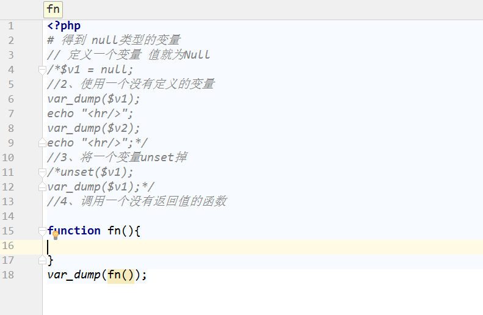

----


## 变量数据类型的转换 

变量会根据上下文的环境，数据类型可以会做相应转换！   \\\\

分为：**自动转换** 、**强制转换**   \\\\


**注意： **   \\\\

不管是自动转换还是强制转换，变量数据类型转换的结果都是相同的！


### 自动转换

PHP会根据上下文的环境，对变量数据类型进行自动转换！

```php
//自动转换
$flag=1;
if($flag){
    echo true;
}else{
    echo false
}

// true
```


### 强制类型转换

使用PHP中的系统内置函数，将一个变量的数据类型强制的转换为另外一个数据类型！  \\\\

**语法：**  

```php
(目标变量的数据类型)变量名  //把变量数据类型强制的转换为目标变量的数据类型
```

 

| **强制类型转换符** | **转换为的类型** |
| ------------------ | ---------------- |
| (int)变量名或者(integer)变量名 | 将变量名强制的转换为整型                |
| (float)变量名                  | 将变量名强制的转换为浮点型              |
| (bool)变量名                   | 将变量名强制的转换为布尔型  **true**\|**false** |
| (string)变量名                 | 将变量名强制的转换为字符型              |
| (array)变量名                  | 将变量名强制的转换为一个数组            |
| (object)变量名                 | 将变量名强制的转换为一个对象            |


#### 将其它数据类型转换为整型 

``(int)变量名或者(integer)变量名``

| **其它数据类型**                          | **整型的结果** |
| ----------------------------------------- | :------------: |
| “字符”                                    |       0        |
| “数字字符”                                |      数字      |
| “字符数字”                                |       0        |
| “”与“  ”与 “0”   空字符串与有空格的字符串 |       0        |
| false                                     |       0        |
| true                                      |       1        |
| null                                      |       0        |
| float                                     |      取整      |

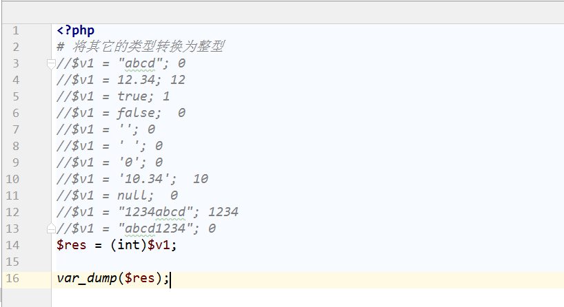


#### 将其它的数据类型转换为浮点型

``(float)变量名``

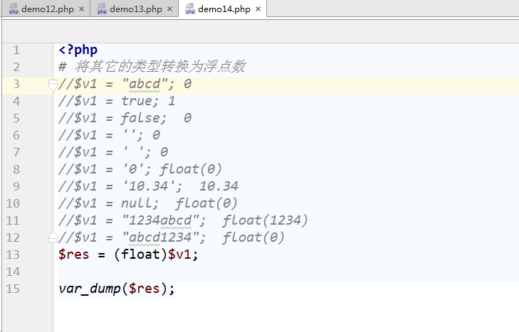


#### 将其它的数据类型转换为布尔型

``(bool)变量名``

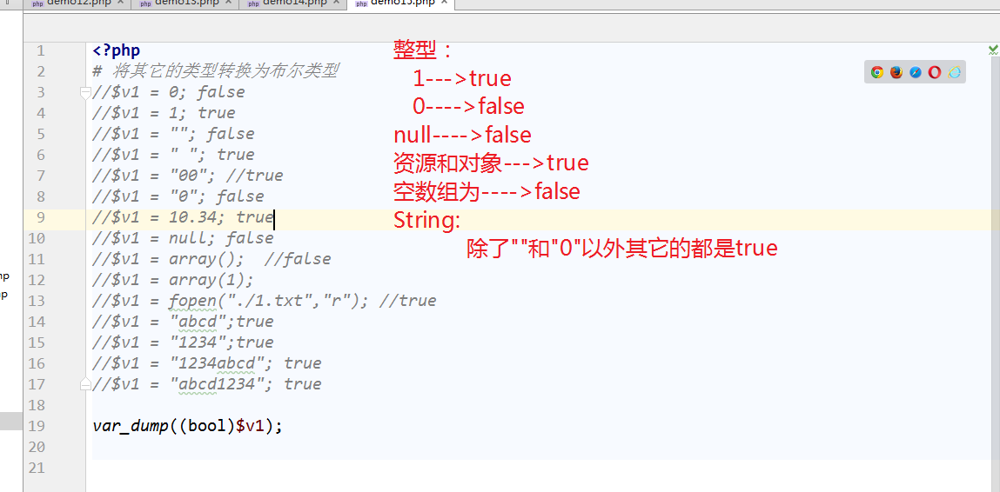


#### 将其它的数据类型为数组

``(Array)变量名``   \\\\

**注意：** 在工作中这种方法几乎不会使用。

```php
<?php
$v1=10;
$arr= Array($v1);
var_dump($arr);
```


----


## 与类型相关的函数

### gettype
语法：
```php
string  gettype ( mixed $var );
```
获取到变量的数据类型


 


### settype
语法：
```php
bool settype ( mixed &$var , string $type );
```
将变量数据类型设置为指定的类型
* mixed  &$var：要设置的变量
* string $type：将变量设置为什么类型


### isset
语法：
```php
bool  isset(mixed $var1[,mixed $var2]);
```
**作用**：判断一个变量是否存在，存在就返回**true**，不存在就返回**false**

\\\\

变量不存在有三种情况：
1. 变量未被声明（没有被初始化）
2. 变量被unset掉了
3. 变量的值如果为NULL，也认为不存在！


### is_int
语法：
```php
bool  is_int ( mixed $var );
```
**作用**：检测变量是否是整型，如果$val是整型返回 TRUE，否则返回 FALSE。 

 

### is_float
语法：
```php
bool is_float ( mixed $var );
```
**作用**：检测变量是否是浮点型，如果 $var 是 float 则返回 TRUE，否则返回 FALSE。

 

### is_string
语法：
```php
bool is_string ( mixed $var );
```
**作用**：检测变量是否是字符串型，如果 $var 是String则返回 TRUE，否则返回 FALSE。

 

### is_bool
语法：
```php
bool is_bool ( mixed $var );
```
**作用**：检测变量是否是布尔型 ，如果 $var 是 boolean则返回 TRUE，否则返回 FALSE。

 

### is_array
语法：
```php
bool is_array ( mixed $var );
```
**作用**：检测变量是否是数组，如果 $var 是 Array则返回 TRUE，否则返回 FALSE。


### is_null
语法：
```php
bool is_null ( mixed $var );
```
**作用**：检测变量是否是NULL，如果 $var 是 null则返回 TRUE，否则返回 FALSE。


### is_numeric
语法：
```php
bool  is_numeric ( mixed $var );
```
**作用**：检测变量是否为数字或数字字符串，如果 $var 是数字和数字字符串则返回 TRUE，否则返回 FALSE。


----


