# ==表单传值==


### 课前补充

==**提问**==：

1. html后缀文件由谁进行解析？
2. php后缀文件又由谁进行解析?
3. html后缀文件中如果包含php代码，访问该html文件，php代码是否会被解析执行？
4. php后缀文件中如果包含html代码，访问该php文件，html代码是否会被解析执行？

**==解答==**：

1. html后缀文件的内容只会被浏览器解析；
2. php后缀文件的内容只会被服务器的php模块解析；
3. php代码不会被解析，因为默认情况下，服务器会将html后缀文件的内容全部当成普通字符串返回给浏览器，而浏览器只会解析html的标签内容，不会解析php源代码，所以php内容不会被解析。
4. html代码在服务器端不会被解析，只会原样返回给浏览器，但是返回给浏览器之后，将会被浏览器解析；


==**浏览器与服务交互流程分析**==

```sequence
浏览器-->服务器:请求\nhttp://www.xxx.com/a.html
note right of 服务器: a.html<?php \necho 123;\n?>\n<html>\n<body>\nHow are u\n<ahref=“http://www.xxx.com/b.php”>\n跳转\n</a>\n</body>\n</html>
服务器-->浏览器:响应\n<?php echo 123;?>\n<html><body>\nHow are u\n<a href=“http://www.xxx.com/b.php”>\n跳转\n</a>\n</body></html>
note left of 浏览器: <?php echo 123;?>\n<html>\n<body>\nHow are u\n<a href=“http://www.xxx.com/b.php”>\n跳转\n</a>\n</body>\n</html>
浏览器-->服务器:点击a链接\n发出新的请求\nhttp://www.xxx.com/b.php
note right of 服务器:b.php\n<?php \necho 123;\n?>\n<html>\n<body>\nHow are u\n</body>\n</html>
服务器-->浏览器:响应\n123\n<html><body>\nHow are u\n</body></html>
note left of 浏览器:123\n<html><body>\nHow are u\n</body></html>
```


## 1. 表单传值的概念

### 为什么使用表单传值

绝大部分的网站几乎都拥有==登陆或注册==页面，并且也都拥有录入信息的后台。

比如我们在网站的登陆页面或注册页面填写信息提交后，填写的信息之所以能够传递到服务器，就是因为网站的页面中使用了表单传值；


### 什么是表单传值

概念：表单传值指的是通过==表单==构建数据，传递给服务器。 


## 2. ==表单传值的方式==

表单传值的方式包含两种：

- [ ] POST方式
- [ ] GET方式


### POST方式

**==需求==**：使用POST方式实现一个会员注册页面，包含帐号，密码两个填写项。

**==解答==**：构建一个名为code1.html的页面，代码如下

```html
<!DOCTYPE html>
<HTML>
<head>
	<meta charset="UTF-8">
	<title>POST方式</title>
</head>
<body>
	<!-- 1. method必须指定为post才是POST方式 -->
	<!-- 2. action是控制之后表单中填写的数据将会被提交到哪个指定的页面中去（必须项） -->
	<form method="post" action="">
		<p>
			<span>帐号：</span>
            <!-- 3. name属性的作用是指定之后程序页面接收该表单数据的名称（必须项） -->
			<input type="text" name="acc" />
		</p>
		<p>
			<span>密码：</span>
			<input type="text" name="pwd" />
		</p>
		<p>
			<input type="submit" value="注册" />
		</p>
	</form>
</body>
</HTML>
```


### GET方式

==**需求**==：使用GET方式实现一个会员注册页面，包含帐号，密码两个填写项。

**==解答==**：构建一个名为code2.html的页面，代码如下

```html
<!DOCTYPE html>
<HTML>
<head>
	<meta charset="UTF-8">
	<title>GET方式</title>
</head>
<body>
	<!-- 1. method必须指定为get才是GET方式 -->
	<!-- 2. action是控制之后表单中填写的数据将会被提交到哪个指定的页面中去（必须项） -->
	<form method="get" action="">
		<p>
			<span>帐号：</span>
			<!-- 3. name属性的作用是指定之后程序页面接收该表单数据的名称（必须项） -->
			<input type="text" name="acc" />
		</p>
		<p>
			<span>密码：</span>
			<input type="text" name="pwd" />
		</p>
		<p>
			<input type="submit" value="注册" />
		</p>
	</form>
</body>
</HTML>
```


### 小结

表单传值的方式包括两种：1)POST方式；2）GET方式

表单传值的方式指的是：表单传递数据的方法；


==**提问**==：有传递就则必定有接收，通过表单传递方式传递出去的数据，在服务器端的PHP程序页面需要如何接收呢？

## 3. ==PHP接收数据的方式==

PHP接收数据的方式包含三种：

- [x] $_POST方式
- [x] $_GET方式
- [x] $_REQUEST方式


### $\_POST方式

$_POST作用：==只==接收POST方式传递的数据。


**==需求==**：使用POST方式实现一个会员注册表单页面，包含帐号，密码两个填写项，同时实现在程序页面中使用$\_POST和$\_GET接收并输出表单页面提交传递的数据。

**==解答==**：

第一步，构建一个名为code3.html的页面，代码如下

```html
<!DOCTYPE html>
<HTML>
<head>
	<meta charset="UTF-8">
	<title>$_POST接收数据</title>
</head>
<body>
	<form method="post" action="http://www.home.com/class/day1/code/code4.php">
		<p>
			<span>帐号：</span>
			<input type="text" name="acc" />
		</p>
		<p>
			<span>密码：</span>
			<input type="text" name="pwd" />
		</p>
		<p>
			<input type="submit" value="注册" />
		</p>
	</form>
</body>
</HTML>
```

第二步，构建名为code4.php的程序处理页面，代码如下

```php
<?php

//输出$_POST接收的数据
var_dump( $_POST ); 
echo '<hr/>';
//输出$_GET接收的数据
var_dump( $_GET ); 
```

第三步，访问code3.html页面，填写注册数据，

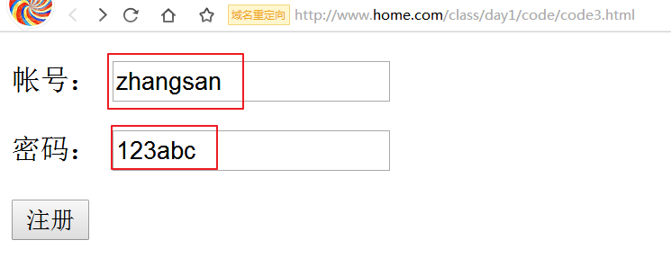

第四步，点击提交按钮，查看最终提交后的效果，


**==小结==**：

$_POST只会接收POST方式传递过来的数据，不会接收GET方式传递过来的数据。


### $_GET方式

作用：==只==接收GET方式传递的数据。


**==需求==**：使用GET方式实现一个会员注册表单页面，包含帐号，密码两个填写项，同时实现在程序页面中使用$\_GET和$\_POST接收并输出表单页面提交传递的数据。

**==解答==**：

第一步，构建一个名为code5.html的页面，代码如下

```html
<!DOCTYPE html>
<HTML>
<head>
	<meta charset="UTF-8">
	<title>$_GET接收数据</title>
</head>
<body>
	<form method="get" action="http://www.home.com/class/day1/code/code6.php">
		<p>
			<span>帐号：</span>
			<input type="text" name="acc" />
		</p>
		<p>
			<span>密码：</span>
			<input type="text" name="pwd" />
		</p>
		<p>
			<input type="submit" value="注册" />
		</p>
	</form>
</body>
</HTML>
```

第二步，构建名为code6.php的程序处理页面，代码如下

```php
<?php

//输出$_POST接收的数据
var_dump( $_POST ); 
echo '<hr/>';
//输出$_GET接收的数据
var_dump( $_GET ); 
```

第三步，访问code5.html页面，填写注册数据，

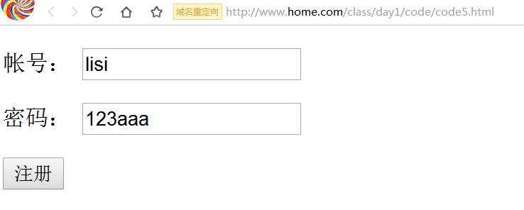

第四步，点击提交按钮，查看最终提交后的效果，


**==小结==**：

$_GET只会接收GET方式传递过来的数据，不会接收POST方式传递过来的数据。


#### 表单传值GET方式的核心特征

使用GET方式传递数据时，提交后的链接地址的格式比较特殊，这个固定格式的链接地址就是GET方式提交数据的核心特征。


==GET方式核心特征格式说明==：

```
以如下链接地址为例：
http://www.home.com/class/day1/code/code6.php?acc=lisi&pwd=123aaa

1. 该链接地址中 “http://www.home.com/class/day1/code/code6.php”是URL链接地址；
2. “?acc=lisi&pwd=123aaa”这个部分是get方式提交的表单数据;
```

在这个数据中==“?==”问号的作用是==专门用来分隔URL链接地址和get参数数据==的；

在这个数据中=="&"==符号的作用是==专门用来分隔get参数数据与数据==的；


### $_REQUEST方式

作用：同时包含$\_POST，$\_GET和$\_COOKIE的数据。


**==需求==**：

1. 在一个form表单中同时使用POST方式和GET方式实现表单传值，其中POST方式传递帐号和密码两个需要填写的数据，GET方式固定传递国籍country=china数据；
2. 实现在程序页面中使用$\_GET、$\_POST和$\_REQUEST接收并输出表单页面提交传递的数据。

**==解答==**：

第一步，构建一个名为code7.html的页面，代码如下

```html
<!DOCTYPE html>
<HTML>
<head>
	<meta charset="UTF-8">
	<title>$_REQUEST接收数据</title>
</head>
<body>
	<!-- 1. 指定method为post意味着之后在表单中填写的帐号和密码数据将会以POST方式进行提交和传递 -->
	<!-- 2. 在URL链接地址后面使用”?country=china“这种方式意味着还将同时以GET方式传递一个country国籍数据，值为china -->
	<form method="post" action="http://www.home.com/class/day1/code/code8.php?country=china">
		<p>
			<span>帐号：</span>
			<input type="text" name="acc" />
		</p>
		<p>
			<span>密码：</span>
			<input type="text" name="pwd" />
		</p>
		<p>
			<input type="submit" value="注册" />
		</p>
	</form>
</body>
</HTML>
```

第二步，构建名为code8.php的程序处理页面，代码如下

```php
<?php

//输出$_POST接收的数据
echo '$_POST: <br/>'; 
var_dump( $_POST ); 
echo '<hr/>';
//输出$_GET接收的数据
echo '$_GET: <br/>'; 
var_dump( $_GET ); 
echo '<hr/>';
//输出$_REQUEST接收的数据
echo '$_REQUEST: <br/>'; 
var_dump( $_REQUEST ); 
```

第三步，访问code7.html页面，填写注册数据，

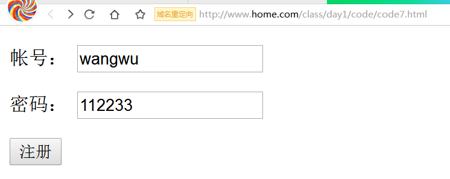

第四步，点击提交按钮，查看最终提交后的效果，


**==小结==**：

$_REQUEST同时包含$\_POST和$\_GET的元素数据；


==**提问**==：$\_REQUEST即包含$_POST元素数据，又包含$\_GET元素数据，那么当$\_POST与$\_GET存在下标同名的元素时，$\_REQUET将会选择谁的数据作为最终值？

解答：默认情况下，$_REQUEST将会采用$\_POST的值作为冲突时的最终值；但是，我们还可以通过php的配置文件修改$\_REUQEST最终采用谁的值。


修改的方式和修改后的效果如下：

第一步，打开php.ini配置文件，找到request_order配置项，如下图所示


第二步，修改配置项的值为"PG"


第三步，重启apache，再次进行测试


## 4. ==POST方式与GET方式的区别==

无论是POST方式，还是GET方式，都属于表单传值。而表单传值的最终目的就是构建数据传输给服务器，这也就意味着POST方式和GET方式都能用来==传输数据给服务器==。

那么既然存在两种方式，我们在实际应用中应该如何来选择使用呢？

为此，我们需要进一步学习POST方式与GET方式之间的区别。POST方式与GET方式主要区别有四点：


- GET方式具有可见性，而POST方式不具有可见性；
- 基于第一点，POST方式在安全性上比GET方式要高一些；
- 在传输的数据量上，POST方式==可能==比GET方式要大；
- 在支持的数据类型上，==GET方式仅支持ASCII码==数据类型，POST方式无限制；


以上四点主要区别，无一例外，都说明了理论上POST方式比GET方式好，而在实际的使用中，我们在构建form表单时，method通常都是被指定为post方式。


==**提问**==：既然POST方式比GET方式优越，为什么还会有GET方式呢？

## 5. GET方式核心特征的应用

#### 指定a标签的href属性

**==需求==**：构建分类列表页，实现点击每个分类都将跳转到同一个页面，但是最终将会输出与点击的分类相关的产品信息。

**==解答==**：

第一步，构建一个名为code9.html的页面，代码如下

```html
<!DOCTYPE html>
<HTML>
<head>
	<meta charset="UTF-8">
	<title>指定a标签的href属性</title>
</head>
<body>
	<!-- 在URL链接地址后面使用GET方式的核心特征拼接携带get方式传递的参数数据type值 -->
	<a href="http://www.home.com/class/day1/code/code10.php?type=1">连衣裙</a>
	<a href="http://www.home.com/class/day1/code/code10.php?type=2">半身裙</a>
	<a href="http://www.home.com/class/day1/code/code10.php?type=3">xuyue裙</a>
</body>
</HTML>
```

第二步，构建名为code10.php的程序处理页面，代码如下

```php
<?php

var_dump( $_GET ); echo '<br/>';
var_dump( $_GET['type'] ); echo '<hr/>';

//根据get方式传递的type值，判断究竟是哪一种分类，然后输出不同分类下的产品信息
if( $_GET['type']==1 ){
    echo '<span>连衣裙1</span><br/>'; 
    echo '<span>连衣裙2</span><br/>'; 
    echo '<span>连衣裙3</span><br/>'; 
}elseif( $_GET['type']==2 ){
    echo '<span>半身裙1</span><br/>'; 
    echo '<span>半身裙2</span><br/>'; 
    echo '<span>半身裙3</span><br/>'; 
}elseif( $_GET['type']==3 ){
    echo '<span>xuyue裙1</span><br/>'; 
    echo '<span>xuyue裙2</span><br/>'; 
    echo '<span>xuyue裙3</span><br/>'; 
}
```

第三步，访问code9.html，点击不同的分类，查看最终效果

页面效果：


点击连衣裙之后的效果：

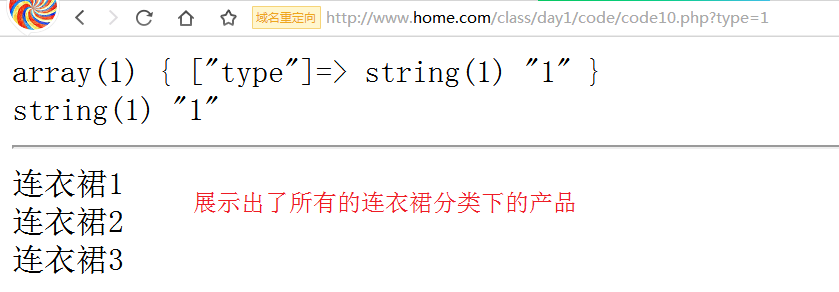

返回列表页，点击半身裙：


#### javascript中指定location对象的href属性

**==需求==**：

1. 构建商品购买页面，假设商品库存为100个，要求有填写购买数量的输入框和立即购买按钮；
2. 在商品购买页面中需要实现当点击立即购买按钮时，会根据用户填写的商品购买数量进行判断，如果没有超出库存则允许购买，如果超出库存则给出提示且不允许购买；

**==解答==**：

第一步，构建一个名为code11.html的页面，代码如下

```html
<!DOCTYPE html>
<HTML>
<head>
	<meta charset="UTF-8">
	<title>javascript中指定location对象的href属性</title>
</head>
<body>
	<span>商品购买数量：</span>
	<input type="text" id='num' />
	<span>当前的库存为：100</span>
	<p>
		<button id="btn">立即购买</button>
	</p>
<script type="text/javascript">
var totalNum = 100;//当前商品的库存数量
document.getElementById('btn').onclick = function (){

	var num = document.getElementById('num').value;//获取用户填写的购买数量

	if ( num>totalNum ){//给出提示，不进行跳转
	
		alert('当前购买的数量超过了商品的库存数量，请重新输入购买数量！');
	}else{//跳转到目标程序页面，并且要携带上用户填写的购买数量
	
		//通过location对象的href属性，跳转到一个指定的链接地址
		window.location.href = 'http://www.home.com/class/day1/code/code12.php?num='+num;
	}

}
</script>
</body>
</HTML>
```

第二步，构建名为code12.php的程序处理页面，代码如下

```php
<?php

//输出接收到的get参数
echo '$_GET: <br/>'; 
var_dump( $_GET );
```

第三步，访问code11.html，填写商品数量，测试使用效果，

测试超出库存数量的情况：


测试没有超出库存数量的情况：

填写数量


点击购买按钮后


**==小结==**：

1. 如果使用form表单，则最佳的传输方式为post方式，所以通常指定method为post；
2. 如果是通过链接跳转到另外一个页面的场景，或者是在跳转之前还需要做判断的场景，则利用GET方式的核心特征，使用a链接或者js代码的location对象href属性更佳；


## 6. 单选按钮与复选框的处理

在web项目中，我们经常会在表单页面构建一些统计选项，以便在后期实现对数据更加精准的定位。常用的统计选项如单选或多选，都是我们经常会用到的。

在表单页面中单选使用的是单选按钮radio来实现的；多选使用的复选框checkbox来实现的。


### 表单页面中的单选按钮

**==需求==**：实现一个会员注册表单页面，包含帐号，密码和性别三个项，同时实现在程序页面中接收并输出表单页面提交传递的数据。

**==解答==**：

第一步，构建一个名为code13.html的页面，代码如下

```html
<!DOCTYPE html>
<HTML>
<head>
	<meta charset="UTF-8">
	<title>表单页面中的单选按钮</title>
</head>
<body>
	<form method="post" action="http://www.home.com/class/day1/code/code14.php" >
		<p>
			<span>帐号：</span>
			<input type="text" name="acc" />
		</p>
		<p>
			<span>密码：</span>
			<input type="password" name="pwd" />
		</p>
		<p>
			<span>性别：</span>
				<!-- 如果要使用单选，则type值必须为radio，同时必须要设置name值和value值 -->
			男 <input type="radio" name="sex" value="male" />
			女 <input type="radio" name="sex" value="female"/>
			保密 <input type="radio" name="sex" value="secret"/>
		</p>
		<p>
			<input type="submit" value="立即注册" />
		</p>
	</form>
</body>
</HTML>
```

第二步，构建名为code14.php的程序处理页面，代码如下

```php
<?php

//输出接收到的post参数
echo '$_POST: <br/>'; 
var_dump( $_POST );
```

第三步，访问code13.html页面，填写注册数据，

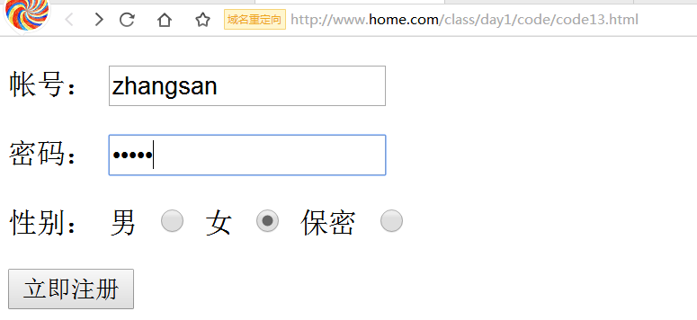

第四步，点击提交按钮，查看最终提交后的效果，


**==小结==**：

单选按钮type值必须为radio.

### 表单页面中的复选框

**==需求==**：实现一个运动网站会员注册表单页面，包含帐号，密码和爱好三个项，其中爱好是多选选项，同时实现在程序页面中接收并输出表单页面提交传递的数据。

**==解答==**：

第一步，构建一个名为code15.html的页面，代码如下

```html
<!DOCTYPE html>
<HTML>
<head>
	<meta charset="UTF-8">
	<title>表单页面中的复选框</title>
</head>
<body>
	<form method="post" action="http://www.home.com/class/day1/code/code16.php" >
		<p>
			<span>帐号：</span>
			<input type="text" name="acc" />
		</p>
		<p>
			<span>密码：</span>
			<input type="password" name="pwd" />
		</p>
		<p>
			<span>爱好：</span>
			<!-- 1.如果要指定为多选，则type值必须为checkbox -->
			<!-- 2.name和value值必须要指定 -->
			<!-- 3.必须在指定的name值后面加上中括号，否则提交的数据将会形成覆盖 -->
			足球 <input type="checkbox" name="hobbies[]" value="football" />
			篮球 <input type="checkbox" name="hobbies[]" value="basketball"/>
			乒乓球 <input type="checkbox" name="hobbies[]" value="pingpang"/>
		</p>
		<p>
			<input type="submit" value="立即注册" />
		</p>
	</form>
</body>
</HTML>
```

第二步，构建名为code16.php的程序处理页面，代码如下

```php
<?php

//输出接收到的post参数
echo '$_POST: <br/>'; 
echo '<pre>';
var_dump( $_POST );
```

第三步，访问code15.html页面，填写注册数据，

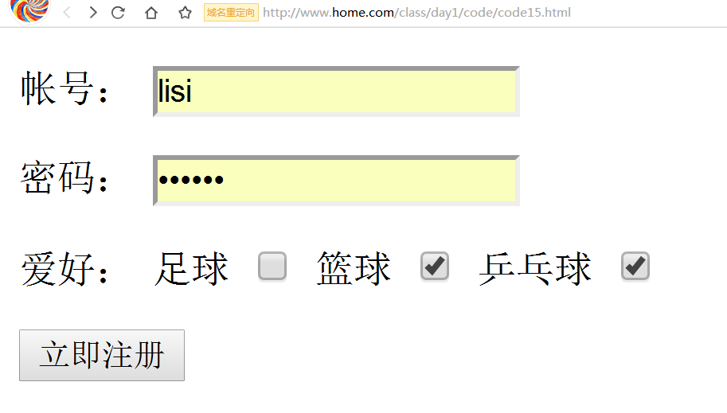

第四步，点击提交按钮，查看最终提交后的效果，

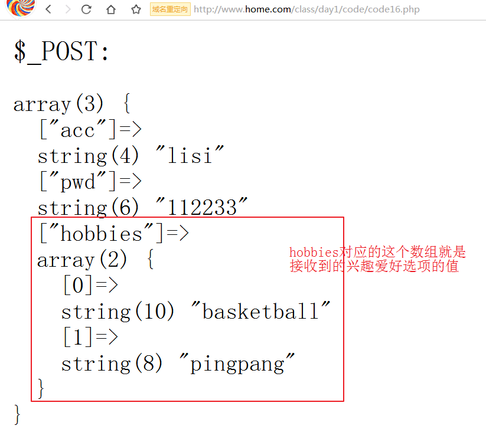


**==小结==**：

如果要构建复选框，则:

1. type值必须为checkbox;
2. name值和value值必须指定上；
3. name值需要加上“[]”中括号这个符号，否则将会形成数据的覆盖；


#  ==文件上传==

### 文件上传的概念

#### 为什么使用文件上传

在web领域，文件上传的应用非常广泛。如上传头像，上传证件照，上传报表文件等，都需要用到文件上传技术。


#### 什么是文件上传

概念：文件上传指的是将文件从本地传输到指定的服务器。


==**提问**==：将文件从本地传输到服务器，从实现的角度来看是一个什么样的过程呢？

#### 文件上传的实现思路

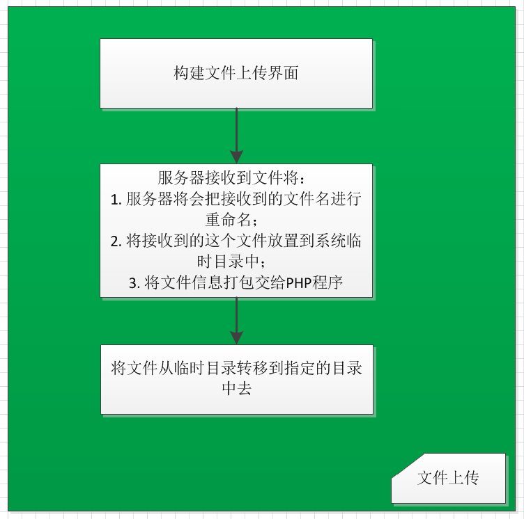


### 文件上传核心步骤

**==需求==**：根据文件上传的3步思路，实现注册页面头像图片上传页面及功能。

**==解答==**：

第一步，构建一个名为code17.html的页面，代码如下

```html
<!DOCTYPE html>
<HTML>
<head>
	<meta charset="UTF-8">
	<title>文件上传核心步骤</title>
</head>
<body>
	<!-- 1. 如果要实现文件上传，method必须为post -->
	<!-- 2. form标签必须包含enctype属性，并且值必须固定为:multipart/form-data -->
	<form method="post" action="http://www.home.com/class/day1/code/code18.php" enctype="multipart/form-data">
		<p>
			<span>帐号：</span>
			<input type="text" name="acc" />
		</p>
		<p>
			<span>密码：</span>
			<input type="password" name="pwd" />
		</p>
		<p>
			<span>头像：</span>
			<!-- 3. 文件上传域type值必须为file； -->
			<!-- 4. 必须为文件上传域指定name属性值； -->
			<input type="file" name="headimg" />
		</p>
		<p>
			<input type="submit" value="立即注册" />
		</p>
	</form>
</body>
</HTML>
```

第二步，构建名为code17.php的程序处理页面，代码如下

```php
<?php

//输出接收到的post参数
echo '$_POST: <br/>'; 
echo '<pre>';
var_dump( $_POST );
echo '<hr/>';
echo '$_FILES：<br/>';
print_r( $_FILES ); 

echo '<hr/>';
var_dump( $_FILES['headimg']['tmp_name'] ); 
echo '<hr/>';

//转移临时文件到指定的目录中去
//参数一： 源文件，即 存储在临时目录中的文件全路径（包含文件路径部分和文件名部分）
//参数二： 目标文件，即 转移文件的目标目录路径位置，同时需要将新的文件名指定上
$re = move_uploaded_file($_FILES['headimg']['tmp_name'], './2.png');
var_dump( $re ); 
```

第三步，访问code17.html页面，选定图片文件，

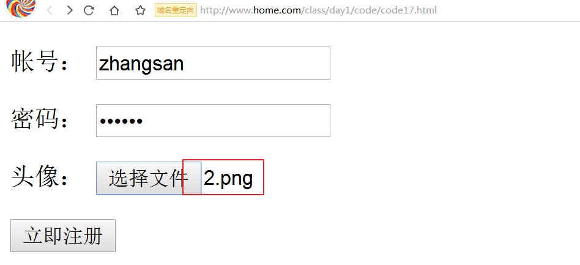

第四步，点击提交按钮，查看最终提交后的效果，

```
####输出到浏览器的内容
$_POST: 
array(2) {                 //post方式接收到的表单数据
  ["acc"]=>
  string(8) "zhangsan"
  ["pwd"]=>
  string(6) "112233"
}
$_FILES：                 //接收到的表单文件数据
Array
(
    [headimg] => Array
        (
            [name] => 2.png           					//原始文件名
            [type] => image/png							//文件所属格式类型
            [tmp_name] => C:\Windows\Temp\php8DAB.tmp	//文件存储在临时目录中的全路径名
            [error] => 0								//文件上传时的错误码值
            [size] => 37143								//文件的大小，单位字节
        )

)
string(27) "C:\Windows\Temp\php8DAB.tmp"	//提取的文件存储在临时目录中的全路径名
bool(true)		//move_uploaded_file函数的返回值，为true,说明文件上传成功
```

**==小结==**：

1. 如果要实现文件上传，form的method属性必须为**post**；
2. form标签必须包含enctype属性，并且值必须固定为:**multipart/form-data**；
3. 文件上传域type值必须为**file**；
4. 必须为文件上传域指定**name属性值**；
5. 在PHP程序中，由**$_FILES**负责接收上传的文件数据；


==**提问**==：网站项目中，实现文件上传的页面只会支持上传一个文件吗？

#### 多文件上传

在web项目中，实现文件上传的页面时常会包含多个文件。

比如家装公司的效果图网站，一个房子内部的效果图不止一张，可能会包含多张，比如会分成客厅效果图，卧室效果图，玄关效果图，厨房效果图等等，那么，在上传文件时就需要支持多文件上传的功能了。


在PHP中我们把多文件上传分成两类：

- [x] 不同名多文件的上传
- [x] 同名多文件的上传


##### 不同名多文件的上传

我们以家装公司的效果图网站来举一个例子。


**==需求==**：

1. 实现一个家装公司效果图网站的图片上传表单页面，包含客厅效果图，卧室效果图两个文件上传域；
2. 实现文件上传的程序处理功能。

**==解答==**：

第一步，构建一个名为code19.html的页面，代码如下

```html
<!DOCTYPE html>
<HTML>
<head>
	<meta charset="UTF-8">
	<title>不同名多文件的上传</title>
</head>
<body>
	<form method="post" action="http://www.home.com/class/day1/code/code20.php" enctype="multipart/form-data" >
		<p>
			<span>客厅效果图：</span>
			<input type="file" name="keting" />
		</p>
		<p>
			<span>卧室效果图：</span>
			<input type="file" name="woshi" />
		</p>
		<p>
			<input type="submit" value="立即提交" />
		</p>
	</form>
</body>
</HTML>
```

第二步，构建名为code20.php的程序处理页面，代码如下

```php
<?php

//输出$_FILES
echo '$_FILES：<br/>';
echo '<pre>';
print_r( $_FILES ); echo '<hr/>';


//转移临时文件到指定的目录中去
foreach( $_FILES as $file ){ //遍历$_FILES，$_FILES有几个元素，就意味着上传了几个文件
    var_dump( $file ); echo '<br/>';
    //转移当前这个文件，从临时目录中转移到指定的目录中去，并且还要重命名
    $newFileName = './' . $file['name'];//为当前文件重命名，重命名为当前原始文件的名字
    $re = move_uploaded_file($file['tmp_name'], $newFileName);
    var_dump( $re );echo '<hr/>'; 
}
```

第三步，访问code19.html页面，选定图片文件，

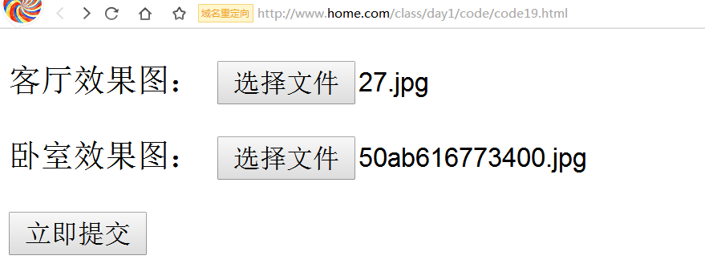

第四步，点击提交按钮，查看最终提交后的效果，

```
####浏览器输出的信息如下
$_FILES：
Array            //$_FILES接收到的文件信息
(
    [keting] => Array     //第一个效果图客厅的图片文件信息
        (
            [name] => 27.jpg
            [type] => image/jpeg
            [tmp_name] => C:\Windows\Temp\php3FC5.tmp
            [error] => 0
            [size] => 459695
        )

    [woshi] => Array		//第二个效果图卧室的图片文件信息
        (
            [name] => 50ab616773400.jpg
            [type] => image/jpeg
            [tmp_name] => C:\Windows\Temp\php3FD5.tmp
            [error] => 0
            [size] => 211851
        )

)

array(5) {	//在foreach遍历中输出的第一个效果图客厅的图片文件信息
  ["name"]=>
  string(6) "27.jpg"
  ["type"]=>
  string(10) "image/jpeg"
  ["tmp_name"]=>
  string(27) "C:\Windows\Temp\php3FC5.tmp"
  ["error"]=>
  int(0)
  ["size"]=>
  int(459695)
}

bool(true)	//表示第一张图片文件上传成功

array(5) {//在foreach遍历中输出的第二个效果图卧室的图片文件信息
  ["name"]=>
  string(17) "50ab616773400.jpg"
  ["type"]=>
  string(10) "image/jpeg"
  ["tmp_name"]=>
  string(27) "C:\Windows\Temp\php3FD5.tmp"
  ["error"]=>
  int(0)
  ["size"]=>
  int(211851)
}

bool(true)	//表示第二张图片文件上传成功
```

**==小结==**：

不同名多文件上传时$_FILES的结构为如下所示，每个文件都固定包含5个元素的信息，

```
Array
(
    [headimg] => Array
        (
            [name] => xx.xxxx           				//原始文件名
            [type] => xxx/xxx							//文件所属格式类型
            [tmp_name] => C:\Windows\Temp\xxx.tmp		//文件存储在临时目录中的全路径名
            [error] => 整型数值							//文件上传时的错误码值
            [size] => 整型数值							//文件的大小，单位字节
        )

)
```


##### 同名多文件的上传

我们以证件审核网站来举一个例子。


**==需求==**：

1. 实现一个证件审核网站的身份证正反两面图片上传表单页面；
2. 实现文件上传的程序处理功能。

**==解答==**：

第一步，构建一个名为code21.html的页面，代码如下

```html
<!DOCTYPE html>
<HTML>
<head>
	<meta charset="UTF-8">
	<title>同名多文件的上传</title>
</head>
<body>
	<form method="post" action="http://www.home.com/class/day1/code/code22.php" enctype="multipart/form-data" >
		<p>
			<span>身份证正面照：</span>
			<!-- 同名多文件上传的表单域同名name值后面必须加上"[]"中括号 -->
			<input type="file" name="idcard[]" />
		</p>
		<p>
			<span>身份证反面照：</span>
			<input type="file" name="idcard[]" />
		</p>
		<p>
			<input type="submit" value="立即提交" />
		</p>
	</form>
</body>
</HTML>
```

第二步，构建名为code22.php的程序处理页面，代码如下

```php
<?php

//输出$_FILES
echo '$_FILES：<br/>';
echo '<pre>';
print_r( $_FILES ); echo '<hr/>';echo '<hr/>';//输出$_FILES全部的信息


//转移临时文件到指定的目录中去
//遍历name元素的值，name元素有两个值，第一个值下标为0，表示第一个文件的原始文件名信息；第二个值下标为1，表示第二个文件的原始文件名信息；
foreach( $_FILES['idcard']['name'] as $name_key=>$name ){ 
    echo 'name_key：'; 
    var_dump( $name_key ); echo '<br/>';//输出name元素的下标值
    echo 'name：'; 
    var_dump( $name ); //输出name元素下标对应的值信息
    echo 'tmp_name：'; 
    var_dump( $_FILES['idcard']['tmp_name'][$name_key] ); //利用name和tmp_name元素下标通用的特性，取得tmp_name元素下标对应的值信息

    $newFileName = './'.$name;//构建新的文件名
    $re = move_uploaded_file($_FILES['idcard']['tmp_name'][$name_key], $newFileName);//转移当前文件到指定的位置
    var_dump( $re );     echo '<hr/>';
}

```

第三步，访问code21.html页面，选定图片文件，

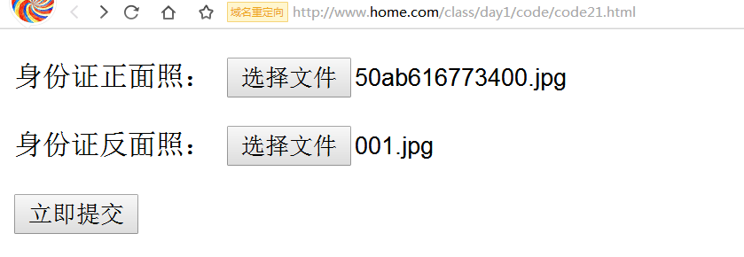

第四步，点击提交按钮，查看最终提交后的效果，

```
####在浏览器中输出的信息
$_FILES：
Array		//$_FILES的信息
(
    [idcard] => Array
        (
            [name] => Array
                (
                    [0] => 50ab616773400.jpg
                    [1] => 001.jpg
                )
            [type] => Array
                (
                    [0] => image/jpeg
                    [1] => image/jpeg
                )
            [tmp_name] => Array
                (
                    [0] => C:\Windows\Temp\php6874.tmp
                    [1] => C:\Windows\Temp\php6885.tmp
                )
            [error] => Array
                (
                    [0] => 0
                    [1] => 0
                )
            [size] => Array
                (
                    [0] => 211851
                    [1] => 109140
                )
        )
)

name_key：int(0)	//遍历得到的第一个name元素的下标值

name：string(17) "50ab616773400.jpg" 	//遍历得到的第一个name下标对应的值信息，即第一张图的原始文件名信息
tmp_name：string(27) "C:\Windows\Temp\php6874.tmp"	//遍历得到的第一个tmp_name下标对应的值信息，即第一张图存储在临时目录的全路径信息
bool(true)  //表示第一张图片上传成功

name_key：int(1)	//遍历得到的第二个name元素的下标值

name：string(7) "001.jpg"	//遍历得到的第二个name下标对应的值信息，即第二张图的原始文件名信息
tmp_name：string(27) "C:\Windows\Temp\php6885.tmp"	//遍历得到的第二个tmp_name下标对应的值信息，即第二张图存储在临时目录的全路径信息
bool(true)	//表示第二张图片上传成功
```

**==小结==**：

在同名多文件上传时，$_FILES结构如下图所示

```
$_FILES：
Array
(
    [idcard] => Array
        (
            [name] => Array	//文件的原始名称信息
                (
                    [0] => 50ab616773400.jpg	//第一个文件的原始文件name信息
                    [1] => 001.jpg				//第二个文件的原始文件name信息
                )
            [type] => Array	//文件的格式类型信息
                (
                    [0] => image/jpeg	//第一个文件的格式类型type信息
                    [1] => image/jpeg	//第二个文件的格式类型type信息
                )
            [tmp_name] => Array	//文件存放在临时目录下的全路径信息
                (
                    [0] => C:\Windows\Temp\php3CEC.tmp	//第一个文件存放在临时目录下的全路径tmp_name信息
                    [1] => C:\Windows\Temp\php3CED.tmp	//第二个文件存放在临时目录下的全路径tmp_name信息
                )
            [error] => Array	//文件上传时的错误码值信息
                (
                    [0] => 0	//第一个文件上传时的错误码值error信息
                    [1] => 0	//第二个文件上传时的错误码值error信息
                )
            [size] => Array		//文件的大小信息
                (
                    [0] => 211851	//第一个文件的大小size信息
                    [1] => 109140	//第二个文件的大小size信息
                )
        )
)
```


#### 案例：封装文件上传函数

在web网站中，文件上传功能不可或缺，但是并不是每一个页面都需要文件上传功能。所以我们会将文件上传功能封装成函数，以便以后在项目中随用随取，而不需要每次都重复写相同的功能代码。


##### error错误码值说明

在手册中的位置：

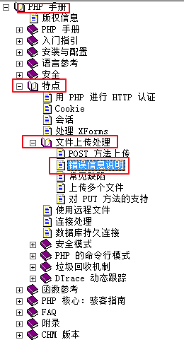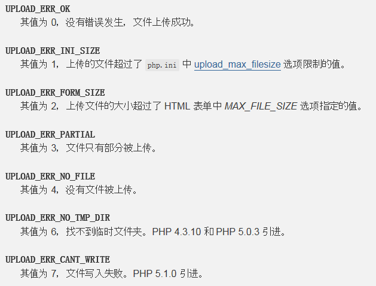


##### 功能分析

1. 检查系统级别错误；
2. 检查逻辑级别错误；
3. 构建绝对不重复的文件名；
4. 转移上传的文件到指定目录中；


##### 代码实现

以下是upfile.php封装的文件上传功能函数，具体的测试使用文件code23.html和code24.php

```php
/**
 * 功能：文件上传
 * @param  array   $file   上传文件包含的5个部分的信息
        包含:
        $file['name']             表示原始文件的文件名，如$file['name']='a.jpg';
        $file['type']             表示文件的格式类型，如：$file['type']='image/jpeg'
        $file['tmp_name']         表示文件存放在临时目录中的全路径，如：
                                  $file['tmp_name']='C:/xxx/xxx/xx/tmp/xx.tmp';
        $file['error']  表示文件上传时的错误码值，包含0，1，2，3，4，6，7
                    				0：表示没有任何错误
                    				1：表示上传的文件大小超过了系统的限定
                    				2：表示上传文件的大小超过了浏览器的限定
                    				3：表示只有部分文件被上传
                   					4：表示没有选择上传的文件
                    				6和7：表示服务器出现问题导致上传失败
        $file['size']   表示源文件的大小，单位是字节
 */
function upfile($file){ 
    #1.检查系统错误
    switch ( $file['error'] ){
        case 1:
            echo '上传的文件大小超过了系统的限定'; 
        return false;
        case 2:
            echo '上传文件的大小超过了浏览器的限定'; 
        return false;
        case 3:
            echo '只有部分文件被上传'; 
        return false;
        case 4:
            echo '没有选择上传的文件'; 
        return false;
        case 6:
            case 7:
            echo '服务器出现问题导致上传失败'; 
        return false;
    }

    #2.检查逻辑错误
    //检查文件大小是否超出逻辑限定
    $limitSize = 200 * 1024;//限定的大小为200KB
    if( $file['size']>$limitSize ){//超出了限定的大小
        echo '您上传的文件超过了限定的大小'.($limitSize/1024).'KB'; 
        return false;
    }

    //检查文件的格式类型是否在允许的范围内
    $limitType = ['image/jpeg', 'image/png'];
    if( !in_array($file['type'], $limitType) ){//上传的文件格式类型不在允许的范围内
        echo '您上传的文件格式类型不正确，请重新选择上传的文件！'; 
        return false;
    }

    #3.构建绝对不重复的文件名
    //(strchr)strstr — 查找字符串的首次出现
    //返回 字符串中从指定字符 第一次出现的位置开始到结尾的字符串。 
    $newFileName = uniqid('img_') . date('YmdHis') . mt_rand(0, 10000) . strchr($file['name'], '.');//构建绝对不重复的文件名，文件后缀保持和源文件名一致
    $path = './';//定义文件的保存路径
    $wholeFileName = $path . $newFileName;//拼接完整的文件全路径

    #4.转移文件到指定的目录中
    if( move_uploaded_file($file['tmp_name'], $wholeFileName) ){//文件上传成功
        echo '文件上传成功！'; 
        return true;
    }else{//文件上传失败
        echo '文件上传失败'; 
        return false;
    }
}
```


## 8. 全天总结

1. 表单传值的方式：POST方式和GET方式；

2. PHP接收表单数据的方式：1）$_POST; 2)$\_GET；3）$\_REQUEST;

3. GET方式的核心特征：在URL链接地址后面可以通过固定的格式拼接GET参数数据，其中?是用来分隔链接地址和GET参数数据的，&符号是用来分隔GET参数数据与数据的；

4. POST方式与GET方式的区别：

   a) GET方式具有可见性；

   b) POST方式比GET方式相对安全；

   c) POST方式传递的数据量==可能==比GET方式要大；

   d) GET方式只支持ASCII码数据类型，POST方式无限制；

5. 文件上传核心三步

   a) 构建上传界面；

   b) $_FILES接收文件数据；

   c) move_uploaded_file函数转移文件

6. $_FILES保存的文件数据包含几个部分的内容：

   a) name表示源文件名

   b) type表示文件的格式类型

   c) tmp_name表示存储在临时目录下的文件全路径

   d) error表示上传时出现的错误码值

   e) size表示上传文件的大小

7. 如果要构建一个表单的注册页面，包含帐号，密码，性别，爱好和头像文件上传域，则form表单应该如何构建

```html
<form method="post" action="http://xxx.xx.com/xx.php" enctype="multipart/form-data">
    <p>
        <span>帐号：</span>
        <input type="text" name="acc" />
    </p>
    <p>
        <span>密码：</span>
        <input type="password" name="pwd" />
    </p>
    <p>
        <span>性别：</span>
        男<input type="radio" name="sex" value="male" />
        女<input type="radio" name="sex" value="female"/>
    </p>
    <p>
        <span>爱好：</span>
        足球<input type="checkbox" name="hobbies[]" value="football" />
        篮球<input type="checkbox" name="hobbies[]" value="basketball"/>
    </p>
    <p>
        <span>头像：</span>
        <input type="file" name="img" />
    </p>
    <p>
        <input type="submit" value="立即注册" />
    </p>
</form>
```


#### 课后练习

实现运动网站会员注册页面，要求：

1. 表单页面包含帐号，密码，性别（男，女，保密），爱好（足球，篮球，乒乓球），头像；
2. 程序页面输出表单页面提交传递的帐号，密码，性别，爱好信息；
3. 程序页面还需要实现头像图片的上传功能，要求实现检查上传时系统错误，图片不能大于50K，格式只允许为jpeg或png；

