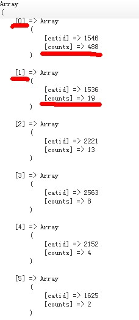
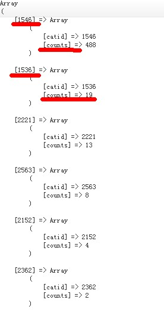

# PHP实现对多维数组按照某个键值排序的两种解决方法

来源 https://blog.csdn.net/websites/article/details/18822265


实现对多维数组按照某个键值排序的两种解决方法(**array_multisort**和**array_sort**):


## array_multisort()函数对多个数组或多维数组进行排序。

```php
//对数组$hotcat按照count键值大小降序进行排序； 
$hotcat =array(
         array('1501'=>array('catid'=>'1546','catname'=>'数组排序 一级','count'=>'588')),
         array('1501'=>array('catid'=>'1546','catname'=>'数组排序二级','count'=>'588')),
         array('1501'=>array('catid'=>'1546','catname'=>'数组排序 三级','count'=>'588'))
);
 //提取列数组；
foreach ($hotcat as $key => $val) {
  	$tmp[$key] = $row['username'];
}
array_multisort($tmp,SORT_DESC,$hotcat);此处对数组进行降序排列；SORT_DESC按降序排列
```

 


## 自定义方法array_sort()对多维数组进行排序

```php
//指定数组以$keys键值排序
//$array为要排序的数组,$keys为要用来排序的键名,$type默认为升序排序
function array_sort($array,$keys,$type='asc'){
    
    $keysvalue = $new_array = array();
    
    //提取并存储指定要排序的列名的数组（列数组）
    //通常为一维数组
    foreach ($array as $k=>$v){    	
        $keysvalue[$k] = $v[$keys];
    }
    
    //排序方式
    if($type == 'asc'){ 
    	asort($keysvalue); //对数组进行排序并保持索引关系（升序 asc）
    }else{
    	arsort($keysvalue); //对数组进行逆向排序并保持索引关系（降序 desc）
    }
    
    reset($keysvalue);  //将数组的内部指针指向第一个单元
    
    //以列数组为依据，重组原数组
    foreach ($keysvalue as $k=>$v){
        //列数组的键($k)是在生成列数组时存储下来的原数组的键
        //所有才能保持所有类型的键值关系,数字类型的键也不会被重置
    	$new_array[$k] = $array[$k];
    }
    return $new_array;
}

//调用示例
$hot_cat = array_sort($hot_cat,'count','desc'); //此处对数组进行降序排列
```


图一



图二



==**温馨提醒**==:由上图可知第一种方法有个弊端，如果你的数组如果是字符串键名将被保留，但是数字键将被重新索引,从0开始,并以1递增。所以当数组排序之后并且需要保留之前的所有键名的话,那就推荐使用第二种方法。

 